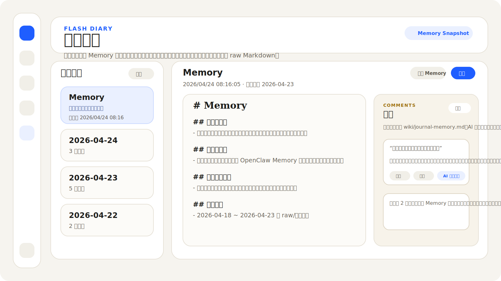
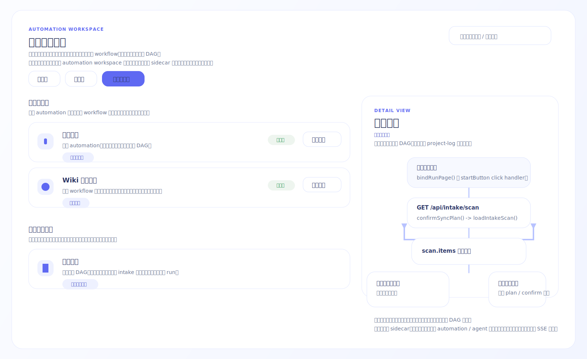
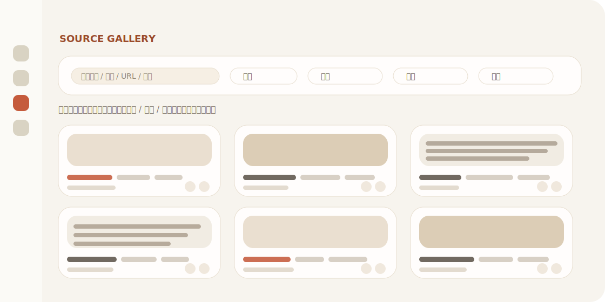
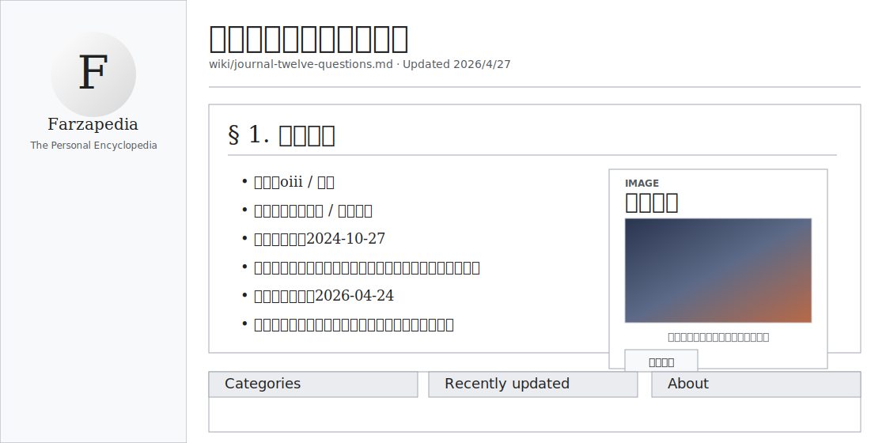

# LLM Wiki 项目日志

这份文档记录的是 **LLM Wiki 应用本身** 的当前界面、当前流程和搭建时间线。
它不是用户知识库里的 `log.md`，也不是 compile 产出的 wiki 内容。
---

## 现有界面

当前应用是 **Electron 桌面壳 + 本地 WebUI**。
桌面入口当前只支持 launcher 路线：桌面双击入口来自 `desktop-webui-launcher/`；`desktop-webui/` 只作为 launcher 启动的 Electron 运行时，不再承担正式打包发布。
左侧固定导航栏负责进入独立页面；右侧主内容区按路由独立渲染�?? 
项目日志页本身不维护界面图；其余独�??DOM 页面各保留一张示意图�? 
项目日志页当前采用单栏阅读布局，页面主体�??full-page 容器内独立纵向滚动，顶部固定一条轻量工具栏：向下滚动时工具栏仍可见。工具栏包含目录、全部评论、未解决、已解决。点击目录会在右侧展开可调整宽度的目录栏；选中文字后，选区旁会浮出“评论”按钮，点击后会高亮原文并打开右侧评论栏，评论支持编辑、删除、解决和按状态筛选�?
### 对话�?
![对话�??../project-log-assets/chat-page.svg)

对话页保留文件浏览和消息流两条主线：\r\n
- 左侧导航栏：对话、闪念日记、自动化、源料库、wiki、系统检查、同步、审查、图谱、设??- 文件浏览区：支持 `wiki` / `raw层` 切换、搜索、文件树、选中模式
- 主工作区：会话列表、消息流、输入框
- 可选右侧预览抽屉：点击文件后打开 Markdown 预览\r\n
### 闪念日记??


闪念日记页是独立的高频记录入口：

- 左栏：顶部固??`十二个问题` ??`Memory` 两张卡片，下面按日期倒序显�??`raw/闪念日记` 的日记文件；左栏自身支持上下滚动
- 右栏：普通日记保持原�?Markdown 编辑区；选�??`Memory` 时切到渲染阅�?+ 评论侧栏模式
- `十二个问题` 对应真实文�??`wiki/journal-twelve-questions.md`，点击后按普�?Markdown 文档方式打开与保存；读取优先�?Cloudflare Remote Brain，同步保存时先写 cloud，再落本地镜�?- 支持“保存当前文档”显式按??- `Memory` 继续使用单一真实文件 `wiki/journal-memory.md`；上半部分是“短期记忆（最??7 天）”，下半部分是“长期记忆�??- `Memory` 视图支持“刷�?Memory”和“评论”；短期记忆会在本地时间每�??`00:00` 自动刷新，错�?`00:00` 时会在下次启动或打开 Memory 时补??- 短期记忆不再按日期摘录最近几条，而是对最�?7 天从健康、学习、人际关系、爱情、财富、情绪与能量、近期重点与风险等角度做多维总结\r\n- 左栏与卡片尺寸经过压缩，列表宽度、间距和卡片高度都比之前更紧�?- 评论区直接绑??`wiki/journal-memory.md`
- 桌面端支持可配置全局快捷键，默认 `CommandOrControl+Shift+J` 打开快速录入小�?
### Workflow 页\r\n


Workflow 工作区现在拆成三条独立路由：
- `#/automation`：白底列表概览页，只负责搜索、筛选、查看状态、进入详情、进入日志。
- `#/automation/<id>`：详情页统一用紧凑 Mermaid 阶段图展示流程；每个节点只表示一个最小可执行单位，第一行显示动作本身，第二行优先显示实现落点，不再套“用户触发 / 系统处理 / 用户可见结果”三段大框。
- `#/automation-log/<id>`：单条 workflow 的运行日志页。
- 列表页当前只聚合三类真实来源：`automations/automations.json` 里的显式 workflow、`agents/agents.json` 里的应用 workflow，以及人工审计源码后录入的 `code-derived` 真实流程；首屏会把“真实 Workflow”和“源码真实流程”分组展示。
详情页当前支持：

- Workflow 页外层内容区支持上下滚动；系统流程和 workflow 条目很多时，不会再被 full-page 容器截断。
- 列表页和详情页都会订阅 `GET /api/automation-workspace/events`；当源码 flow sidecar、被审计的源文件，或相关 `automations / agents / .env` 配置变化时，页面会自动重拉。
- 详情页头部提供“返回 Workflow”按钮；显式 workflow 和应用流程仍保留“运行日志”入口，源码流程不显示运行日志按钮。
- Mermaid 节点直接显示“步骤标题 + 实现落点”；触发节点、判断节点、处理中节点和结果节点继续使用不同视觉样式。
- code-derived flow、显式 workflow 和应用 workflow 统一走同一套 Mermaid 渲染，不再区分 DAG 画布与文档流。
- 当统一 `flow nodes / edges / branches` 结构无法表达真实边标签时，详情页允许直接消费源码侧手写 Mermaid；当前 `审查与运行结果` 就走这条直通链路，保留 `单条推进 / 确认写入 / 批量进行 / 全部写入 / 批量录入 inbox / 打开对话` 这些真实分支标签。
- `同步编译总览` 现在也走手写 Mermaid 原图；它和 `编译链路` 继续共存，前者负责 compile 端到端总览，后者负责 compile 内核执行单元。
- 当前所有 code-derived workflow 都已经切到源码侧手写 Mermaid：`Workflow 工作区`、`审查与运行结果`、`同步入口`、`源料库`、`闪念日记快速记录`、`同步编译总览`、`编译链路`。
- 其余 workflow 的自动生成图也不再套自定义蓝橙绿 class 配色，而是统一回到和手写 Mermaid 原图一致的原生 Mermaid 颜色、布局和卡片尺寸。
- Mermaid 详情图现在默认在卡片内容区内水平居中；当图宽超过容器时，仍保留横向滚动，不再因为左贴边而在右侧留下大块空白。
- Mermaid 详情图现在支持持久图钉评论：进入评论模式后，可以直接点节点、连线或空白处落评论；评论会以图钉附着在图上，并在右侧评论面板里同步出现。
- 图钉支持拖动改位；如果 Mermaid 后续重排或原目标消失，评论仍保留在最后一次有效位置，不会因为图形变化被自动删除，只有显式删除才会移除。
- 长流程继续在单页滚动容器里展示，不再依赖内部画布拖拽、分支偏移微调或评论锚点模式。
### 工作台页\r\n
工作台页继续保留 `项目推进??/ 任务计划??/ 任务�?/ 工作日志 / 工具�??这组二级导航�? 
其�??`工具�??子页当前已经从旧的三栏条目编辑器改为 dashboard 式页面：

- 顶部显示页面标题、说明、搜索框和项目头像区\r\n- 中部上方使�??`工作�?/ 工具资产` 大切换按�?- 主区展示工作流卡片与工具资产卡片
- 右侧固定显�??`最近运行�??Agent` ??`收藏??/ 快捷入口`
- 点�??`管理` 后通过弹层管理工作流或工具资产\r\n- 数据主源??`工具�?toolbox.json`，�??Markdown 工具条目??legacy 资产继续展示
- `任务池` 子页新增 `列表视图 / 树状图` 双视图；树状图支持 `领域 / 项目 / 任务` 单层级切换、左侧筛选栏折叠、左右拖拽调宽、右侧画布缩放与纵向滚动
- `任务池` 树状图编辑模式支持直接改名；在领域节点按 `Enter` 会进入新增项目，在项目节点按 `Enter` 会新增子任务，在任务节点按 `Enter` 会新增同级任务；删除项目或领域时会把任务保留到 `待分组 / 未归类`，并且支持把任务拖到项目节点重新挂接；树上的未保存修改继续与任务计划页顶部的共享任务池草稿共用同一条显式保存边界
- `任务池` 顶部新增领域 chip 行，并额外提供 `健康` 领域入口
- `健康` 领域页聚焦睡眠：展示入睡时间、起床时间、深度睡眠质量、总睡眠时长、睡眠评分、清醒时长、睡眠平均心率、步数 / 活动量以及最近 7 天趋势
- `健康` 领域页提供 `导入小米运动健康数据` 弹层，支持手机号验证码连接、二维码登录生成 token，以及 token / API 高级连接，并通过本地 Python bridge 调用 `mi-fitness` SDK 完成连接与同步
- 健康导入不再暴露共享 UID 输入；当当前 SDK 无法读取登录账号本人的健康数据时，页面只显示本人数据暂不支持的明确提示
- 当小米账号登录触发图形验证码风控时，导入弹层会直接显示验证码图片与输入框，不再把健康导入错误显示成乱码
- 当短信验证码已经发到手机、但小米登录流程还停在图形验证码阶段时，导入弹层现在可以在同一轮“登录并连接”里补齐 `ticketToken`，不要求用户先额外重发短信
- 当弹层里已经填入短信验证码时，图形验证码区域和底部状态会明确提示“直接点登录并连接”，避免用户被中间态按钮误导
- 健康导入弹层的默认账号入口现在是纯“手机号验证码连接”，不再显示历史遗留的密码输入框
- 当小米接口在“发送短信成功后、返回手机号信息失败”这一步报系统错误时，弹层现在按“短信已发出”的部分成功处理，不再把这类假失败挡在发送阶段
### 源料库页\r\n


源料库页�?`raw + sources_full` 的混合画册页，不复用对话页文件树�? 
当前固定采用两行结构�?
- 第一行：筛选区保留搜索、排序、来源、标签、状态五个入口；来源�?`剪�??/ 闪念日记 / sources_full` 动态返回，标签按真??`tags` 动态返回，状态�??`raw / source` 动态返�?- 第二行：画册式卡片流，首卡固定为“新增剪??/ 日记�?- 源料卡片：固定三列画册布局，优先显示图片，没有图片时显示正文摘录；卡片中显示标题、`raw / source` 标记、桶类型、标签、日�?- 多选后出现批量工具条：导入对话、批??ingest、加�?inbox、取消选择
- 多选工具条新增“批量删除�?- 查看原文：通过弹层直接编辑 Markdown，并支持关闭、保存、单条删??- 卡片底部动作改为图标按钮，不再显示纵向挤压的文字按钮
- 数据边界：页面主对象�?`raw/剪藏`、`raw/闪念日记` ??`sources_full`

### Wiki ??


Wiki 页是独立阅读入口，不复用对话页文件树�? 
当前固定??Wikipedia 风格浏览编译后的知识页，默认打开 `wiki/index.md`?? 
当前 `wiki/index.md` 不再走普通 article 阅读器，而是独立??Peiweipedia 首页封面：顶�??Hero 会显示欢迎语、首页简介、条目数和分类数；左侧展示精选条目与按分类浏览，右侧展示最近更新与关于摘�? 
首页的统计、精选条目、最近更新、分类浏览和关于摘要都来自真实 wiki 数据：条目和分类从 `/api/tree?layer=wiki` 统计，简介和关于从 `wiki/index.md` 的真实内容提取，精选条目从真实条目页中挑选，不再显示写死的示例数字或文案�? 
顶部搜索框走统一 `/api/search?scope=local`，�??普通 Wiki 页面内展示本??wiki / raw / sources_full / 向量结果??左�??Farzapedia 品牌图现在可点击进�??`wiki/about-me.md` 对应的个人展示页；这个页面不再走普�??article 模板，而是按独立个人主页布局渲染�?
- `wiki/about-me.md` 对应专用 profile page：顶部品牌�??+ 页签、紧??Hero、右侧统计卡、左侧成果库主板、右侧单张切换卡、底部代表能力区\r\n- 个人展示页当前做了二次压缩：顶部栏、Hero、统计卡、成果卡和能力卡都比首版更紧凑，避免首屏信息被放大后挤出可视??- 首页右侧卡片右上角提供 `时间线 / 简历` 切换，只展示当前选中的内容，避免双卡在窄宽度下重叠�??- 个人展示页页签固定�??`首�??/ 时间�?/ 成果�?/ 能�??/ 简历`
- 个人展示页支持原??Markdown 编辑：顶部提??`编�??Markdown / 保�??/ 取消`，直接写??`wiki/about-me.md`；文字、统计和头像图片链接都通过这条链路维护\r\n- 普??wiki 文章页现在改为 Wikipedia 风格的正文右浮动图片框；图片不再占用独立右栏，而是嵌在正文流里，正文会环绕图片继续排版；当页面可编辑时，可直接上传或更换图片，图片文件会落??`wiki/.page-media/`，并把 `side_image` 写回该页 frontmatter；如需图片下方说明文字，可在 frontmatter 里补 `side_image_caption`\r\n- 普�??wiki 页面仍保持原�?Farzapedia 阅读器，不�??`about-me` 专页渲染逻辑影响

### 审查�?
![审查�??../project-log-assets/review-page.svg)

审查页是独立全宽页面，不沿用对话页布局?? 
集中显示??
- 系统检查待处理事项\r\n- 同�??/ 编译失败??- inbox 待处理原??- 闪念日记提交失败??- 需要用户确认的建议�?- 首屏只读取本地审查队列；联网补证建议不会阻塞页面加载，只会在用户点击左侧导航“系统检查”并且检�?run 结束后后台刷新缓??- 只有当前页存在可批量删除的同步失败项时，才显�?`全选本�??/ `批量删除` 工具；Deep Research-only 页面不再展示无效的选择工具
- 工具�?`刷新` 在重新读取审查队列时会显示明确的“刷新�??/ 已刷�?/ 读取失败”状态，不再表现成无反馈点击

### 图谱�?
![图谱�??../project-log-assets/graph-page.svg)

图谱页是独立全宽页面，用于查??wiki 页面之间的关系图?? 
它不显示对话页文件树，服务于浏览与理解结构�?
### 设置�?
![设置�??../project-log-assets/settings-page.svg)

设置页采用“双导航”结构：左侧全局导航保持不变，全局导航右侧新增可调整宽度的设置页导航栏。设置页导航包含 `LLM 大模型`、`仓库与同步`、`网络搜索`、`Vector Search / Embedding`、`插�??/ MCP`、`快捷键`、`项目日志`??
设置页当前包含：

- 仓库与同步：集中显示本地仓库配置、同步结果、编译情况、运行进度条、最新日志，以及同步运行中的暂停 / 取�??/ 刷新控制\r\n- LLM 大模型：按厂商卡片管�?Anthropic、OpenAI、Gemini、DeepSeek、Groq、xAI、Kimi、GLM、MiniMax、Ollama、自定�??OpenAI-compatible、中转站 API、Codex CLI；每个厂商支持多账户、启用开关、新增和删除账户\r\n- 中转�?API：保留当前余额、历史消耗、余额查�?URL 与字段路径配置入??- Codex CLI：保留本??CLI 状态、版本和余额/订阅状态刷新入口；如�??CLI 没有公开余额命令，则显示“未提供余额接口�?- 网络搜索配置：外网搜索状态已合并进网络搜??API 卡片，通过状态灯和“刷??/ 测试”按钮展示真实可用�?- 向量检索配??- 插�??/ MCP 预留配置\r\n- 同步结果面板：同步完成后显示已同步、已编译、未同步、未编译数量；编译情况面板独立展�?compile 阶段百分比和日志
- 快捷键配�?- 项目日志入口\r\n
### Publish ??
Publish 页是独立??Cloudflare Remote Brain 操作页，不复用对话页四栏布局；入口已从全局导航移动到设置页的“云同步”二级导航中??
- 页面展示 Cloudflare Remote Brain 状态、Remote MCP endpoint 提示、Push / Pull / Publish 三个按钮和结果区
- 未配置时明确提示需??`CLOUDFLARE_WORKER_URL` ??`CLOUDFLARE_REMOTE_TOKEN`

---

## 现有流程

下面描述的�??**当前真实运行流程**，不是理想流程�?
### 首次启动与初始化

1. 桌面应用启动后先判断本地配置状态�??2. 如果未配置、配置损坏、目标仓库不存在或源文件夹为空，进入欢迎�?/ 初始化配置页�?3. 用户填写目标仓库与同步源文件夹后，应用进入主界面??4. 初始化后的同步与编译在后台执行，不阻塞主界面停留在初始化页�??5. 后续启动如果配置有效，则直接进入主界面�?
### 同步入口

1. 用户点击左侧导航栏“同步”�??2. 应用先调??`/api/intake/scan`，检�?`raw/剪藏`、`raw/闪念日记` ??`inbox`??3. 如果没有新源料，也没�?`inbox` 待处理项，则提示“未检测到新源料”，不启动同步�?4. 如果检测到新源料，弹出“新源料检测”弹窗�??5. 如果存在可批量录入项，继续显示批量录入方案表；用户确认后才启动后台同步编译�??6. 同步结果进入运行日志，并由审查页聚合关键问题�?
### 手机??Cloudflare 同步\r\n
1. 手机端只负责输入和阅读，不负??compile??2. 手机??Android APK 使用本地设备账号生成 `ownerUid`，不再依赖第三方登录�?3. 手机端把原始输入写入 Cloudflare Worker `/mobile/entries`，�??Worker 落到 D1 `mobile_entries`，状态为 `new`??4. 当前手机端固定支持两类写入：
   - `flash_diary`：闪念日??   - `clipping`：剪??5. 手机端可选择图�??/ 视频附件；附件通过 Worker `/media/upload` 写�??`MEDIA_BUCKET`。如果上传失败，文字记录仍会写入，并在正文中保留附件失败提示�?6. 电脑端同步编译开始时通过 Worker `/mobile/entries/pending` 拉取待同步手机输入�??7. 拉取后的手机输入按类型落入本??raw 队列�?   - `flash_diary` -> `raw/闪念日记/YYYY-MM-DD.md`
   - `clipping` -> `raw/剪�??<标�??.md`
8. 本地落盘成功后，电脑端通过 Worker `/mobile/entries/status` 把对应记录标记为 `synced`；失败则标记�?`failed` 并写入错误�??9. compile 成功后，电脑端把本�??`wiki/**/*.md` 作为只读页面发布??Cloudflare Remote Brain `wiki_pages`，手机端通�??`/mobile/wiki/list` 只读浏览??10. 手机端“对话”页通过 Worker `/mobile/chat/list` ??`/mobile/chat/send` 读写会话；聊天模式支??`wiki / web / hybrid`，并返回带类型的 `wiki / web` 来源�?11. 这条链路依�??`CLOUDFLARE_WORKER_URL`、`CLOUDFLARE_REMOTE_TOKEN`；如果要启�??`web / hybrid` 聊天，还需要�??Worker 侧配??`CLOUDFLARE_SEARCH_ENDPOINT`??
### 源料�?
1. 用户点击左侧导航栏“源料库”�?2. 页面调用 `GET /api/source-gallery`，�??`raw/剪藏`、`raw/闪念日记` ??`sources_full` 统一聚合成同一套卡片数据�??3. 页面首屏调�??`GET /api/source-gallery`，同一条接口同时返回画册卡片�??`来�??/ 标�??/ 状态` 三组动态筛选项�?4. 搜索框继续接入统一 `/api/search?scope=local`，用本地搜索结果过滤和排序当前画册结果；来源、标签、状态筛选会与搜索条件同时生效�?5. 画册第一张卡片固定为“新增剪??/ 日记”：
   - 选择“剪藏”后，带链接则写??`raw/剪藏` 收藏入口；无链接则写??`raw/剪藏` 笔记入口
   - 选择“日记”后，直接写??`raw/闪念日记`
6. 其他卡片统一展示??   - 图片预览或正文摘??   - 标题\r\n   - `raw / source` 层级标记
   - 桶类型（剪�??/ 闪念日记 / sources_full??   - 标签\r\n   - 日期\r\n7. 点击“查看原文”后，打开预览弹层，展示渲染后的正文和原始 Markdown??8. 多选卡片后会出现批量工具条??   - `导入对话`：把选中的路径注入对话页输入区上下文
   - `批�??ingest`：写�?`.llmwiki/source-gallery-batch-ingest.json`
   - `加�??inbox`：把选中的源料复制�??`inbox/source-gallery/...`
   - `批量删除`：直接删除选中�?markdown 源料文件
9. 点击卡片底部图标动作后：
   - `查看原文`：打开编辑弹层，直接修改当??Markdown；保存后立即写回源文??   - `加�??inbox`：单条复制�??`inbox/source-gallery/...`
   - 弹层右上角提供关闭和单条删除按钮
10. 即�??`raw/剪藏` ??compile 成功后被移动�?`_已清理`，已同步�?`sources_full` 的同名源料仍然会继续出现在源料库里�?
### Workflow 工作区\r\n
1. 用户点击左侧导航栏“Workflow”。
2. 列表页调用 `GET /api/automation-workspace`，按配置态把显式 workflow 和应用 workflow 分成“运行中 / 未启动 / 全部 Workflow”三种筛选；源码审计后的真实流程只在“全部 Workflow”里作为“源码真实流程”分组显示。
3. 点击 workflow 主体后进入 `#/automation/<id>` 详情页；点击“运行日志”后进入 `#/automation-log/<id>`。
4. 详情页调用 `GET /api/automation-workspace/<id>`；后端继续返回统一的 normalized flow 数据，用来承载显式 workflow、app workflow 和 code-derived flow。
5. 前端把 flow 转成 Mermaid `flowchart TD` 紧凑图；每个节点只对应一个最小可执行单位，节点第二行优先显示 `implementation` 实现落点，方便直接反查该改哪里。
6. code-derived flow 当前收录已经人工审计并能明确定位源码入口的流程，例如：同步入口、同步编译总览、编译链路、闪念日记快速记录、Workflow 工作区、源料库、审查与运行结果。
7. 如果节点引用应用但应用本身没有模型，节点文案会显示“跟随默认模型 · {provider} / {model}”；没有应用的纯代码节点不显示模型标签。
8. 日志页调用 `GET /api/automation-workspace/<id>/logs`，单独展示这一条 workflow 的历史运行记录；code-derived flow 不显示运行日志按钮。
9. 列表页和详情页会同时订阅 `GET /api/automation-workspace/events`；后端监听源码 flow sidecar、其对应源码文件、`automations/automations.json`、`agents/agents.json`、`.env`，一旦变化就发 `change` 事件，前端收到后自动重拉当前视图。
### 批量录入??compile

当�??compile 已改�?**内部多批次、外部单次最终发�?*??
#### 外层同步脚本\r\n
1. 读�??`sync-compile-config.json`
2. 确认源目录配置；如未配置则弹目录选择\r\n3. 获�??live `.llmwiki/lock`，避免并??compile
4. 检查源目录库存�?   - Markdown 数量\r\n   - ??Markdown 附件数量
5. 同�??Markdown ??`target_vault/sources_full`
6. 同步�?Markdown 附件�?`target_vault/sources_full/附件副本（非Markdown）`
7. 读�??`.llmwiki-batch-state.json`
8. 闪念日记自动进入 compile 候选时，额外遵守日记专属规则：
   - 只考虑“前一天”的日记
   - 只在“当天早上的第一次同步”里自动纳入\r\n   - 今天的日记、前天及更早的历史日记，不会被这条自动规则再次带??compile
   - 同一天早上如果第一次同步已经消耗过这次自�??compile 资格，后续再次同步也不会重复带入昨天日记\r\n9. ??`batch_limit + batch_pattern_order` 选出本次所有内部批??10. 创�??`.llmwiki/staging/<runId>/`
11. 所有内�?batch 都�??staging 中运行，不直接改 live `wiki/`
12. 全�??batch 成功后，才一次性发�?staging 到正�?`wiki/` ??`.llmwiki/`
13. 只有发布成功后，才：\r\n   - 更�??`completed_files`
   - 清理允许清理的剪藏原文到 `_已清理`\r\n   - 写�??`.llmwiki/final-compile-result.json`
14. 发布本�??wiki 只读结果??Cloudflare Remote Brain `wiki_pages`
15. 最后释�?lock

#### 内�??batch compile 内核\r\n
每个内部 batch 固定执行�?
1. ??`sources_full` 选择当前批次文件
2. 把这批文件复制到 staging `sources/`
3. 运�??`node dist/cli.js compile`
4. 进行概念抽取\r\n5. 生�??claims 候�??6. 写入情景记�??`episodes`
7. 合并语义记�??`claims / concepts`
8. 从重�?workflow claims 提升出程序记�?`procedures`
9. 更�??staging 中的�?   - `.llmwiki/state.json`
   - `.llmwiki/claims.json`
   - `.llmwiki/episodes.json`
   - `.llmwiki/procedures.json`
10. 重�??staging 下�??`wiki/index.md` ??`wiki/MOC.md`

#### 最终发布语??
- live `wiki/` 在整�?run 成功前保持旧版本
- 任�??batch 失败时，不发布半成品\r\n- 用户最终只看到一�?compile 结果，不暴露中间批次产物\r\n
### 四层记忆模型\r\n
当�??compile 维护四层记忆�?
#### 工作记忆

- 载体：`sources_full/`、staging `sources/`
- 含义：最新原始源料与当前批次工作??
#### 情景记忆

- 载体：`wiki/episodes/*.md`、`.llmwiki/episodes.json`
- 含义：单篇源料压缩后的观察、来源、候�?claims

#### 语义记忆

- 载体：`wiki/concepts/*.md`、`.llmwiki/claims.json`
- 含义：跨源料合并后的稳定事实、模式、结??
#### 程序记忆

- 载体：`wiki/procedures/*.md`、`.llmwiki/procedures.json`
- 含义：从重复语义中提取出的工作流与操作模�?
### claim 生命周期

当�??claim 不是“永远同权”，而是带生命周期：

- `confidence`：有多少来源支持、是否有矛盾、最近确认时??- `retention`：这条知识是否仍应摆在前??- `status`??  - `active`
  - `contested`
  - `superseded`
  - `stale`

系统已经支持??
- **Supersession**：�??claim 替代�?claim
- **Retention decay**：长时间未访�?/ 未强化会降低留存??- **Page access reinforcement**：只要用户真正打开概念页、程序页或情景页，就会刷新对??claims ??`lastAccessedAt`，�??retention 重置为高值；因遗忘变�?`stale` ??claim 会恢复为 `active`

### 亲自指导录入\r\n
1. 用户把暂时不想批量处理的材料放入 `inbox`
2. 审查页显�?`inbox` 待处理项\r\n3. 用户点击“亲自指导录入”，应用跳转到对话页，并自动选中对�??`raw/inbox` 文件作为上下??4. 用户�?AI 讨论内容重点\r\n5. 用户说“可以录入了”或类似指令后，应用�?   - 生�??`wiki/inbox/<标�??.md` 总结�?   - 追加应用 / 仓库日志
   - 把�??inbox 文件移动??`inbox/_已录入`\r\n
### 闪念日记

#### 页面内编??/ Memory 浏览\r\n
1. 用户点击左侧导航栏“闪念日记�?2. 应用进入 `#/flash-diary`
3. 左栏先显示固??`Memory` 卡片，再拉�??`raw/闪念日记` 下的日记文件列表，按日期倒序展示\r\n4. 自动打开今天或最新一篇日??5. 用户在右栏直接编辑原�?Markdown，点击“保存当前日记”后立即回�??raw 文件\r\n6. 如果用户点�??`Memory`，右栏切??`wiki/journal-memory.md` 的渲染页；页面上半部分显示“短期记忆（最??7 天）”，下半部分显示“长期记忆�?7. 短期记忆会在本地时间每�??`00:00` 自动刷新；如果应用错�?`00:00`，则会在下次启动或下次打开 Memory 时补??8. `Memory` 视图继续显示评论面板入口；评??AI 自动解决会直接写回这�?wiki 源文�?
#### 全局快捷记录\r\n
1. 用户在桌面端按设置页配置的“闪念日记快速记录”快捷键，默�?`CommandOrControl+Shift+J`
2. Electron 弹出独立的小型“闪念日记”录入窗�?3. 用户输入文字，可附加图片 / 视频\r\n4. 点击“提交”后，应用调�?`/api/flash-diary/entry`
5. 服务端检??`raw/闪念日记/YYYY-MM-DD.md`
6. 如果当天文件不存在则创建；如果存在则把新条目插入顶部\r\n7. 同时将图??/ 视频复制??`raw/闪念日记/assets/YYYY-MM-DD/`
8. 提交成功后，小窗提示“提交完成”并关闭；主窗口收到刷新事件

#### 失败进入审查\r\n
1. 如果闪念日记写入失败，原始文本、附件路径、目标日期和错误信息会写??`.llmwiki/flash-diary-failures.json`
2. 审查页聚合�??`flash-diary-failure` 类型待处理项\r\n3. 卡片中保留原始内容预览和失败原因
4. 用户点击“重试写入闪念日记”后，服务端重新提交；成功则从失败队列移�?
### 审查与运行结�?
1. 系统检查和同步都通过左侧导航触发，默认不切页\r\n2. 运行结果??run manager 记录\r\n3. 对于同步任务，运行结束后会补一??**final compile result** 摘要，而不是只依赖中间批次日志\r\n4. final compile result 同时输出 `synced / compiled / not synced / not compiled` 状态计数，设置页“仓库与同步”会把这些计数展示为结�??chip
5. 对于系统检查任务，后端统一执�??`node dist/cli.js lint`
6. 当前系统检查固定覆盖：
   - 坏双�?`broken-wikilink`
   - 无出链页�?`no-outlinks`
   - 坏引�?`broken-citation`
   - 图�??/ 视�??/ 附件来源不可追溯 `untraceable-image` / `untraceable-video` / `untraceable-attachment`
   - 缺摘�?`missing-summary`
   - 空�??/ 薄�??`empty-page`
   - 重复概念 `duplicate-concept`
   - 孤立�?`orphaned-page`
   - 过�??claim `stale-claim`
   - 低置信度 claim `low-confidence-claim`
7. 审查页聚合：\r\n   - 系统检查问??   - 同�??/ 编译失败
   - inbox 待处�?   - 闪念日记提交失败
   - 需要确认的建议�?8. 审查页首屏不会主动联网补全；只有用户点击左侧导航“系统检查”，并在检�?run 完成后，后台才会刷新联网补证建议缓存\r\n9. Deep Research ??`全部进行` / 卡片主动作只负责后台准备草案，并把事项推进�??`done-await-confirm`
10. 只有用户点�??`确认写入` / `全部写入` 后，补引用或改写草案才会真正写回 source vault 页面；未确认前再次检查，原始缺失引用仍会继续??lint 发现\r\n11. 对于 `新来源已取代的过时表述`，`确认写入` 还会同步刷新匹配 claim 的生命周期状态，??`.llmwiki/claims.json` 中对应记录�??`lastConfirmedAt / retention / status` 更新为最新确认值，避免下一次系统检查按同一??stale claim 原样再次报出\r\n12. 审查页读??summary 时会自动回填旧�??`发起改写草案` 留下的遗留项；如果页面正文已经存在匹配的历史改写草案块，系统会补刷对??stale claim 的生命周期，并把重复生成??`新来源已取代的过时表�??卡片直接收口为已完成\r\n13. 如果系统检??run 失败，审查页失败卡片会优先显示真??lint 问题行和汇总计数，并过�?`DeprecationWarning` / `process exited with code 1` 这类无行动价值的噪音尾部提示\r\n14. 对于 `需要网络搜索补证的数据空白`，`确认写入` 现在会同步刷新匹??claim ??`supportCount / confidence / lastConfirmedAt / retention`，避免已确认的低置信度结论在下一次系统检查里原样再次报出
15. 审查页读??summary 时也会自动回填旧版已确认过�??`Deep Research草案` 遗留项；如果页面正文已经存在匹配草案块，系统会补刷对应低置信??claim，并把重复生成的 `需要网络搜索补证的数据空白` 卡片直接收口为已完成\r\n16. 系统检查在扫�??`[[wikilink]]` ??`^[citation]` 时，会忽??fenced code block（�??```markdown / ```json）里的演示内容，不再把代码块中的草稿链接或示例引用误判成真实断链\r\n17. `fill-chinese-aliases` ??wiki alias 生成现在会同时吸收三类别名来源：混合标题里的英文前缀、嵌入�??```markdown 原�??frontmatter，以及页面正文开头紧接着的二??frontmatter；对已有同义页面的断链，可先批量回�??alias 再重新运行系统检??18. `llmwiki lint` 现在会先跑一轮确定�??autofix prepass：仅针对 `broken-wikilink` ??`untraceable-*` 候选，自动执行 alias 回填、示例语法改写、以及基??`.llmwiki/link-migrations.json` 的桥接页创建；只有在 rerun 后对应错误真正消失的修复才会计为 `applied`，最终系统检查结果只保留未收口的问题，并在运行日志里追加一段自动修复摘�?
### 搜索入口

1. 当前所有搜索统一收口??`/api/search`
2. `/api/search` 支持三�??`scope`??   - `local`：只查本??wiki / raw / sources_full / 向量索引
   - `web`：只查真实外部搜??provider
   - `all`：同时返回本地结果和联网结果，但两者分桶显示，不做黑箱混排\r\n3. 对话页本地上下文仍优先来自文章引用与本地知识库；开启联网补充时，聊天后端通过统一搜索编排器请??`scope=web`
4. 审查页遇到“补??/ 新来�?/ 引用缺失 / 外部信息”类事项时，也通过统一搜索编排器请�?`scope=web`
5. 源料库搜索框通过 `scope=local` 调统一搜索入口，再用结�?path 过�??/ 排序画册卡片\r\n6. Wiki 页顶部搜索框通过 `scope=local` 调统一搜索入口，并??Farzapedia 页面内展示结??7. 联网搜索和本地搜索现在逻辑分开，但都通过同一搜索入口返回结构化结??8. `scope=web` 不再回退??Worker `/search`；如果没有配置真??`CLOUDFLARE_SEARCH_ENDPOINT`，�??`web` bucket 明确返回未配置状??9. `GET /api/search/status` 暴露当前搜索能力状态；设置页“外网搜索状态”卡片会显示真实外部搜�??provider 是否可用

### 项目日志维护\r\n
1. 只要应用界面、流程、同�?/ compile / 录�??/ 审查逻辑发生用户可见变化，就必须更新本文�?2. “现有界面”和“现有流程”允许改写，必须反映当前真实状�??3. “时间线”只允许追加，不改写旧记??4. `compile` 属于核心流程，任何涉�?compile 架构、发布语义、记忆模型、结果输出方式的变化，都必须在这里落�?5. 项目日志页右侧固定显示“工作区留存文件”面板：按项目分组列出当前工作区内的留存文件，并标注“建议删�?/ 建议保留”；用户可直接在 WebUI 上删除选中文件或目??
### Cloudflare 远端能力

1. Remote Brain Worker 已部署到 Cloudflare，当前支持：\r\n   - `status`
   - `push`
   - `publish`
   - `pull`
   - `llm`
   - `ocr`
   - `transcribe`
   - `embed`
   - `vector/query`
   - `search`
   - `media/upload`
2. `pull` 已改�?cursor 分页；桌面端会循环拉取直到没�?`nextCursor`
3. `search` 当前�?Worker 内部混合检索：\r\n   - D1 关键词检??   - Vectorize 语义检�?   - RRF 融合\r\n4. Remote Brain `publish` 当前已改为双通道??   - Worker 负责页面、索引写??D1 / R2
   - 桌面端本地直接通过 Cloudflare Vectorize REST API 写入向量，避�?Worker binding ??upsert 格式兼容问题\r\n5. 对话页和审查页已经接�?`searchWeb`
6. 当前对话页和审查页不再直接各自调�?`searchWeb`，而是统一??`/api/search` 对应的搜索编排器
7. 当�??`.env` 未配�?`CLOUDFLARE_SEARCH_ENDPOINT` 时，`scope=web` 明确显示外网搜索未配置，不再调�??Worker 内部检索冒充公网联网搜�?8. 图�??OCR 已切�?`@cf/meta/llama-3.2-11b-vision-instruct`，真实样本已能提取文??9. 音频转写使用 `@cf/openai/whisper`，真实样本已能输出转写文??10. 手机端输入、Wiki 只读阅读、附件上传和对话聊天都已经收口到同一??Cloudflare Worker：`/mobile/entries*`、`/mobile/wiki/list`、`/mobile/chat/*`、`/media/upload`
11. 手机??`web / hybrid` 聊天依赖 Worker 侧配??`CLOUDFLARE_SEARCH_ENDPOINT`；未配置时，联网搜索不会伪装成可??
---

## 时间线
### [2026-04-27 12:25] Workflow Mermaid 详情图新增持久图钉评论

- 修改内容：Workflow 详情页 Mermaid 图新增评论模式和右侧评论面板；现在可以直接点节点、连线或空白处创建评论图钉，并把评论持久保存到自动化评论存储。
- 修改内容：图钉支持拖动改位；拖拽保存现在先回到详情页状态层更新本地 comment state，再持久化到后端。`pointercancel` 或保存失败都会回滚到原坐标，不会在界面上留下未保存的假位置。
- 修改内容：当 Mermaid 重排或原目标消失时，评论不会自动删除；图钉会继续保留在最后一次有效位置，并在评论面板里标记为原目标已不存在。
- 影响范围：Workflow 详情页 Mermaid 渲染层、评论面板、自动化评论持久化链路、项目日志中的 Workflow 当前界面说明。
- 验证结果：`rtk test "npm test -- test/automation-workspace-routes.test.ts test/web-automation-detail-page.test.ts test/web-automation-detail-comments.test.ts test/web-automation-mermaid-view.test.ts"`、`rtk tsc --noEmit`、`rtk err "npm run build"`、`rtk test "npm test"` 通过；`rtk err "npx fallow"` 仍失败于仓库现有基线（22 dead-code、437 clone groups、137 complexity），当前入口仍是 `runtime-helpers.ts`。

### [2026-04-27 11:40] 普通 Wiki 配图改为正文右浮动图片框

- 修改内容：把普通 wiki 文章页的“页面配图”从独立右侧栏改成嵌在正文里的右浮动图片框，正文会像维基百科那样围绕图片继续排版，不再浪费下方空间。
- 修改内容：图片框支持继续上传 / 更换图片，并新增 `side_image_caption` 前置约定，可在图片下方显示说明文字。
- 影响范围：普通 wiki 阅读页、页面配图前端渲染、wiki 页面示意图、项目日志。
- 验证结果：`rtk test -- npm test -- test/web-wiki-page.test.ts`、`rtk tsc --noEmit`、`rtk npm run web:build` 通过。

### [2026-04-27 11:00] Workflow Mermaid 详情图默认居中

- 修改内容：Workflow 详情页里的 Mermaid 图容器改为水平居中承载 SVG，默认把图形摆在卡片中央，不再左贴边显示。
- 修改内容：保留超宽流程图的横向滚动；当图比卡片更宽时，仍可左右查看，不会因为强制拉伸破坏原生 Mermaid 布局。
- 影响范围：Workflow 详情页 Mermaid 展示层、项目日志中的 Workflow 当前界面说明。
- 验证结果：`rtk test "npm test -- test/web-automation-detail-page.test.ts"`、`rtk tsc --noEmit`、`rtk err "npm run build"`、`rtk test "npm test"` 通过；`rtk err "npx fallow"` 仍失败于仓库现有基线（16 dead-code、427 clone groups、134 complexity）。

### [2026-04-27 10:58] 普通 Wiki 文章页新增右侧配图上传与替换

- 修改内容：普通 wiki 文章页新增右侧“页面配图”卡片；当页面是 source-backed 可编辑页面时，右侧会显示上传 / 更换图片入口。
- 修改内容：新增 `/api/page-side-image` 上传与读取链路；上传后的图片统一落在 `wiki/.page-media/`，并把 `side_image` 真实写回对应 wiki 页面 frontmatter。
- 影响范围：普通 wiki 阅读页、页面保存链路、wiki 页面示意图、项目日志。
- 验证结果：`rtk test -- npm test -- test/web-page-side-image.test.ts test/web-wiki-page.test.ts` 通过。

### [2026-04-26 21:02] Wiki 首页封面配色收口到维基百科风格

- 修改内容：`wiki/index.md` 首页封面的背景底色、面板边框和模块标题底色改得更接近维基百科首页风格；整体改为浅米白 / 浅蓝 / 浅绿 / 浅灰配色，不再保留之前偏现代化的蓝白配色。
- 修改内容：同步更新项目日志中的 Wiki 页示意图，使日志里的首页封面颜色与当前真实界面一致。
- 验证结果：`rtk npm run web:build` 通过。

### [2026-04-26 20:52] Wiki 首页改为基于真实数据的 Peiweipedia 封面

- 修改内容：`wiki/index.md` 不再复用普通 article 阅读器，而是进入独立??Peiweipedia 首页封面布局；页面固定分为欢迎 Hero、精选条目、最近更新、按分类浏览和关于摘要五块。
- 修改内容：首页不再显示 `切换到 v1 / v2`；欢迎标题统一改为 `Peiweipedia`。
- 修改内容：首页统计、精选条目、最近更新、分类浏览和关于摘要全部改成从真实 wiki 数据生成：条目数 / 分类数来自 `/api/tree?layer=wiki`，简介与关于来自 `wiki/index.md` 原文，精选条目来自真实条目页。
- 验证结果：`rtk test -- npm test -- test/wiki-clone-data.test.ts test/web-wiki-page.test.ts test/web-wiki-internal-scroll.test.ts` 通过。

### [2026-04-26 20:10] About Me 首页右侧改为时间线 / 简历切换卡

- 修改内容：`wiki/about-me.md` 的首页右侧不再同时堆叠“时间线”和“简历”两张卡片，而是合并为同一张切换卡；卡片右上角提供 `时间线 / 简历` 按钮，只展示当前选中的内容。
- 修改内容：首页右侧切换现在是专页内部状态，不改 hash、不跳离 `首页` 面板；顶部大页签 `首页 / 时间线 / 成果库 / 能力 / 简历` 仍然保留原来的整页切换语义。
- 验证结果：`rtk test npx vitest run test/web-wiki-page.test.ts`、`rtk tsc --noEmit`、`rtk err npm run build`、`rtk test npm test` 通过；`rtk err fallow` 仍因仓库既有存量失败，当前报告 `12` 个 dead-code、`418` 个 clone groups、`133` 个 complexity，起点仍是 `runtime-helpers.ts`。

### [2026-04-26 19:48] 任务池空草稿会自动回正，保存不再静默失效

- 修改内容：任务池页与任务计划页共用的共享任务池草稿新增“是否已手动改动”标记；当页面误入“编辑态 + 空草稿”，但后端共享任务池其实还有数据时，前端会在渲染前自动把未改动的空草稿恢复成真实任务池，不再只剩 `健康` 一个领域 chip，也不再出现 `共 0 项任务` 的假空状态。
- 修改内容：任务池保存前不再对“共享任务池尚未加载完成”做静默返回；这类状态现在会先触发加载，并给出明确提示，避免用户点击保存却没有任何反馈。
- 修改内容：树状图和列表视图里所有真正会改动任务池草稿的操作，现在都会显式标记为“已改动”，因此手动删空任务后仍然可以正常保存，不会被自动恢复逻辑误伤。
- 验证结果：`rtk test npx vitest run test/web-workspace-page.test.ts`、`rtk tsc --noEmit`、`rtk err npm run build`、`rtk test npm test` 通过；`rtk err fallow` 仍因仓库既有存量失败，当前报告 `12` 个 dead-code、`418` 个 clone groups、`133` 个 complexity，起点仍是 `runtime-helpers.ts`。

### [2026-04-26 22:05] 自动化页改名为 Workflow
- 修改内容：左侧导航和 `#/automation*` 页面头部的可见名称统一改成 `Workflow`；列表页标题、详情页眉眼、日志页返回文案、搜索占位、状态文案与筛选按钮一起切换，不再混用“自动化展示页 / 自动化详情”旧称呼。
- 修改内容：自动化页自己的 code-derived flow 名称同步改成 `Workflow 工作区`，避免在同一页里同时出现新旧两套命名。
- 验证结果：`rtk test "npm test -- test/web-automation-list-page.test.ts test/web-automation-detail-page.test.ts test/automation-workspace-routes.test.ts"`、`rtk tsc --noEmit`、`rtk err "npm run build"`、`rtk test "npm test"` 通过。
### [2026-04-27 00:10] Workflow 新增同步编译总览
- 修改内容：在保留 `编译链路` 内核图的同时，新�?`同步编译总览` code-derived flow，把“点击同步 -> intake 判断 -> 启动 sync run -> sync-compile -> llmwiki compile -> 发布结果”重新串成单张端到端图。
- 修改内容：这条总览图与 `编译链路` 共存；前者负责回答“用户点同步后完整会发生什么”，后者负责回答“compile 内核内部具体做了什么”，避免再把总览图和内核图混成一条。
- 验证结果：`rtk test "npm test -- test/automation-workspace-routes.test.ts"`、`rtk tsc --noEmit`、`rtk err "npm run build"` 通过。
### [2026-04-27 10:34] 审查与运行结果改回手写 Mermaid 原图
- 修改内容：`审查与运行结果` 不再使用统一 flow schema 的近似图，而是直接消费源码侧手写 Mermaid，原样保留你确认过的那版分支和边标签。
- 修改内容：Automation detail renderer 新增 `automation.mermaid` 直通能力；当 detail payload 带这段源码时，前端直接渲染该 Mermaid，仅补统一的紧凑初始化配置，不再把它重新拆成 nodes / edges。
- 验证结果：`rtk test "npm test -- test/automation-workspace-routes.test.ts test/web-automation-detail-page.test.ts"`、`rtk tsc --noEmit`、`rtk err "npm run build"`、`rtk test "npm test"` 通过；`rtk err "npx fallow"` 仍是仓库既有基线失败：15 个 dead-code、422 个 clone groups、133 个 complexity，起点仍是 `runtime-helpers.ts`。
### [2026-04-27 10:42] 其余 Workflow 图统一跟随原生 Mermaid 风格
- 修改内容：除手写 Mermaid 直通图外，Automation detail renderer 生成的其余 workflow 图也不再附加 trigger / branch / action / result 自定义 classDef；统一改回原生 Mermaid 默认配色、默认节点边框和更接近原图的卡片尺寸。
- 修改内容：这次只动 renderer 视觉层，不改任何 workflow 的业务节点、执行顺序或详情 API 数据结构；效果是其余图会在颜色、布局和节点观感上尽量贴近 `审查与运行结果` 那张原图。
- 验证结果：`rtk test "npm test -- test/web-automation-detail-page.test.ts test/automation-workspace-routes.test.ts"`、`rtk tsc --noEmit`、`rtk err "npm run build"`、`rtk test "npm test"` 通过；`rtk err "npx fallow"` 仍是仓库既有基线失败：15 个 dead-code、422 个 clone groups、133 个 complexity，起点仍是 `runtime-helpers.ts`。
### [2026-04-27 10:50] 同步编译总览改为手写 Mermaid 原图试写版
- 修改内容：`同步编译总览` 不再只依赖统一 flow schema 自动生成，而是像 `审查与运行结果` 一样直接挂入源码侧手写 Mermaid，先试写一条 compile 端到端总览图供后续批量替换参考。
- 修改内容：这条 compile 原图保留你之前认可的一页版语义：`用户点击同步 -> 扫描原始资料 -> 同步到本地工作区 -> 判断是否有待编译文件 -> 批次 compile -> 更新 memory / 页面 / 导航 -> staging 发布 -> Cloudflare 发布结果`。
- 验证结果：`rtk test "npm test -- test/automation-workspace-routes.test.ts test/web-automation-detail-page.test.ts"`、`rtk tsc --noEmit`、`rtk err "npm run build"`、`rtk test "npm test"` 通过；`rtk err "npx fallow"` 仍是仓库既有基线失败：15 个 dead-code、423 个 clone groups、133 个 complexity，起点仍是 `runtime-helpers.ts`。
### [2026-04-27 11:05] 所有 code-derived Workflow 全部改成手写 Mermaid 原图
- 修改内容：`Workflow 工作区`、`同步入口`、`源料库`、`闪念日记快速记录` 和 `编译链路` 也全部切到源码侧手写 Mermaid，不再依赖统一 flow schema 自动生成近似图；现在所有源码真实流程都和 `审查与运行结果` / `同步编译总览` 一样，由原图源码直接决定布局、边标签和节点尺寸。
- 修改内容：这次没有改任何业务执行顺序，只替换展示层语义来源；结构化 `flow` 数据仍保留给后端 detail DTO 使用，但前端展示优先使用 `automation.mermaid`。
- 验证结果：`rtk test "npm test -- test/automation-workspace-routes.test.ts test/web-automation-detail-page.test.ts"`、`rtk tsc --noEmit`、`rtk err "npm run build"` 通过；全量 `rtk test "npm test"` 当前失败在与 Workflow 无关的 `test/web-page-side-image.test.ts` 和 `test/web-wiki-page.test.ts`；`rtk err "npx fallow"` 仍是仓库既有基线失败，但当前汇总升到 17 个 dead-code、425 个 clone groups、133 个 complexity，起点仍是 `runtime-helpers.ts`。
### [2026-04-26 22:40] Workflow 图统一收口为最小执行单位 Mermaid
- 修改内容：`#/automation/<id>` 的 Mermaid renderer 去掉了固定的三段式 `subgraph` 包装，统一改成紧凑 `flowchart TD`；节点不再硬塞阶段说明，而是显示“动作标题 + 实现落点”两层信息，尺寸也不再被旧的超大 `min-width / min-height` 强行放大。
- 修改内容：workflow node contract 新增 `implementation` 字段，并沿着 normalization、code-derived builder、Automation Workspace API 和浏览器端 DTO 贯通，方便详情页直接把节点和源码入口函数对齐。
- 修改内容：源码真实流程全部改成更细的最小执行单位，重点重写了 Workflow 工作区、审查与运行结果、同步入口、源料库、闪念日记快速记录；同时新增 `编译链路` code-derived flow，把 `sync-compile.mjs + llmwiki compile + compiler/index.ts` 接进同一套 Workflow 系统。
- 验证结果：`rtk test "npm test -- test/web-automation-detail-page.test.ts test/automation-workspace-routes.test.ts test/web-automation-list-page.test.ts"`、`rtk tsc --noEmit`、`rtk err "npm run build"` 通过；`rtk test "npm test"` 通过；`rtk err "npx fallow"` 仍是仓库既有基线问题。
### [2026-04-26 21:35] 自动化详情页统一切到 Mermaid 阶段图
- 修改内容：`#/automation/<id>` 不再渲染旧的 DAG 画布和评论锚点；现在所有自动化详情统一渲染 Mermaid 阶段图，并按“用户触发 / 系统处理 / 用户可见结果”三段展示。
- 修改内容：详情页继续复用现有 normalized flow 数据；显式自动化、应用 workflow 和 code-derived flow 全部走同一套 Mermaid 渲染链路，不再区分真实 DAG 与文档步骤视图。
- 修改内容：自动化详情页测试拆成列表页与详情页两份回归文件，详情页通过本地 Mermaid runtime 封装做稳定 mock，避免直接依赖第三方 Mermaid 包导致的脆弱测试。
- 验证结果：`rtk test "npm test -- test/web-automation-list-page.test.ts test/web-automation-detail-page.test.ts test/automation-workspace-routes.test.ts"`、`rtk tsc --noEmit`、`rtk err "npm run build"` 通过。
### [2026-04-26 19:12] 工作台任务池树状图切到可直接编辑的工作流

- 修改内容：任务池树状图从只读浏览收口为可直接编辑的工作流；在树视图里可以直接点选并原地编辑领域、项目、任务名称，不再需要退回列表视图改名。
- 修改内容：当焦点停在树节点上时，按 `Enter` 会按节点类型执行新增：在领域上按 `Enter` 直接新增项目，在项目上按 `Enter` 直接新增子任务，在任务上按 `Enter` 直接新增同级任务。
- 修改内容：删除项目或领域时不再丢任务；项目下任务会保留到同领域的 `待分组`，删除整个领域时则保留到 `未归类 / 待分组` 这一组兜底桶。
- 修改内容：树里的任务节点现在可以直接拖到目标项目上重新挂接，用于把任务从一个项目挪到另一个项目，不改变既有共享任务池保存语义。
- 修改内容：树画布继续保留鼠标悬停时滚轮缩放和触控板双指 pinch zoom，两条缩放链路都服务于同一张任务池树画布。
- 修改内容：树上的未保存提示与顶部保存动作继续共用任务计划页的共享任务池草稿边界；树里产生的改动不会自动落盘，仍然必须通过显式保存按钮统一提交。
### [2026-04-26 18:26] About Me 个人页接入原�?Markdown 编辑\r\n
- 修改内容：`wiki/about-me.md` 对应的个人展示页从纯渲染改为“展�?+ 编辑”同页模式；顶部新�??`编�??Markdown / 保�??/ 取消` 操作�?- 修改内容：新�?`PUT /api/page` 保存路由，只允许写�??source-backed ??wiki Markdown；运行时生成页如 `wiki/index.md` 继续保持只读??- 修改内容：头像、标题、简介、成果卡、时间线和简历信息都统一??`wiki/about-me.md` 编辑；头像通�??Markdown 图片链接更新�?- 验证结果：`rtk test -- npm test -- test/web-page-save.test.ts test/web-wiki-page.test.ts`、`rtk tsc --noEmit`、`rtk npm run build`、`rtk npm run web:build`、`rtk test -- npm test` 通过；`rtk err npx fallow` 仍因仓库既有存量失败，当前报告�??`12` ??dead-code、`412` ??clone groups、`132` ??complexity 超阈值�?
### [2026-04-26 17:36] About Me 个人页改为一�?Dashboard 适配\r\n
- 修改内容：`wiki/about-me.md` 的首页不再通过整体缩放硬塞进视口，而是改成真正的一??dashboard 布局；顶部栏、Hero、成果库、时间线、简历和代表能力按视口高度分配空间，尽量在当前窗口里完整可见??- 修改内容：页面横向改为铺满容器，不再因为按比例缩放导致右侧留下大块空白�??- 验证结果：`rtk test -- npm test -- test/wiki-clone-data.test.ts test/web-wiki-page.test.ts`、`rtk tsc --noEmit`、`rtk npm run build` 通过�?
### [2026-04-26 17:32] Wiki 页新增基??`wiki/about-me.md` 的个人展示页\r\n
- 修改内容：Wiki 左�??Farzapedia 品牌图改为可点击入口，点击后进�??`wiki/about-me.md` 的专用展示页，不再只停留在普通索引页�?- 修改内容：新�?`about-me` Markdown 解析器和独立前端渲染模块；专页采用高保真个人主页布局，包含顶部页签、Hero、统计卡、成果库、时间线、简历和代表能力区�??- 修改内容：普�?wiki 阅读器继续保持原??article / talk / toc / comment 结构，只??`wiki/about-me.md` 单一路径做模板分流�?- 验证结果：`rtk test -- npm test -- test/wiki-clone-data.test.ts test/web-wiki-page.test.ts`、`rtk tsc --noEmit`、`rtk npm run build`、`rtk test -- npm test` 通过；`rtk err npx fallow` 仍因仓库级既??dead-code / duplication / complexity 存量失败??
### [2026-04-26 15:14] 健康导入移除共�??UID 入口\r\n
- 修改内容：健康导入弹层移除共??UID 输入框，二维码登录轮询也不再携带共享 UID 参数�?- 修改内容：小米健康同步不再自动取共享对象兜底；当当前 SDK 无法读取登录账号本人的健康数据时，返回明确中文提示，不再显�??UID 关系错误??- 验证结果：`rtk tsc --noEmit`、健康导入相关测试、`rtk npm --prefix web run build`、`rtk npm run build` 通过；全??`rtk npm test` 当前因既??`test/wiki-clone-data.test.ts` 等�??`Navigation Guide` 超时失败，和本次健康导入改动不相交�?
### [2026-04-26 15:05] 健康导入新增小米账号二维码登??
- 修改内容：健康导入弹层的高级连接区新增“二维码登录生成 token”，用户可用小米账�??App 扫码，扫码成功后后端自动保�??token 并继续同步健康数据�??- 修改内容：后端新增二维码登录开�?/ 轮询接口，Node 服务会启动本�?Python bridge 后台等待扫码结果，避免验证码登录被小米图形验证码风控卡住??- 修改内容：Python bridge 新�??`qr-login` 命令，复??`mi-fitness` ??`login_qr` 能力，在二维码生成后先把二维�?URL 写回本地状态文件，扫码成功后返??token JSON??- 验证结果：`npx tsc --noEmit`、健康导入相关测试已通过；全量测试在本次改动后继续执行�??
### [2026-04-26 14:23] “十二个问题”改为可编辑云端同步文档\r\n
- 修改内容：闪念日记页�?`十二个问题` 从只读文档恢复为可编�?Markdown 文档，重新显示保存入口并允许直接在右侧编辑区修改�?- 修改内容：后端保存合同改为“先�?Cloudflare Remote Brain，再落本地镜像”；cloud 保存失败时不会偷偷写本地，避免电脑和手机看到不同版本�?- 修改内容：`十二个问题` 的列表描述与文档元信息不再标记“只读”，与当前实际交互保持一致�?- 验证结果：`rtk test -- npm test -- test/flash-diary-routes.test.ts test/web-flash-diary-page.test.ts` 通过�?
### [2026-04-26 14:18] 健康导入支持接住“短信已发但票据未完成”的半流�?
- 修改内容：`/api/workspace/health/connection/account` 现在会把图形验证码一并带??Xiaomi 账号连接链路；当短信已发到手机、但 session 里还没有 `ticketToken` 时，bridge 会先用当前图形验证码补齐票据，再继续提交短信验证码完成登录�?- 修改内容：如果账号连接阶段再次触发图形验证码挑战，导入弹层会直接刷新新的验证码图片，而不再只显示一条泛化错误�?- 修改内容：导入弹层新增中间态提示；当用户已经填入短信验证码时，界面会明确提示不要再点“提交图形验证码”，而是直接点“登录并连接”�??- 修改内容：导入弹层去掉密码输入框，账号入口固定收敛为手机号验证码登录，避免把旧的密码登录路径和当前短信链路混在一起�??- 修改内容：bridge 现在把“短信验证码已发出，但小�?`get_phone_info` 返回系统错误”视为部分成功，前端会保留图形验证码并提示用户直接填写短信验证码后继续登录�?- 验证结果：`rtk test python -m py_compile scripts/mi-fitness-bridge.py`、`rtk test npx vitest run test/health-domain-xiaomi.test.ts test/health-domain-routes.test.ts test/health-domain-service.test.ts test/web-workspace-page.test.ts`、`rtk tsc --noEmit`、`rtk err npm run build`、`rtk test npm test` 通过；`rtk err fallow` 仍因仓库级既??dead-code / duplication / complexity 存量失败??
### [2026-04-26 14:07] 修复图形验证码挑战�??bridge 调试日志覆盖\r\n
- 修改内容：`web/server/services/health-domain-xiaomi.ts` 现在�?Python bridge 失败时优先解??`stdout` 里的结构�?JSON 错误，不再先�?`stderr` ??SDK 调试日志当成真正错误返回给前端�?- 修改内容：新增桥接回归测试，覆盖“`stdout` 已返�?`captcha_required`，�??`stderr` 仍打印下载验证码 URL 调试日志”的真实场景，确保健康导入弹层能继续收到验证码图片而不是一行日志文本�??- 验证结果：`rtk test npx vitest run test/health-domain-xiaomi.test.ts test/health-domain-routes.test.ts test/health-domain-service.test.ts`、`rtk test npx vitest run test/web-workspace-page.test.ts`、`rtk tsc --noEmit`、`rtk err npm run build`、`rtk test npm test` 通过�?
### [2026-04-26 14:00] 健康导入弹层补齐图形验证码挑战并修复乱码\r\n
- 修改内容：Node ??Python bridge 时强制启??UTF-8，修�?Windows 下小米运动健康中文错误被解码成乱码的问题�?- 修改内容：健康导入的“获取验证码”链路现在能识别小米返回??`87001` 图形验证码风控，并把验证码图片回传到账号连接弹层里继续完成后续短信验证码流程�?- 修改内容：WebUI 健康导入弹层新增图形验证码展示区与输入框；同一手机号触发挑战后，可以在原弹层里继续提交图形验证码，不再停在不可用的报错态�??- 验证结果：`rtk test npx vitest run test/health-domain-service.test.ts test/health-domain-routes.test.ts test/web-workspace-page.test.ts`、`rtk tsc --noEmit`、`rtk err npm run build`、`rtk test npm test` 通过；桌面应用重新启动后主窗口正常可见�?
### [2026-04-26 13:49] 修复健康域路由缺失导出导致桌面应用无法启??
- 修改内容：补??`web/server/routes/health-domain.ts` ??`handleWorkspaceHealthApiConnectionSave` ??`handleWorkspaceHealthSync` 的命名导出，修复 `web/server/index.ts` 启动时的 ESM 导入错误??- 修改内容：新增健康域回归测试，直接校验桌面启动依赖的健康路由处理器仍然可导入，避??WebUI 只在运行时建窗前崩掉??- 验证结果：`rtk test npx vitest run test/health-domain-service.test.ts`、`rtk tsc --noEmit` 通过；重新执�?`scripts/start-desktop-webui.ps1` 后，Electron 主窗口恢复创建，`/api/config` 返�??200??
### [2026-04-26 12:36] “十二个问题”改为只读用户文�?
- 修改内容：闪念日记页�?`十二个问题` 卡片继续固定置顶，但只读取现??`wiki/journal-twelve-questions.md`，不再自动生成默认模板�??- 修改内容：后端禁止通过闪念日记页保存这份文档；前端打开后进入只�?Markdown 文本视图，不再显示保存入口�?- 验证结果：`rtk test -- npm test -- test/flash-diary-routes.test.ts test/web-flash-diary-page.test.ts` ??`rtk tsc --noEmit` 通过�?
### [2026-04-26 12:39] 闪念日记页新增“十二个问题”文档并把短期记忆改为多维总结

- 修改内容：闪念日记左栏新增固定置顶卡??`十二个问题`，对应真??Markdown 文�??`wiki/journal-twelve-questions.md`；点击后在右侧按普通可编辑文档打开，并继续走现有保存链路�?- 修改内容：`Memory` 的“短期记忆（最�?7 天）”改为单独的 7 天多维总结链路，不再输出按日期摘录；新的短期区块固定覆盖健康状态、学习状态、人际关系、爱情状态、财富状态、情绪与能量、近期重点与风险�?- 修改内容：闪念日记左栏支持内部上下滚动，并整体压缩了列表宽度、卡??padding、间距和圆角，减少页面拥挤感�?- 验证结果：`rtk test -- npm test -- test/flash-diary-routes.test.ts test/flash-diary-memory.test.ts test/web-flash-diary-page.test.ts`、`rtk tsc --noEmit`、`rtk npm run build` 通过；完??`rtk test -- npm test` 仍有既有失�??`test/web-workspace-page.test.ts` 2 项；`npx fallow` 仍有仓库级既有问题（1 ??unused file?? ??unused type exports??73 ??clone groups??28 ??complexity 超阈值）??
### [2026-04-26 11:58] 短期记忆改为最近状态条目，不再只显示日期窗�?
- 修改内容：闪念日??Memory 的“短期记忆（最�?7 天）”不再输�?`可见窗口` 占位文本，而是直接从最�?7 天日记提取近期状态条目，按日期生成可�?bullets??- 修改内容：长期记忆的增量沉淀与午夜刷新机制保持不变，这次只纠正短期记忆正文语义�?- 验证结果：`rtk test -- npm test -- test/flash-diary-memory.test.ts test/flash-diary-memory-scheduler.test.ts test/flash-diary-routes.test.ts test/web-flash-diary-page.test.ts` ??`rtk tsc --noEmit` 通过�?
### [2026-04-26 11:41] 修复闪念日记�?Memory 点击后无预览\r\n
- 修改内容：�??`Memory` 刷新需�?provider ??provider 当前不可用时，如??`wiki/journal-memory.md` 已存在，服务端会回退返回现有 Memory 内容，而不是整条请求失败�??- 修改内容：闪念日记页�?`/api/flash-diary/memory` 返回�?200 或失败响应时，不再静默无反应，而是切到明确�?`Memory 加载失败` 状态�??- 验证结果：`rtk test -- npm test -- test/flash-diary-memory.test.ts test/flash-diary-memory-scheduler.test.ts test/flash-diary-routes.test.ts test/web-flash-diary-page.test.ts` 通过�?
### [2026-04-26 11:31] 任务计划 AI 排期改为专用助手解析，不再误用默认应用模�?
- 修改内容：任务计划页点击 `AI优先级判断·时间排序` 时，后端不再??`task-plan-assistant` 缺失或禁用时静默回退到当前默认应用；缺失专用助手时会直接返回结构�?`task-plan-agent-not-found`??- 修改内容：旧�?`agents/agents.json` 如果还没??`task-plan-assistant`，读取配置时会自动补出一条专用任务计划助手，并优先继承当前默认应用�??provider / accountRef，但清空模型覆盖，避免把 `wiki-general` 里�??`gpt-5-codex` 误带进任务计划链路�?- 影响范围：任务计划�??AI 排期按钮、任务计划状态刷新链路、旧版应用配置的兼容读取、`test/task-plan-service.test.ts` 回归测试??
### [2026-04-26 01:16] 闪念日记 Memory 改为分层记忆并接入午夜自动刷??
- 修改内容：`wiki/journal-memory.md` 继续作为唯一真�??Memory 文件，但正文结构改为上方“短期记忆（最??7 天）”和下方“长期记忆”�?- 修改内容：服务端新增本地时间 `00:00` ??Memory 自动刷新与补刷逻辑；如果应用在午夜未运行，会在下次启动或打�??Memory 时补做最�?7 天短期记忆刷新�?- 修改内容：闪念日记页�?Memory 路由继续保持薄层，只把新的分??Memory 内容和同一??`journal-memory.md` 评论入口呈现出来??
### [2026-04-25 22:08] 自动化页接入源码流程热刷�?
- 修改内容：原来的 `code-derived` 流程集中注册表已拆�??source-owned flow sidecar；当前分别挂在自动化页、同步页、源料库页、审查页和闪念日记路由旁边，由服务端在运行时统一加载??- 修改内容：新�?`GET /api/automation-workspace/events` SSE；后端会监听源码流�??sidecar、对应被审计源码文件，以�?`automations/automations.json`、`agents/agents.json`、`.env` 这几类会影响自动化展示的数据源�?- 修改内容：`#/automation` 列表页和 `#/automation/<id>` 详情页现在会自动订阅变更事件；收??`change` 后自动重拉，不再需要手动刷新页面才能看到新的自动化标题、流程节点或来源分组变化�?
### [2026-04-25 21:42] 自动化页切到源码真实 DAG

- 修改内容：移除自动化工作区对 `docs/project-log.md` “现有流程”章节的派生读取，不再把文档流程当成自动化数据源??- 修改内容：新�?source-code-audited flow registry，当前把“同步入口”“闪念日记快速记录”“自动化工作区”“源料库”“审查与运行结果”作??`code-derived` 真实流程接入自动化页�?- 修改内容：自动化列表页改为“真实自动化 / 源码真实流程”分组；详情页只展示真�??DAG，不再保留文档步骤视图�?- 修改内容：放??branch 校验，允许没�?merge 的单侧条件分支；同时纯代码节点不再误显示“跟随默认模型”�??
### [2026-04-26 12:02] 系统检查接入确定性自动修�?prepass

- 修改内容：`llmwiki lint` 在最终输出前新增确定�?autofix prepass；当前只会�??`broken-wikilink` ??`untraceable-*` 候选自动落盘三类可证明修复：补 alias、把代码示例行改写成非链接说明文本、以及基??`.llmwiki/link-migrations.json` 创建桥接页�??- 修改内容：自动修复不再按“文件改过”就算成功；每个 repairer 应用后都会重�?prepass，只有原始错误真正消失时才计�?`applied`，否则会降级�?`failed` 并保留最终诊断�?- 修改内容：`llmwiki lint` 的命令行输出现在会在最终错误列表前先打印中文自动修复摘要与逐项明细，方便审查页和用户直接看到本轮系统检查自动收掉了什么、哪些修复没有真正生效�??- 验证结果：`rtk test "npm test -- test/lint-autofix.test.ts test/lint-autofix-orchestrator.test.ts test/lint-autofix-repairers.test.ts test/lint-autofix-bridge-pages.test.ts test/lint.test.ts"` ??`rtk tsc --noEmit` 通过�?
### [2026-04-25 21:20] 自动化页拆分真实流程与文档流??
- 修改内容：自动化列表页现在把“真实自动化”和“文档流程”分组展示；项目日志里的流程说明不再和显�?automation / app workflow 混在一起冒充可执�??DAG??- 修改内容：`#/automation/<id>` 详情页新增双视图：真实自动化继续显�??DAG 画布；项目日志派生出的流程只显示文档步骤，并明确标注“不是直接从运行代码链路生成的自动�??DAG”�??- 修改内容：真实流程画布排版收紧，branch lane 的横向间距已经大于卡片宽度，减少一屏只出现两张卡片�?branch 卡片互相挤压的问题�??
### [2026-04-25 21:18] alias 回填接入混合标题与嵌入原??frontmatter

- 修改内容：`src/wiki/aliases.ts` ??`scripts/fill-chinese-aliases.mjs` 现在会额外提取混合标题中的英文前缀别名（如 `Claude Code`、`TUN 模式`）、```markdown 原文块里??frontmatter aliases，以及正文开头二??frontmatter 里�??aliases??- 修改内容：这让已有同义页面的断链不必再手工逐页�?frontmatter；对实�??source vault 重新运行 alias 回填后，系统检查里的真实错误数??`576` 先降�?`449`，随后通过少量确定??alias 补写进一步降�?`400`??- 验证结果：新�?`test/wiki-aliases.test.ts` 覆盖混合标题、嵌??markdown frontmatter、正文二??frontmatter 三�??alias 提取，并??`test/lint.test.ts` 一起通过�?
### [2026-04-25 21:01] 系统检查忽略代码块中的�?wikilink / citation

- 修改内容：`checkBrokenWikilinks` ??`checkBrokenCitations` 扫�??Markdown 时，新增 fenced code block 识别；位??``` / `~~~` 代码块内�?`[[...]]` ??`^[...]` 不再计入真实系统检查结果�?- 修改内容：�??`321 备份原则`、`Agent Skills` 这类把历史草案包??```markdown 代码块中的页面，不会再因为代码块里的演示链接被系统检查误报�??`Broken wikilink` ??`Broken citation`??- 验证结果：新�?`test/lint.test.ts` 中两条回归用例，覆盖代码块�??wikilink / citation 忽略逻辑并通过�?
### [2026-04-25 20:52] 低置信度 Deep Research 确认写入后同步收??claim

- 修改内容：`需要网络搜索补证的数据空白` ??`确认写入` 时，不再只往页面末尾追加 `Deep Research草案`；同时会刷新匹配 claim ??`supportCount / confidence / lastConfirmedAt / retention`，让已确认的低置信度结论真正脱离下一??`low-confidence-claim` 检查�??- 修改内容：审查�??summary 读取前新增旧�?`Deep Research草案` 遗留回填；如果页面正文里已经存在匹配的历史草案块，�?claim 仍停在低置信度状态，系统会自动补�?claim 并把重复卡片收口??`completed`??- 修改内容：系统检查失败卡片会继续优先显示真实 lint 问题，但不再??Node `DeprecationWarning` 噪音混进摘要正文??- 验证结果：新�?`test/deep-research-low-confidence.test.ts` ??`test/web-review-run-summary.test.ts` 回归用例并通过�?
### [2026-04-25 20:46] 源料库来??/ 标�??/ 状态筛选接??
- 修改内容：`/api/source-gallery` 不再只返回卡片列表，现已同时返�??`来�??/ 标�??/ 状态` 三组动态筛选项；来源�??`剪�??/ 闪念日记 / sources_full`，状态按 `raw / source`，标签按当前源料真�??tags 聚合�?- 修改内容：源料库页顶部三个筛选入口不再只是占位按钮，现已接成真实下拉筛选，并与现有搜索、排序共同作用在同一批画册结果上�?- 验证结果：`rtk test -- npm test -- test/sources-routes.test.ts test/web-sources-page.test.ts` 通过�?
### [2026-04-25 20:56] 项目日志条件流程改成真正分叉

- 修改内容：项目日志派生自动化的提取器不再把所有编号步骤强行串成直线；现在会识别两类条件分支：相邻的互斥条件步骤，以及同一句里的双条件 `如果…；如果…`�?- 修改内容：`同步入口` 这类“未检测到新源??/ 检测到新源料”的互斥路径，以及“如果当天文件不存在则创建；如果存在则把新条目插入顶部”这种双条件步骤，详情页都会显示�?branch / merge??- 验证结果：automation workspace 路由回归测试通过，确认项目日志流程详情里会生??branch / merge 节点�?branch 分组�?
### [2026-04-25 20:50] 自动化页外层内容区支持上下滚??
- 修改内容：自动化列表页、详情页和日志页�?route 根容器现在都变成独立纵向滚动区；当自动化条目很多或页面内容超过视口时，会在自动化页内部上下滚动，而不是被 full-page shell 截断�?- 修改内容：详情页仍保留流程画布自己的内部滚动，不和页面级滚动互相替代�?- 验证结果：`test/web-automation-page.test.ts` 回归通过，确认三个自动化页面根节点都带滚动容器标记�??
### [2026-04-25 20:45] 自动化页接入项目日志“现有流程�??
- 修改内容：自动化工作区不再只依赖 `automations/automations.json` ??`agents/agents.json`；现在会额外读取 `docs/project-log.md` ??`## 现有流程` 章节，把每�??`###` 系统流程派生成只读自动化条目�?- 修改内容：项目日志里的系统流程会出现在自动化列表页，并能像普通自动化一样进入详情页查看自上而下的步骤流??- 验证结果：新�?automation workspace 路由回归测试，确认“同步入口”“自动化工作区”等项目流程可以进列表并打开详情??
### [2026-04-25 20:35] 自动化详情页补内部滚动与箭头连线

- 修改内容：自动化详情页的流程画布改成独立内部滚动区，长流程优先在画布内滚动，不再把整个页面撑成长白板??- 修改内容：流程节点之间新�?SVG 箭头连线，替换原先只有中点圆点的视觉表达；评论锚点仍然沿用节??/ 连线中点，不改评论数据结构�??- 验证结果：`test/automation-flow-layout.test.ts`、`test/web-automation-page.test.ts` 回归通过，`rtk tsc` ??`rtk npm run web:build` 通过�?
### [2026-04-25 20:28] 审查页失败检查卡片优先显示真??lint 问题\r\n
- 修改内容：审查页聚合失败的系统检�?run 时，不再只截取最后几行日志；如果 run 里已经有 `broken-wikilink`、`broken-citation` 等真实问题行，会优先展示这些问题和汇总计数�?- 修改内容：`需要你确认后再继续：` ??`process exited with code 1` 这类泛化尾部提示不再挤掉真实错误，避免用户在审查页只看到一个无行动价值的失败卡片??- 验证结果：`test/web-review-aggregator.test.ts` 新增失败 run 回归用例并通过�?
### [2026-04-25 20:26] 自动化详情页修复节点重叠并补返回按钮

- 修改内容：自动化详情页不再用固定层间距摆放所有节点，改成按节点内容估算高度逐层排版，避免长步骤卡片把下面节点压住�?- 修改内容：详情页头部新增“返回自动化”按钮，用户可以直接从流程详情页返回自动化列表�??
### [2026-04-26 12:58] 工作台任务池新增树状图与健康睡眠领域�?
- 修改内容：工作台 `任务�??子页新增 `列表视图 / 树状�??双视图；树状图按 `领�??/ 项�??/ 任务` 左到右展开，并支持左栏折叠、左右拖拽调宽、画布缩放和纵向滚动??- 修改内容：`任务�??顶部新增领�??chip 导航，现有共享任务池补�??`domain / project` 层级字段；点??`健康` 会进入新的睡眠聚焦领域页�?- 修改内容：`健康` 领域页新增睡眠仪表盘，显示入睡时间、起床时间、深度睡眠质量、总睡眠时长、睡眠评分、清醒时长、睡眠平均心率、步�?/ 活动量和最??7 天趋势�?- 修改内容：`健康` 领域页接??`导入小米运动健康数据` 弹层与本??Python bridge；后端新增健康域状态存储、账号验证码连接、token / API 连接和手动同步路由，并通过 `mi-fitness` SDK 拉取�?7 天睡眠相关数据�?- 影响范围：工作台 `task-pool` 子页路由与样式、共享任务池存储结构�??api/workspace/health/*` 新接口、项目日志�??
### [2026-04-25 23:40] 工作台任务池与正式日程改为跨页共??
- 修改内容：工作台 `项目推进页` ??`今日时间表` 不再使用硬编码演示数据，改为只读展示 `任务计划页` 已确认的正式版日程；未确认、加载中和读取失败分别显示独立状态�?- 修改内容：工作台 `任务池页` 不再是占位页，改为直接读取并编辑??`任务计划页` 共用�?`pool.items`；筛选、增删改和保存继续复用现�?`/api/task-plan/pool` 与同一套前端事件�??- 修改内容：共享任务池与正式日程渲染补上转义、优先级归一化和保存中禁用编辑控件，避免脏数据注入与保存中静默丢改动??- 影响范围：工作台 `project-progress / task-plan / task-pool` 三页的数据一致性、对�?workspace 页面测试、项目日志�??
### [2026-04-25 22:20] 审查页自动回填旧版过时表述确认遗??
- 修改内容：审查�??summary 读取前新增旧�?`发起改写草案` 遗留回填；如果页面正文里已经存在匹配的历史改写草案块，�??`.llmwiki/claims.json` 对�??claim 仍停�?`stale`，系统会自动�?`lastConfirmedAt / lastAccessedAt / retention / status` 刷回最新值�?- 修改内容：同一批被历史确认但因�?bug 再次生成??`outdated-source` 审查项，会�??runtime ??`deep-research-items.json` 中直接收口�??`completed`，避免用户继续看到重复卡片�??- 影响范围：审查页加载、Deep Research 过时表述遗留修复、claims 生命周期、项目日志�??
### [2026-04-25 22:12] 自动化页空配置回退到应用工作流

- 修改内容：�??`automations/automations.json` 为空时，`/api/automation-workspace*` 不再返回空列表，而是自动�?`agents/agents.json` 里的已有应�??workflow 映射成可浏览的自动化条目和详情流??- 修改内容：派生出来的自动化详情仍然走统一的应用元数据、生效模型、评论、布局和日志链路，因此右侧评论、默认模型回退和详情图形不需要再分叉实现�?
### [2026-04-25 22:08] 过时表述确认写入后同步刷??stale claim 生命周期

- 修改内容：Deep Research ??`outdated-source` 卡片�?`确认写入` 时，不再只往页面末尾追加“发起改写草案”；同时会刷新匹�?claim ??`.llmwiki/claims.json` 中�??`lastConfirmedAt / lastAccessedAt / retention / status`，避免同一??stale claim 在下一次系统检查里原样复现??- 修改内容：这次刷新会同时兼�??source vault ??runtime root 中存�?claims store 的情况，避免双根模式下只改错一边�??- 验证结果：新增审查路由回归测试，确�??`outdated-source` 写入�?`checkStaleClaims()` 不再返回同一??stale claim??
### [2026-04-25 21:58] 审查页工具栏收口无效选择按钮与刷新反�?
- 修改内容：审查�??`全选本�??/ `批量删除` 只在当前队列里存在可批量删除的同步失败项时才显示；Deep Research-only 页面不再摆出一个永远点不了的“全选本页”按钮�?- 修改内容：审查页工具??`刷新` 增加明确�?`刷新�?..` 忙碌态与刷新结果提示，避免在数据未变化时表现成“点击没有反应”�??- 验证结果：`test/web-review-page.test.ts` 增加对应前端回归用例并通过�?
### [2026-04-25 21:45] 自动化工作区落地

- 修改内容：新�?`#/automation`、`#/automation/<id>`、`#/automation-log/<id>` 三条独立路由，左侧导航新增“自动化”入口�??- 修改内容：自动化配置从旧的扁平结构升级为�?`summary / icon / flow` 的正�?DAG 模型，设置页自动化编辑器补�??`summary`、`icon` ??`Flow JSON` 字段�?- 修改内容：新�?`/api/automation-workspace*` 聚合接口，详情页由后端统一返回应用元数据、生效模型、评论、布局偏移和运行日志�?- 修改内容：详情页支持触发器置顶、自上而下??DAG 排版、整??branch lane 微调、右侧评论按钮，以及默认模型回退文案展示�?
### [2026-04-25 21:12] Deep Research 批量补引用改为单批次准备草案\r\n
- 修改内容：审查�??`全部进行` 遇到大批�?`missing-citation` 卡片时，不再为每条卡片各自启动一个后台任务去反复重写同一�?`.llmwiki/deep-research-items.json`；改�?runtime 级别单批次准备补引用草案，避免长队列长期卡在 `10% 执行中`??- 修改内容：`补引�??/ `全部进行` 现在只负责把事项推进??`done-await-confirm` 并生成可预览的写入草案；真正减少下次系统检查�??broken citation 数量，仍然必须�??`确认写入` / `全部写入`??- 验证结果：新增高并发回归测试覆盖 1000 条缺失引用批量推进场景，并回归审查路由相关测试�??
### [2026-04-25 15:30] 桌面入口收口??launcher-only

- 修改内容：删�?root 桌面打包入口，以??`desktop-webui/package.json` 中�??`package` 脚本、`electron-builder` 依赖和打??`build` 配置�?- 修改内容：保�?`desktop-webui-launcher/` 作为当前开发机唯一支持的桌�?`.exe` 入口；`desktop-webui/` 仅保�?Electron 运行时角色�??- 影响范围：桌面启动链路、Electron runtime package 配置、桌??contract tests、项目日志�??### [2026-04-25 20:52] 任务计划页收口分割联动、卡片内滚动与底部留??
- 修改内容：工作台 `任务计划页` ??`task-plan` 模式下改为真正占满内容列可用高度，避??`workspace-page__content` ??`workspace-page__body` 按内容收缩后在页面底部留下空白�?- 修改内容：`AI 智能排期助手` 顶部区域改为“标题栏 + 唯一伸缩卡片区”两行布局，四张卡片会跟随中间分割线一起伸缩；`已有任务池` ??`今日建议时间�??卡片继续固定外框，内部列表改为垂直滚动承接长内容�?- 影响范围：任务计划页布局样式、顶部分割拖动后的视觉联动、任务池与建议时间表卡片的长内容承载方式、对应前端样式回归测试�?
### [2026-04-25 20:46] Relay 余额探测失败不再打�??WebUI 服务\r\n
- 修改内容：`/api/providers/relay/balance` 的服务层改为吞掉 relay 余额探测中的网络异常和非 JSON 响应，统一返回 `ok: false` 的结果对象，而不是把异常继续抛�??Express??- 修改内容：设置页�?relay 余额接口返�??HTML 或其他异常内容时，只显示探测失败信息；不会再把本�?Web server 直接打挂，审查页等其他页面也不再因此出现 `Failed to fetch`??- 影响范围：设置�??relay 余额探测、桌面端本�??WebUI 服务稳定性、审查页刷新链路�?
### [2026-04-25 20:42] 审查页首屏去掉联网补全阻�?
- 修改内容：`/api/review` 不再在首屏同步等待外网搜索补证，审查页改为只读取本地待处理队列与本地缓存的联网建议�??- 修改内容：联网补证建议改为仅在用户点击左侧导航“系统检查”后，�??check run 结束时在后台刷新并写�?runtime 缓存；同步编译和审查页刷新都不会再触发这条联网链路�??- 影响范围：审查页首屏加载速度、系统检查完成后的联网补证建议刷新时机、review 路由�?runs 路由�?
### [2026-04-25 20:10] 闪念日记页新�?Memory 卡片与评论视�?
- 修改内容：闪念日记页左栏顶部新增固�??`Memory` 卡片，背后对应真实源文件 `wiki/journal-memory.md`，不再只是日期日记列表�?- 修改内容：右栏新增双模式；普通日记继续保留原�?Markdown 编辑与保存，`Memory` 改为渲染阅读 + 评论侧栏，并复用现有 wiki 评�??/ AI 写回链路??- 修改内容：服务端新�??`GET /api/flash-diary/memory` ??Memory 摘要返回；首次打开会按日期正序读取全�??`raw/闪念日记/*.md` 生成初版，后续只按天补跑“昨天及以前、且尚未应用”的日记??- 影响范围：闪念日记页、flash diary 路由、Memory 生成服务、项目日志、页面示意图�?
### [2026-04-25 19:20] Farzapedia 与服务端切�??source vault / runtime root 双根模型\r\n
- 修改内容：服务端、源料链路和桌面启动链路统一切到显�??`source_vault_root` + `runtime_output_root`；可编辑 Markdown 继续留�??source vault，`wiki` 编译产物�??llmwiki` 状态、`sources_full`、OCR / 转�??sidecar ??Farzapedia `wiki-clone` 读取根改为落�?`.runtime/ai-vault`??- 验证范围：按迁移计划回归同步配置、compile runtime roots、staging publish、Web runtime roots、page/tree、review 聚合、wiki comments ??desktop integration/build 链路�?
### [2026-04-25 18:10] 手机端彻底切??Cloudflare 单链�?
- 修改内容：手机端仓库删除旧云函数目录、�??Android 第三方登录配置和旧移动后端部�?规则文件，APK 现在只保??Cloudflare Worker 链路�?- 修改内容：桌面端同步脚本统一收口??`cloudflare-mobile-sync.mjs`，并删除??Admin 依赖和旧规则部署脚本，桌面端同步/发布只走 Cloudflare??- 修改内容：Remote Brain Worker 的手机对话接口支??`wiki / web / hybrid` 三种模式，返回带类型�?`wiki / web` 来源；手机端与桌面端都对齐到这份 Worker 合同�?- 验证结果：手机端前端测试、TypeScript 构建、Capacitor 同步通过；桌面端 Cloudflare mobile chat 测试、TypeScript 构建和主构建通过??
### [2026-04-24 23:44] 工作台工具箱页改为参考图??dashboard

- 修改内容：工作台中�??`工具�??子页不再使用原来的三�?CRUD 编辑器，改为参考图�?dashboard 布局，包含顶部搜索、`工作�?/ 工具资产` 视觉切换、工作流面板、工具资产卡片区，以及右侧的 `最近运行�??Agent` ??`收藏??/ 快捷入口`??- 修改内容：工具箱服务端主数据源切??`工具�?toolbox.json`，用于承载工作流、工具资产、最近运行和收藏夹；�?`工具�?*/*.md` 条目仍会通过迁移层作??legacy 资产继续出现在工具资产区??- 修改内容：工具箱页管理方式改为分区管理，点�??`管理` 后在弹层中新增、编辑、保存和删除受管工作流或工具资产，不再默认常驻显示详情编辑表单�?- 影响范围：工作台工具箱子页、`/api/toolbox`、工具箱本地数据结构、对应页面测试、项目日志�??
### [2026-04-24 23:35] 项目日志评论入口改为选区旁浮动按�?
- 修改内容：项目日志页正文选中文字后，会在选区附近显示浮动“评论”按钮，不再依赖顶部工具栏创建评论�?- 修改内容：点击浮动按钮后，继续展开右侧评论栏并聚焦到新评论输入框，保留保存、删除、解决和按状态筛选�?- 影响范围：项目日志页评论创建交互、对应页面测试、项目日志文档�?
### [2026-04-24 23:14] 项目日志页补齐独立纵向滚�?
- 修改内容：项目日志页�?full-page 主内容容器内改为自身承担纵向滚动，不再依赖外层页面滚动�??- 修改内容：顶部工具栏继续保持 sticky，可在阅读长文档时持续显示目录、评论和筛选动作�?- 影响范围：项目日志页滚动体验、对应页面测试、项目日志文档�?
### [2026-04-23 20:35] 设置页新??Agent 配置�?Codex 额度进度??
- 修改内容：设置页侧边二级导航�?LLM 大模型后新�??“Agent 配置”，用于管理可复�?Agent 的名称、用途、Prompt、工作流、模型来源、模型名和启用状态�??- 修改内容：新�?`/api/agent-config` 读取与保存接口，配置持久化到仓库根目�?`agents/agents.json`，其他页面后续可�?Agent ID 读取并接入�??- 修改内容：Codex OAuth 账号卡片??5h / 1w 剩余额度从纯文本扩展为文本加进度条，仍按 `100 - usedPercent` 展示剩余额度??- 影响范围：设置页、Agent 配置本地文件、CLIProxyAPI Codex OAuth 账号额度显示�?
### [2026-04-23 10:58] 网络搜索、媒�?OCR / 转写�?Remote Brain 待办收口

- 修改内容：`CLOUDFLARE_SEARCH_ENDPOINT=https://api.tavily.com` 现在会自动打�?Tavily `/search`，请求体使�??`max_results`，并兼容 Tavily 返回�?`content` 摘要字段�??api/search/test` 已用真实 `.env` 验证返回“网络搜??API 可用”�?- 修改内容：源料媒体索引新??audio 类型，Source Gallery 详情弹窗新增“图??OCR”和“音视频转写”入口，并显�?OCR / 转�??sidecar 路径�?- 修改内容：使用真实样�?`.llmwiki-media-samples/ocr-sample.png` ??`.llmwiki-media-samples/transcribe-sample.wav` 跑�??Cloudflare OCR / transcribe，分别写??`.llmwiki/ocr/media-sample-ocr.txt` ??`.llmwiki/transcripts/media-sample-transcribe.txt`??- 修改内容：复�?Remote Brain 记录后确�?push / publish / pull e2e ??cursor 分�??pull 已完成，`docs/project-pending.json` 移除旧�??Remote Brain、网络搜索和真实媒�??provider 待办�?- 验证结果：`rtk test -- npm test -- test/cloudflare-service-adapters.test.ts test/source-media-index.test.ts test/web-sources-page.test.ts`、`rtk tsc --noEmit` 通过；真??Tavily 搜索、真??OCR、真实转写调用均成功??
### [2026-04-23 10:35] 设置页新??Agent 配置�?Codex 额度进度??
- 修改内容：设置页二级导航新增“Agent 配置”，支持维护多个 Agent 的名称、需求说明、provider、模型名、工作流、Prompt 和启用状态，配置持久化到 `agents/agents.json`??- 修改内容：Codex OAuth 账号卡面支持折叠，并展�??5h / 1w 剩余额度进度条；刷新按钮会重新读取账号和 quota??- 修改内容：聊天�??composer 新�??Agent 选择器；会话持久??`agentId`，创建、切换、发送消息都会带上当�?Agent??- 修改内容：LLM 调用链会把选�??Agent ??purpose / workflow / prompt 注�??system prompt；�??Agent provider ??`codex` / `codex-cli` / `codex-oauth` 时，Wiki 内部调用会路由到 CLIProxyAPI ??OpenAI-compatible endpoint `http://127.0.0.1:<port>/v1`，使用本??`clientKey` ??Agent 模型名�?- 验证结果：`rtk test -- npm test -- test/web-chat-page.test.ts test/web-chat-store.test.ts test/web-llm-chat.test.ts test/web-chat-guided-ingest.test.ts`、`rtk tsc --noEmit` 通过�?
### [2026-04-22 16:10] 快速录入与同步结果面板收口

- 修改内容：快速录入小窗改为通�??`data:text/html;charset=utf-8;base64,...` 加�??HTML，避免中文乱码和 CSS 被当成正文显示�?- 修改内容：闪念日记页恢复为�??Markdown 编辑区，移除页面内预览切换，和当前“保存当前日记”工作流保持一致�?- 修改内容：设置页“仓库与同步”运行面板显示已同步、已编译、未同步、未编译状�?chip；同步运行中暂停 / 取消按钮可用�?- 修改内容：同步运行结束时，run manager 会�??final compile result 补充为状态计数行，供设置页直接展示最终结果�?- 验证结果：`npm test -- test/flash-diary-capture.test.ts test/web-settings-page.test.ts test/web-run-manager.test.ts test/webui-desktop-integration.test.ts`、`npx tsc --noEmit`、`npm run build`、`npm --prefix web run build`、`npm --prefix desktop-webui run build` 通过�?
### [2026-04-22 15:20] Windows 中文乱码??rg 链路彻底收口

- 修改内容：确认并补�??PowerShell 5 ??PowerShell 7 用�??profile ??UTF-8 设置，包??`chcp 65001`、`InputEncoding`、`OutputEncoding`、`$OutputEncoding` 和常用写文件命令默�??`utf8`??- 修改内容：通�??WinGet 系统安装�?`ripgrep 15.1.0` 修�??Codex App 内�??`rg.exe` ??Windows 拒绝执行的问题，并把系�??`rg.exe` 目录写入用�??PATH ??PowerShell profile 前置路径??- 修改内容：复扫项目目录�??`D:\Desktop\ai的仓�??文本文件，实际乱码特征为 0；唯一命中来自“乱码解决方案”文档里的故意错误示例，不属于残留错误�?- 验证结果：�??PowerShell 会话�?`[Console]::OutputEncoding.WebName` ??`$OutputEncoding.WebName` 均�??`utf-8`；`where rg` 优先解析�?WinGet 安装目录；中文输出验证正常�??
### [2026-04-22 15:00] 日常使用阻塞项收口：删除、跳转、快速录入与本机命令环境

- 修改内容：源料库单条删除与批量删除改为等待后端返回真实删除结果；如果后端没有确认任何文件被删除，前端不再假装成功，避免用户以为源料已清理但文件仍留在工作区�??- 修改内容：对话页会话列表的删除入口改为悬停显示的 `×`，并补强 `pointerdown/click` 两条事件路径；已选页面上下�??chip 也支持直接移除，便于清理当前对话上下文�??- 修改内容：Wiki 搜索结果、侧栏导航和页面??`#/wiki/...` 链接统一拦截�?Wiki 路由内跳转，不再误回对话页；编译页渲染前会剥??BOM 前缀�?frontmatter，默认显示可??HTML??- 修改内容：Wiki ??`Edit` 先接入项目日志同类的侧边评论面板：选中文字后点�?Edit，可打开包含选区、评论输入、保存、删除和关闭按钮的右侧栏。当前阶段先完成交互入口，评论持久化仍作为后续收口项�?- 修改内容：快捷录入小窗新增“记入日??/ 记入剪藏”切换，提交时分别写入闪念日记或剪藏入口??- 修改内容：设置页二级导航的“项目日志”现在直接进入项目日志页；“仓库与同步”页直接展示本地同步与云同步运行内容，不再要求额外点击“打开运行页”�??- 修改内容：同步新源料检测不再把今天的日记和更早旧日记当成新增源料；日记自动编译仍保留“前一??+ 早上第一次同步”的规则??- 修改内容：�??`raw/剪�??Windows ??Codex App Powershell 乱码以及 rg 无法使用解决方案.md` 收口本机命令环境：安装系??`ripgrep` ??PowerShell 7，补充当�?shell PATH，并初始??RTK 全局规则。Codex/终端重启后会优先使用系统 `rg`??- 影响范围：`web/client/src/pages/chat/index.ts`、`web/client/src/pages/wiki/index.ts`、`web/client/src/pages/settings/index.ts`、`web/client/src/pages/sources/index.ts`、`web/client/styles.css`、`web/server/render/markdown.ts`、`web/server/services/intake-summary.ts`、`web/server/services/source-gallery.ts`、`desktop-webui/src/flash-diary-capture.ts`、`docs/current-task.md`
- 验证结果：`npm --prefix web run build`、`npm --prefix desktop-webui run build`、`npm run desktop:webui:launcher:build` 通过，并已刷新桌??`C:\Users\Administrator\Desktop\LLM-Wiki-WebUI-Launcher.exe`??
### [2026-04-22 09:28] 闪念日记 compile 收口为“前一�?+ 当天早上第一次同步�??
- 修改内容：闪念日记自动进??compile 候选的规则正式收口为“只看前一天日记，并且只在当天早上的第一次同步里自动带入”。这样不会再把今天日记、前天及更早历史日记反复编译，也不会在同一天多次同步时重复带入昨天日记�?- 修改内容：`.llmwiki-batch-state.json` 中�??`flash_diary_auto_compile.last_run_on` 继续作为这条规则的持久化标记；当天早上第一次同步一旦消耗过自动 compile 资格，后续同步即使仍在上午，也不会再次自动带入昨天日记�?- 修改内容：修�?`test/flash-diary-auto-compile.test.ts` 的时间用例，避免??`09:00Z` 误当作中国本地早上，导致测试与真实运行时区不一致�?- 验证结果：`rtk vitest run test/flash-diary-auto-compile.test.ts test/sync-compile-batch.test.ts` 通过�?
### [2026-04-22 09:12] 修�??Wiki 真跳转与源料预览关闭\r\n
- 修改内容：`#/wiki` 路由开始支持真实页面路径参数，点�??Wiki 页左栏导航、分类、最近更新、搜索结果后，会按对??`wiki/*.md` 页面切换，不再一律跳回默认首页或误回对话页�?- 修改内容：Wiki ??`Talk` 按钮已接到对话页入口，点击后会把当前页面路径写入待注入上下文，再跳转到聊天页继续讨论当前条目??- 修改内容：源料库预览弹窗的关闭按钮和遮罩点击关闭，改为在弹窗自身注册事件，不再依赖页面根节点委托；之前弹窗挂??`document.body` 下导致关闭按钮点了没反应，这条链路现在已修正�?- 修改内容：源料库卡片补了长链接和长标题的换行约束，标题和无图摘录不再轻易把卡片撑爆；筛选头部的说明文案也已去掉，界面更干净�?- 影响范围：`web/client/src/router.ts`、`web/client/src/shell/main-slot.ts`、`web/client/src/pages/wiki/index.ts`、`web/client/src/pages/sources/index.ts`、`web/client/styles.css`
- 验证结果：`npm --prefix web run build` 通过，`npm test -- test/web-chat-page.test.ts` 通过�?
### [2026-04-22 06:45] 源料库切到三列画册并补齐编�??删除闭环

- 修改内容：源料库卡片区固定为三列画册布局，页面禁用横向滚动；卡片标题改为两行截断，避免长标题直接溢出卡片??- 修改内容：卡片底部“查看原??/ 加�??inbox”改为图标按钮，通�??`aria-label` 保留语义，去掉之前会竖排挤压的文字按钮�?- 修改内容：多选工具条新增“批量删除”，可直接删除所选源�?markdown 文件�?- 修改内容：源料详情弹层从只读预览改为直接编辑模式，支持保存修改、关闭和单条删除；保存通�??`PUT /api/source-gallery/:id`，删除通过 `DELETE /api/source-gallery`??- 影响范围：`web/client/src/pages/sources/index.ts`、`web/client/styles.css`、`web/server/routes/source-gallery.ts`、`web/server/services/source-gallery.ts`
- 验证结果：`npm test -- test/web-sources-page.test.ts`、`npm test -- test/sources-routes.test.ts` 通过�?
### [2026-04-22 00:24] 彻底移除页面构建诊断角标

- 修改内容：设置页底部残留??`Build <version> / build time` 区块已从源码和构建产物中删除，不再在正常页面内显示构建角标�??- 修改内容：全�??fatal screen 不再额外展示 `route / build / main width` 诊断块，只保留错误标题、说明和堆栈文本，避免再次出现像右下角悬浮诊断卡片那样的干扰信息�?- 影响范围：`web/client/main.ts`、`web/client/src/pages/settings/index.ts`、`web/client/styles.css`
- 验证结果：`npm --prefix web run build` 通过；源码与构建产物??`settings-page__build`、`sources-page__build` 已清空�?
### [2026-04-22 00:08] 设置页接入中转站余额读取??Codex CLI 状态检�?
- 修改内容：设置页“LLM 大模型”中的中转站 API 卡片不再只是占位，点击“刷新余额”会请求本地接口 `/api/providers/relay/balance`，按用户填写的余??URL、余额字段路径、消耗字段路径读取当前余额和历史消耗�?- 修改内容：设置页�?Codex CLI 卡片接入 `/api/providers/codex-cli/status`，现在会检测本�?`codex --version` 并显�?CLI 是否可用、版本号以及“CLI 当前没有稳定余额查询接口”的真实状态说明�?- 修改内容：新增服务�??`provider-status` 服务与对应路由，避免在前端直接拼装本地命令或跨域请求�?- 验证结果：`test/provider-status.test.ts`、`test/provider-status-routes.test.ts`、`test/web-settings-page.test.ts` 通过；`npm --prefix web run build`、`npm run build` 通过�?
### [2026-04-21 21:18] 设置页二级导航、LLM 多账户与项目日志评论工具??
- 修改内容：设置页从单栏卡片改为“全局导�??+ 可调宽设置导�?+ 内容面板”结构，二级导航包含 LLM 大模型、网络搜索、Vector Search / Embedding、插�?/ MCP、云同步??- 修改内容：LLM 大模型页新增厂商卡片和多账户控件，覆�?Anthropic、OpenAI、Gemini、DeepSeek、Groq、xAI、Kimi、GLM、MiniMax、Ollama、自定�??OpenAI-compatible、中转站 API、Codex CLI??- 修改内容：中转站 API 卡片增加当前余额、历史消耗和余额刷新入口；Codex CLI 卡片增加 CLI 状态和余额/订阅状态刷新入口�?- 修改内容：网络搜索状态不再单独成卡，合并进网络搜??API 页面，用状态灯和“刷�?/ 测试”按钮展示真实可用性�??- 修改内容：项目日志页顶部新增固定工具栏，支持目录、评论、全部评论、未解决、已解决；目录栏和评论栏作为右侧浮动面板展示，评论支持高亮、编辑、删除和解决�?- 修改内容：全局导航移除 Publish 一级入口，云同步入口迁入设置页二级导航�?- 验证结果：`test/web-project-log-page.test.ts`、`test/web-settings-page.test.ts`、`test/search-routes.test.ts` 的目标用例通过；后续继续跑完整构建??
### [2026-04-21 20:47] 源料库与 Wiki 搜索接入统�??/api/search

- 修改内容：源料库顶部搜索框不再使用局�?`source-gallery?query=` 过滤，改为请�?`/api/search?scope=local&mode=hybrid`，再按返�?path 过滤和排序画册卡片�??- 修改内容：源料库搜索刷新加入请求序号，避免打开页面的初始全量加载覆盖后续搜索结果�?- 修改内容：Wiki 页顶�?Farzapedia 搜索框接??`/api/search?scope=local&mode=hybrid`，搜索结果直接在 Wiki 页面内展示，保留 Wikipedia 仿站结构�?- 验证结果：`test/web-sources-page.test.ts`、`test/web-wiki-page.test.ts`、`test/search-routes.test.ts`、`test/search-orchestrator.test.ts` 通过�?
### [2026-04-21 20:22] 外网搜索状态可视化与误用防??
- 修改内容：新�?`GET /api/search/status`，返回本地搜索与真实外部联网搜索 provider 的配置状态�??- 修改内容：设置页新增“外网搜索状态”卡片，显示 `CLOUDFLARE_SEARCH_ENDPOINT` 是否已配置，以及当�??endpoint host??- 修改内容：继续保??`/api/search` 作为统一搜索入口；`scope=web` 未配置真实外部搜??endpoint 时明确返回未配置，不再静默回退�?Worker 内部检索�?- 验证结果：`test/search-routes.test.ts`、`test/web-settings-page.test.ts` 已通过；后续继续跑搜索相关回归和构建�?
### [2026-04-21 18:20] 搜索统一收口??/api/search，并拆分本�??联网通道

- 修改内容：新增统一搜索编排器，`/api/search` 成为唯一搜索入口；支�?`scope=local|web|all`，返�?`local` / `web` 分桶结果，不再把本地和联网搜索混成一条黑箱结果�?- 修改内容：对话页联网补充不再直接调用 `searchWeb`，改为通过统一搜索编排器请??`scope=web`；文章上下文仍保留本地优先�??- 修改内容：审查页对“补??/ 新来�?/ 引用缺失”类问题的联网建议，不再直接�?`searchWeb`，改为走统一搜索编排器请??`scope=web`??- 修改内容：`scope=web` 只认真实外部搜索 endpoint；未配置 `CLOUDFLARE_SEARCH_ENDPOINT` 时，联网结果返回“未配置”，不再偷偷回退�?Worker 内部检索�?- 验证结果：`test/search-routes.test.ts`、`test/web-llm-chat.test.ts`、`test/web-review-route.test.ts` 通过；`npm run build` 通过�?
### [2026-04-21 17:52] 正式整库 Remote Brain publish + Vectorize 全量成功

- 验证结果：使用正式仓�?`ai的仓�??真实跑�?Remote Brain 全�??publish，结果�??`13` 个内部批次�??54` ??wiki 页面�??6` ??`.llmwiki` 索引文件、`254` 条向量全部写入成功，`vectorErrors: 0`??- 验证结果：整库发布总耗时�?`275908ms`，�??`4 ??36 秒`；当前主要瓶颈已从“写入失败”收敛为“全�?embedding 阶段仍偏慢”�??- 结论：Remote Brain 的页面发布、D1 / R2 持久化、Vectorize 写入、Worker 内部混合检索已经形成真实闭环�?
### [2026-04-21 17:28] Remote Brain 向量发布改为本�??REST upsert

- 修改内容：不再依??Worker 里�??`env.VECTORIZE.upsert()` 写入向量；Remote Brain `publish` 改成“Worker 发页�?+ 桌面端本地直�?Cloudflare Vectorize REST API”双通道发布�?- 修改内容：向�?id 改为 `pagePath -> sha256 -> 32 hex` 的固定�??id，规�?Vectorize `id <= 64 bytes` 限制�?- 修改内容：向量写入格式改为官�?`application/x-ndjson` 批�??upsert；每条记录只写扁�?metadata：`path / title / hash / publishedAt / excerpt`??- 修改内容：embedding 阶段加入小并发，降低整库 publish 的串行耗时??- 验证结果?? 条页面向量真??upsert 成功�? 页临�?wiki ??end-to-end Remote Brain publish 真实成功，返�?`vectorUpserted: 2`、`vectorErrors: 0` 和实�?`mutationId`??- 当前边界：正式整??publish 仍需继续做性能收口；当前问题已从“写不进去”收敛为“全量长跑还不够快”�?
### [2026-04-21 16:08] 真�??OCR 打通，Cloudflare 检??媒体链路继续收口

- 修改内容：Cloudflare Remote Brain Worker ??OCR 模型�?`@cf/llava-hf/llava-1.5-7b-hf` 切换�?`@cf/meta/llama-3.2-11b-vision-instruct`，并补齐??Cloudflare AI 返�??`result.response / result.description` 的文本提取，不再只读顶层 `response`??- 验证结果：真实样�?`ocr-sample.png` 已成功写??`.llmwiki/ocr/sample-ocr.txt`，结果�??`LLM Wiki OCR Sample / April 21 2026 - retention confidence supersession`??- 修改内容：Remote Brain Worker `/publish` 返回值新??`vectorErrorSamples`，用于继续定位向量写入失败样本，而不是只给总数�?- 修改内容：项目日志“现有流程”补??Cloudflare 远端能力现状，明确区分“已接入�?Worker 内部混合检索”和“尚未配置的外网搜索 provider”�??- 当前边界：对�?/ 审查里�??`searchWeb` 已接通，??`.env` 还没�?`CLOUDFLARE_SEARCH_ENDPOINT`，所以现在不是公网联网搜索，而是 Worker 内�??D1 + Vectorize 混合检索�?
### [2026-04-21 15:52] 手机??Cloudflare R2 媒体上传代码接�?
- 修改内容：手机端新�??`uploadWikiMedia` 上传链路，把图片 / 视频附件直接发到 Cloudflare Worker `/media/upload`，�??Worker 写�??`MEDIA_BUCKET` 并返回可公开访问的媒�?URL??- 修改内容：手机端 `diaryService` 改为先把本地文件转�??base64，再调�??`uploadWikiMedia`，把返回??Cloudflare R2 URL 写入远端 `mobile_entries`??- 修改内容：桌面端 `cloudflare-mobile-sync.mjs` 在拉取手机端媒体 URL 后，会自动把远端媒体下载到本�?raw 目录对应�?`assets/` 下，再用相对路径写�??Markdown，而不是只保留远�??URL??- 验证结果：Worker `/media/upload` 已真实返�?`key + url`；手机端和桌面端代码都已编译通过??- 当前边界：这条手机真机上传闭环当时仍处于“代码已接好、待部署验证”�??
### [2026-04-21 13:44] Remote Brain 真�??push / publish / pull 闭环打�?
- 修改内容：使用真??Cloudflare Worker 跑�??Remote Brain 状态检查、push、publish、pull 四个动作；本�?wiki 发布到云??D1/R2 后可从云端读取页面列表�??- 验证结果：`status` 返�??`cloudflare-connected`，D1、R2、mediaR2、Vectorize、AI bindings 均�??`true`；`push` 收到 254 ??wiki 页�??manifest；`publish` 发�??254 ??wiki 页面�?16 ??`.llmwiki` 索引文件；`pull` ??D1 读回已发布页面�?- 修改内容：`.env` 补�??Cloudflare D1 database id、R2 bucket、media bucket、Vectorize index 等非敏感资源配置，方便设置页和状态页显示完整云端摘要�?- 修改内容：`docs/project-pending.json` 移除已完成�??Remote Brain 部署待办，�??R2 媒体上传、网络搜索、向量检索、OCR/转写更新为“Cloudflare 绑定已通，等待产品流程或真实样本接入”�??- 当前边界：`pull` 当�??Worker 端最多返??200 个页面摘要，完整页正文已�?`publish` 写�??D1/R2；后续如果移动端需要完整分页浏览，需要扩展分页参数�??
### [2026-04-21 13:40] Cloudflare Worker 模板按官??skill 收口

- 修改内容：安装并读�??Cloudflare / Wrangler / Workers best practices / Agents SDK skills 后，??`cloudflare/remote-brain-worker` 做一次配置和安全收口??- 修改内容：Worker 配置样例??`wrangler.toml.example` 切换�?`wrangler.jsonc.example`，补??`nodejs_compat`、observability、D1/R2/Vectorize/AI bindings 和模??vars??- 修改内容：Worker Bearer token 鉴权从普通字符串比较改为 SHA-256 digest 后固定长度比较，降低 token 比较侧信道风险�??- 修改内容：README 改为??`wrangler.jsonc` 为部署入口，并补充修�?binding 后运�?`npm run typegen`??- 验证结果：`rtk test -- npm test -- test/cloudflare-remote-brain-worker.test.ts test/cloudflare-service-adapters.test.ts`、`rtk test -- npm run build`、`rtk test -- npm --prefix web run build` 均通过�?- 当前边界：仍未在真�??Cloudflare 账号上部署；下一步需要创??D1/R2/Vectorize/AI binding 并设�?`REMOTE_TOKEN`??
### [2026-04-21 12:11] Cloudflare Remote Brain 本地代理链路收口

- 修改内容：Cloudflare / Remote Brain 请求统一改为 proxy-aware fetch；�??`.env` 中存�?`GLOBAL_AGENT_HTTP_PROXY`、`HTTPS_PROXY` ??`HTTP_PROXY` 时，Node fetch 会通�??undici `ProxyAgent` 走本地代理�??- 修改内容：WebUI 服务启动时统一加载项目根目??`.env`，确�?`CLOUDFLARE_WORKER_URL`、`CLOUDFLARE_REMOTE_TOKEN`、`GLOBAL_AGENT_HTTP_PROXY` 在桌面端和浏览器端一致生效�??- 修改内容：`src/utils/cloudflare-http.ts` ??`web/server/services/remote-brain-sync.ts` 共用同一套代理请求工具，避�??Cloudflare AI、OCR、转写、向量检索和 Remote Brain 状态检查走不同网络链路�?- 验证结果：Cloudflare Worker 真�??`/status` 返�??`cloudflare-connected`，D1、R2、mediaR2、Vectorize、AI bindings 均�??`true`；`npm test -- test/cloudflare-service-adapters.test.ts test/remote-brain-routes.test.ts`、`npm --prefix web exec tsc -- --noEmit`、`npm run build`、`npm --prefix web run build` 均通过�?- 当前边界：`rtk test` ??D 盘工作区仍触??`D:\C:\...commands.json` 路径拼接问题，本次已记录该问题并用等价的窄范??npm 命令完成验证??
### [2026-04-21 11:45] Cloudflare Worker AI / media endpoints 模板补齐

- 修改内容：`cloudflare/remote-brain-worker` ??Remote Brain publish / push / pull / MCP 之外，新??`/llm`、`/ocr`、`/transcribe`、`/embed`、`/vector/query`、`/search`、`/media/upload`??- 修改内容：Worker endpoint 统一沿用 Bearer token 鉴权；LLM / OCR / 转�??/ embedding ??Workers AI binding，OCR / 转写失败返回结构化错误，不伪造内容�??- 修改内容：Vector 查询�?Vectorize binding；媒体上传写入独??R2 `MEDIA_BUCKET`；搜�?endpoint 先�??D1 `wiki_pages` ??LIKE 搜索�?- 修改内容：Wrangler 示例??README 补�??D1、R2 page bucket、R2 media bucket、Vectorize、AI binding、模??vars 与本�?`.env` 配置说明??- 当前边界：模板已完成，但仍需在真??Cloudflare 账号部署 D1/R2/Vectorize/AI 绑定后做端到端联调�??
### [2026-04-21 11:20] Cloudflare Remote Brain Worker MVP 落地

- 修改内容：新�?`cloudflare/remote-brain-worker` 模板，包??Wrangler 配置示例、D1 schema、Worker 入口和部署说明�?- 修改内容：Worker 支持 `GET /status`、`POST /publish`、`POST /push`、`POST /pull`、`POST /mcp`；`publish` 写�??D1 ??`publish_runs` / `wiki_pages`，并�?R2 binding 存在时保存页�?Markdown 正文�?- 修改内容：本�?Publish 不再只打空请求，会收??`wiki/**/*.md` ??`.llmwiki/*.json`，发�?path / content / hash / modifiedAt；Push 发送轻�?manifest，Pull 保持读取 Worker 结构化返回�??- 修改内容：Remote MCP MVP 通�??Bearer token 暴�??JSON-RPC `tools/list` ??`tools/call`，工具包??`get_page` / `search_wiki`??- 当前边界：Worker 模板尚未在真??Cloudflare 账号完�??D1/R2/secret 绑定和线上部署联调�?
### [2026-04-21 10:05] Cloudflare 服务本地适配器落�?
- 修改内容：新增统一 Cloudflare services config，支�?LLM、OCR、转写、embedding、web search 所需环境变量，并提供不含 token 的摘要结构�??- 修改内容：root LLM provider 新�??`cloudflare`，可�?`LLMWIKI_PROVIDER=cloudflare` 调�??Cloudflare Worker endpoint ??Workers AI REST??- 修改内容：OCR / 转写新增真�??Cloudflare Worker HTTP 入口，成功后写入 `.llmwiki/ocr/*.txt` / `.llmwiki/transcripts/*.txt`，未配置时返回结构化错误且不写假结果�?- 修改内容：新�?Cloudflare embedding / vector query / web search 客户端；当前只提供服务端 HTTP client，不改搜??UI，不实�??Worker 端完整服务�?- 验证结果：`rtk test -- npm test -- test/cloudflare-service-adapters.test.ts` 通过�?
### [2026-04-21 09:10] Cloudflare Remote Brain / Publish 第一阶段落地

- 修改内容：`web/server/services/remote-brain-sync.ts` ??skeleton 切�??Cloudflare Worker HTTP 调用，`LLMWIKI_REMOTE_PROVIDER=cloudflare` 时读�?`CLOUDFLARE_WORKER_URL`、`CLOUDFLARE_REMOTE_TOKEN` 以及可选的 `CLOUDFLARE_ACCOUNT_ID`、`CLOUDFLARE_D1_DATABASE_ID`、`CLOUDFLARE_R2_BUCKET`、`CLOUDFLARE_VECTORIZE_INDEX`??- 修改内容：未配置时返�?`cloudflare-unconfigured`，配置后 `status / push / pull / publish` 通�??Bearer token 调�??Worker endpoint；HTTP 失败返回结构化错误，不向服务器外层抛崩溃??- 修改内容：WebUI 新�??`#/publish` 独立页面和左侧导航入口，页面显�??Cloudflare Remote Brain 状态、Remote MCP endpoint 提示、Push / Pull / Publish 三个按钮和结果区??- 影响范围：Remote Brain 后端、WebUI 路由、左侧导航、Publish 页面、对应测试、项目日志、pending / progress??
### [2026-04-21 08:30] Wiki 阅读页恢复�??Farzapedia 仿站\r\n
- 修改内容：把�?WebUI ??`#/wiki` ??iframe launcher 改为直接渲染??Wikipedia/Farzapedia 阅读页，补齐左侧导航、Article/Talk tabs、搜索框、文章内容、Categories/Recently updated/About 首页模块和缺页空状态�??- 影响范围：`web/client/src/pages/wiki/index.ts`、`web/client/assets/styles/wiki-launch.css`、`test/wiki-clone-data.test.ts`、`docs/project-pending.json`、`progress.json`??- 说明：默认仍打开 `wiki/index.md`，缺少内容时保持结构化空状态，不再退回普通卡片或裸文本�??
### [2026-04-21 07:25] 搜索评测集扩�?绩效评估收口

- 修改内容：�??`search/queries.sample.json` 扩大�?6 条离线评测样例，覆�??direct / keyword / hybrid / temporal / entity / workflow 查询意图??- 修改内容：�??`search/qrels.sample.json` 回标�?`wiki/concepts`、`wiki/procedures`、`wiki/episodes`、`sources_full` 四类路径，补齐四层检索评估面??- 修改内容：`test/search-eval.test.ts` 先验证样例结构和四类路径覆盖，再调�??`scripts/search-eval.mjs` 确认会输??`P@k`、`Recall@k`、`MRR`、`nDCG@k`??- 修改内容：`docs/project-pending.json` 删�??`search-eval-expanded-corpus`，`progress.json` 写�??completed 记录�?- 验证结果：`rtk test -- npm test -- test/search-eval.test.ts`、`rtk test -- npm run search:eval -- --queries search/queries.sample.json --qrels search/qrels.sample.json`、`rtk test -- npm run build` 均通过�?
### [2026-04-21 02:07] gbrain 中层逻辑迁移首批收口

- 修改内容：把统一检索内核落成 `/api/search`，检索策略按意图分类、多查询扩展、关键词 + 向量并行、RRF 融合、cosine re-score、compiled truth boost 与四层去重统一编排。
- 修改内容：系统检查接入确定性 rule engine，图片来源追溯、附件 / PDF / 视频追溯与审查项聚合进入同一条 lint 链路。
- 修改内容：源料侧新增媒体索引、OCR / 转写 sidecar 与 entity index，供源料库、审查页和后续富化使用。
- 修改内容：remote brain 仅保留 status / push / pull skeleton，作为云端镜像入口，不改变本地文件驱动主架构。
- 修改内容：同步更新 `docs/project-pending.json`，把已完成的 lint skeleton 项从待完成中移除，并把后续项收口为“扩大搜索评测集”“接真实 OCR / 转写”“接真实云服务”等具体动作。
- 验证结果：本次仅更新项目日志与待完成清单，不涉及用户可见界面改动。
### [2026-04-20 17:36] 源料库重写�??raw + sources_full 混合画册??
- 修改内容：删除旧的源料库三栏结构与旧 `sources` 详情编辑视图，源料库改为“上方筛选�??+ 下方画册流”的两行布局�?- 修改内容：新�?`/api/source-gallery`、`/api/source-gallery/:id`、`/api/source-gallery/media`、`/api/source-gallery/create`、`/api/source-gallery/selection/inbox`、`/api/source-gallery/selection/ingest`，统一聚合 `raw/剪藏`、`raw/闪念日记` ??`sources_full`??- 修改内容：画册首卡固定为“新增剪??/ 日记”，支持直接输入并写�?raw；源料卡片支持图片预览、层级标记、标签、查看原文、多选导入对话、多选加??inbox、多选写入批�?ingest 队列�?- 修改内容：对话页新增 `llmWiki.pendingChatArticleRefs` 桥接，源料库可把多选源料直接带入聊天输入上下文�?- 验证结果：`npm test -- test/web-sources-page.test.ts test/sources-routes.test.ts test/web-sources-integration.test.ts`、`npm --prefix web run build`、`npm run build` 均通过�?
### [2026-04-20 15:41] 审查页接入工作区留存文件，项目日志改为单??
- 修改内容：项目日志页移除右侧“工作区留存文件”面板，改回单栏铺满，只保留项目日志正文�?- 修改内容：审查页改为左右两栏布局；左侧为“待处理事项”，右侧接入原有“工作区留存文件”面板，保留“建议删??/ 建议保留 / 待完成”折叠结构�?- 修改内容：右侧工作区面板支持在面板内部独立纵向滚动，不再挤占审查主内容区�?- 影响范围：审查页、项目日志页、工作区面板组件、对应页面测试�??
### [2026-04-20 14:32] 项目日志页新增待完成清单

- 修改内容：项目日志页右侧“工作区留存文件”面板新增“待完成”折叠区，与“建议删??/ 建议保留”并列�?- 修改内容：新�?`docs/project-pending.json`，集中记录“下次再做”“做了一半暂停”“MVP 后续”的事项；每条记录包含功能线、当前状态、是什么、当时为什么暂停、下次如何恢复�?- 影响范围：项目日志页�??api/project-log/workspace`、工作区面板测试??
### [2026-04-20 13:39] 移除全局右下角运行诊断浮??
- 修改内容：删除所有页面右下角�?`BUILD / route / main / browser` 浮层，不再在正常页面上显示运行诊断信息�??- 保留内容：错误页仍可读�??route、build、main width 快照，方便真正崩溃时定位问题�?- 影响范围：WebUI 全局入口、运行诊断模块、全局样式、对应测试�?
### [2026-04-20 13:31] 项目日志页收口工作区面板错误提示与折叠结??
- 修改内容：项目日志页右侧“工作区留存文件”面板不再直接把 HTML 响应当成 JSON 解析；当接口返回的�??`<!DOCTYPE html>` 等�??JSON 内容时，页面会显示明确提示“工作区留存文件接口未返�?JSON，请重启 WebUI 后再试”，不再暴�??`Unexpected token '<'`??- 修改内容：右侧面板改为“建议删??/ 建议保留”两个折叠区，每个折叠区内部继续按项目分组展示�?- 验证结果：`npm test -- test/web-project-log-page.test.ts test/web-project-log-route.test.ts test/project-log-doc.test.ts` 通过；`npm --prefix web run build` 通过�?
### [2026-04-20 12:55] 项目日志页接入工作区留存文件分组与删除入??
- 修改内容：项目日志页改为左右双栏，左侧继续显�?`docs/project-log.md`，右侧新增“工作区留存文件”面板，按项目分组展示当前工作区中的留存文件�?- 修改内容：右侧面板改为“建议删??/ 建议保留”两个折叠区，每个折叠区内部继续按项目分组展示�?- 修改内容：右侧面板为每条留存文件补充状态、建议删??/ 建议保留标签，并提�??WebUI 直接删除按钮�?- 修改内容：项目日志文档章节顺序修正为“现有界�?-> 现有流程 -> 时间线”，并把所有改动记录统一收回到“时间线”中按倒序维护�?- 验证结果：项目日志页前端交互测试、项目日志路由测试与文档顺序测试通过??
### [2026-04-20 12:18] 系统检查接入媒体追溯与生命周期规则

- 修改内容：系统检查新�?`no-outlinks`，会把没有任�?`[[wikilink]]` 出链�?wiki 页面标记为待处理，补齐知识页之间的连接性检查�?- 修改内容：系统检查新增媒体来源追溯，覆盖 `untraceable-image`、`untraceable-video`、`untraceable-attachment`；�??wiki 正文引用图片、视频或附件，但�?`raw/` ??`sources_full/` 找不到来源时，直接报错进入审查页�?- 修改内容：系统检查新增生命周期可见性，读�??`.llmwiki/claims.json` 输�??`stale-claim` ??`low-confidence-claim`，把已过期或低置信度的知识结论显式暴露到审查链路??- 验证结果：`npx tsc --noEmit` 通过，`npm run build` 通过，`npm test` 已回归到全绿；`fallow` 当前机器未安装，无法执行�?
### [2026-04-20 07:20] 修复源料库列表慢与存档失??
- `sources_full` 列表增加目录签名缓存；文件、索引和 batch-state 未变化时，重复打开源料库不再重读所??Markdown 正文�?- 单条源料详情改为??id 直读对�??Markdown，不再为了打开详情重新走全量列表扫描�??- 补齐整页存档服务链路，生�?`.llmwiki/archives/<source-id>.html`，并把存档路径写回源料索引�??- 影响范围：源料库列表加载、源料详情打开、整页存档动作�??
### [2026-04-20 02:18] 闪念日记默认预览与编辑切??
- 闪念日记页默认进入预览模式，正文由共??Markdown renderer 输�??HTML
- 编辑模式保留显式保存按钮，并支持预�??/ 编辑切换
- 预览区补�?GFM 表格、代码块�?wiki link 的统一样式表现\r\n
### [2026-04-20 02:10] sources 详情接入共�??Markdown 渲染\r\n
- `sources_full` 详情接口补�??HTML 渲染结果，统一�?`web/server/render/markdown.ts`
- `sources` 详情正文从原�?`<pre>` 改为 HTML 渲染容器，支??GFM 表格、代码块�?wiki link
- 相关样式补齐为可阅读�?Markdown 预览样式，保�?sources 页面原有布局\r\n- 本次不改 `wiki-clone`，也不新增第二套 Markdown parser

### [2026-04-20 01:51] 修�??Wiki 页恢�?Wikipedia 仿站读取链路\r\n
- 修改内容：`#/wiki` 不再显�??WebUI 的现代卡片头部，而是直接铺满嵌入 `wiki-clone` ??Wikipedia 风格阅读器，避免外层界面破坏百科页面观感??- 修改内容：`wiki-clone` 的数据根目录改为优先读取 `sync-compile-config.json` 中�??`target_vault/wiki`，确保固定读取正式仓�?`D:\Desktop\ai的仓库\wiki`，而不是误读项目目录下不存在�??`wiki/`??- 修改内容：桌面启动脚本启�?`wiki-clone` 时显式传??`WIKI_ROOT`，并重新拉起本�??`4176` 服务�?- 验证结果：`npm test -- test/wiki-clone-data.test.ts`、`npm --prefix web run build`、`npm --prefix wiki-clone run build` 均通过；`http://127.0.0.1:4176/` 返�??200，且不再包�??“This page does not exist”�??
### [2026-04-20 01:02] 修复手机端输入到桌面同步检测链�?
- 修改内容：`/api/intake/scan` 在扫描本??`raw/剪藏`、`raw/闪念日记` ??`inbox` 前，先拉取远�?`mobile_entries where status == new`，避免手机端已经提交但桌面同步按钮仍提示“未检测到新源料”�?- 修改内容：WebUI 服务�?`web/` 目录启动时，会把 `.env` 里的远端服务密钥相对路径解析到项目根目录，并在存�?`GLOBAL_AGENT_HTTP_PROXY` 时加�?`global-agent/bootstrap.js`，保证远端同步请求走本地代理??- 修改内容：桌面启动配置与 `sync-compile-config.json` 统一�?`D:\Desktop\ai的仓�????`D:\Desktop\llm-wiki-compiler-main`，修复乱码路径导??Electron 启动�?Web 服务不起来的问题�?- 验证结果：真实远端拉取成�?1 条手机端闪念日记，已落盘??`raw/闪念日记/2026-04-20.md`；`GET /api/intake/scan` 现在能返??`闪念日记/2026-04-20.md` 和当前剪藏待处理项�??
### [2026-04-20 00:06] 手机??APK 同步链路收口为可安装版本

- 修改内容：为手机端新�?Android 应用配置，包名固定�??`com.wikillm.app`，完成可安�??APK 的工程收口�??- 修改内容：手机端新增“快速进入”本地设备身份入口；日�??/ 剪藏写入 `mobile_entries`，手机端可读取电脑端发布??`wiki_pages` ??`wiki_sync_state`??- 修改内容：手机端媒体上传失败不再阻断文字提交；如果远端媒体发布链路尚未就绪，正文会保留“附件上传失败”提示，保证日记 / 剪藏主链路可用�?- 验证结果：手机端测�??13 项通过，Web 构建通过，Capacitor 同步通过，Android debug APK 构建通过；普通设备身份已验证可写??`flash_diary` ??`clipping`，并可读??90 个已发布 wiki 页面�?- 输出产物：`C:\Users\Administrator\Desktop\LLM-Wiki-Mobile-debug.apk`

### [2026-04-19 17:58] 新�??sources_full 源料库页并接入长期源料动�?
- 修改内容：新增左侧导航“源料库”独立页面，主对象固定�??`sources_full`；页面采用左筛选、中列表、右详情布局，并补充对应界面??`project-log-assets/sources-page.svg`??- 修改内容：新增源料库接口与交互闭环，支持全文搜索、Tag / List 元数据保存、高亮、OCR、AI 标签建议、整页存档，以及“新增收??/ 简单笔记”写??raw 入口�?- 影响范围：导航栏、路由、源料库页面、`/api/sources*` 路由�??llmwiki/sources-full-index.json`、`.llmwiki/source-highlights.json`、`.llmwiki/archives/`、项目日志�??
### [2026-04-19 13:35] 接入手机输入与手机只�?wiki 发布\r\n
- 修改内容：新增远端同步接入；电脑端同步编译开始时会拉取手机�??`mobile_entries`，按类型写入本�??`raw/闪念日记`、`raw/剪藏` ??`inbox`；compile 成功后把 `wiki/**/*.md` 作为只读页面发布到远�?`wiki_pages`??- 影响范围：同步编译脚本、远端数据边界、手机端输�??阅读链路、项目日志�??
### [2026-04-19 12:30] 闪念日记改为编辑专用并接入可配置快捷??
- 修改内容：设置页新增“快捷键”配置区，展示并允许修改“闪念日记快速记录”快捷键；默认从 `Alt+Shift+J` 改为更不容易�?Windows 输入法占用�??`CommandOrControl+Shift+J`，并显示 Electron 注册成功 / 失败状态�?- 修改内容：闪念日记页右栏移�??Markdown 预览区，只保留原??Markdown 编辑区，并把保存动作改为显式“保存当前日记”按钮�?- 影响范围：设置页、闪念日记页、桌面壳主进程、preload、快速录入小窗、项目日志�??
### [2026-04-19 11:10] 新增闪念日记页面、快捷键小窗与失败进审查闭环

- 修改内容：新增左侧导航“闪念日记”页面，采用左右双栏布局；桌面端新增全局快捷??`Alt+Shift+J`，可弹出独立小窗录入文字与图�?/ 视频；提交后写入 `raw/闪念日记/YYYY-MM-DD.md`，失败内容进�?`.llmwiki/flash-diary-failures.json` 并在审查页重试�??- 影响范围：导航栏、路由、闪念日记页、桌面壳主进??/ preload、审查页、项目日志�??- 涉及产物：`raw/闪念日记/*.md`、`raw/闪念日记/assets/YYYY-MM-DD/`、`.llmwiki/flash-diary-failures.json`

### [2026-04-19 09:50] 补�??compile 重构与访问强化到项目日志

- 修改内容：重写项目日志中的“现有流程”，??compile 改为内部多批次、外部单次最终发布；补充四层记忆、claims 生命周期、retention、访问强化�??final compile result??- 影响范围：项目日志、设置页中的项目日志读取内容??- 说明：这次是对日志文档本身的纠偏，修复“核�?compile 已改但项目日志未同步”的问题�?
### [2026-04-19 09:40] 接入页面访问强化 retention

- 修改内容：用户通过 `/api/page` 打�??concept / procedure / episode 页面时，服务端刷新对�?claims ??`lastAccessedAt`，�??`retention` 置为高值，并把因遗忘变�?`stale` ??claim 恢复�?`active`??- 影响范围：概念页、程序页、情景页、claims 生命周期??
### [2026-04-19 09:33] 完成生命周期感知 compile 重构主链??
- 修改内容：compile 改为 staging 内部批处理、live wiki 最终一次性发布；新�??claims / episodes / procedures 三份索引与对应页面；同步运行结果改为读�??`final-compile-result.json` 摘要�?- 影响范围：`sync-compile.mjs`、`src/compiler/index.ts`、tiered memory、run manager、wiki 产物结构�?
### [2026-04-18 23:10] 改为按独�?DOM 页面维护界面�?
- 修改内容：删除单张总览图，改为对话页、Wiki 页、审查页、图谱页、设置页各一张界面图??- 影响页面：项目日志页�?- 维护规则：以后新增独�?DOM 页面时，必须在“现有界面”补一张页面图；不包括项目日志页�??
### [2026-04-18 22:58] 修复项目日志入口卡片与图片目�?
- 修改内容：项目日志卡片改为设置页整行显示，避免被网格压成竖排；项目日志示意图移动到项目根目�??`project-log-assets/`??- 影响页面：设置页、项目日志页�?- 维护规则：项目日志图片在当前界面发生用户可见变化时更新，不做每条命令级别更新??
### [2026-04-18 21:58] 新增项目日志�?
- 修改内容：新增项目日志文档、项目日志页面、设置页“项目日志”入口、服务�??`/api/project-log`??- 影响页面：设置页、项目日志页�?- 维护规则：`AGENTS.md` 新增项目日志维护规则，仅在用户可见变化完成后更新项目日志??
### [2026-04-18 21:36] 修复同步按钮的新源料检测入??
- 修改内容：左侧导航栏“同步”改为先检测新源料，再决定是否启动后台同步编译??- 影响流程：无新源料时提示“未检测到新源料”；有新源料时弹出“新源料检测”弹窗�??- 涉及范围：同步入口、intake scan、批量录入方案弹窗�??
### [2026-04-18 21:04] 接入亲自指导录入主链�?
- 修改内容：审查�??inbox 项可以进入对话页指导录入；用户确认录入后生成总结页、追加日志、移动原 inbox 文件�?`_已录入`�?- 影响流程：inbox 从单纯待处理区变成可进入“亲自指导录入”的入口�?- 涉及范围：审查页、对话页、raw 文件树、chat 后端�?
