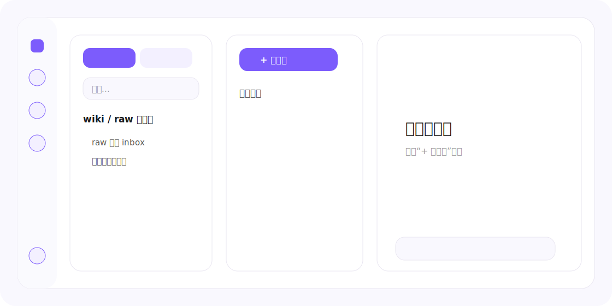
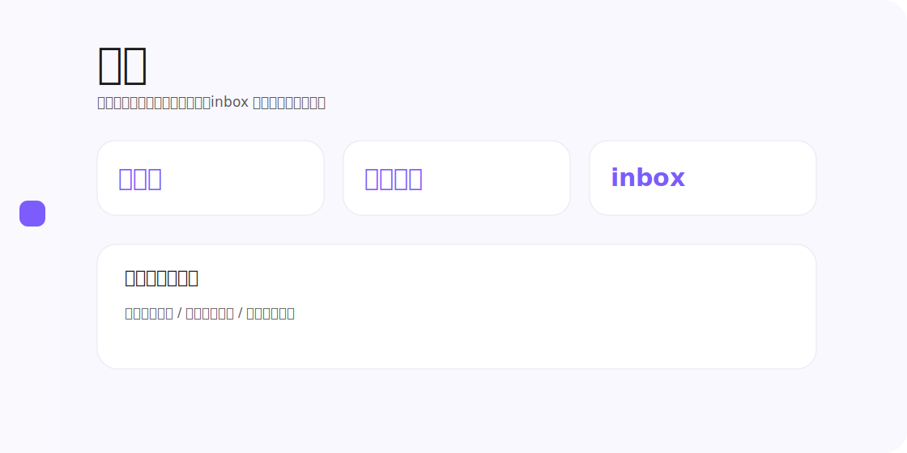
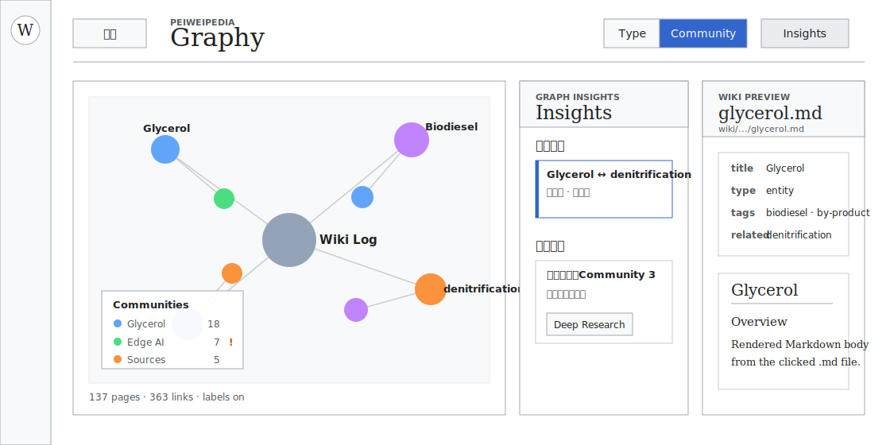
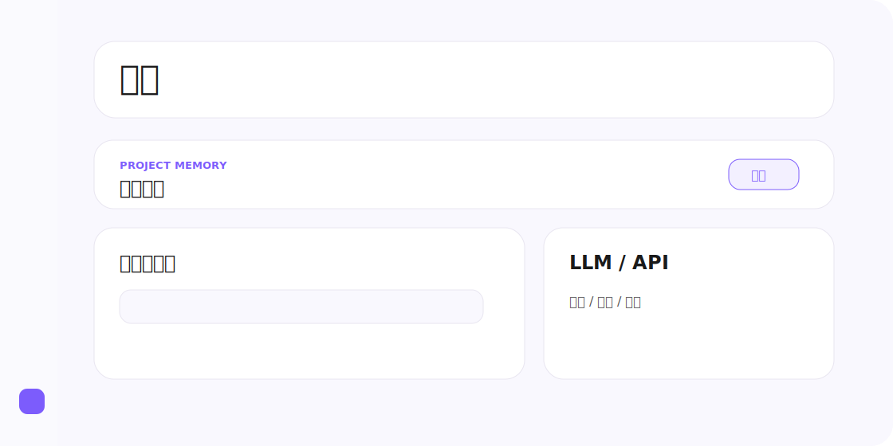

# LLM Wiki 项目日志

这份文档记录的是 **LLM Wiki 应用本身** 的当前界面、当前流程和搭建时间线。
它不是用户知识库里的 `log.md`，也不是 compile 产出的 wiki 内容。
---

## 现有界面

当前应用是 **Electron 桌面壳 + 本地 WebUI**。
桌面入口当前只支持 launcher 路线：桌面双击入口来自 `desktop-webui-launcher/`；`desktop-webui/` 只作为 launcher 启动的 Electron 运行时，不再承担正式打包发布。
线上 `llm-wiki.cn` 外层使用 Cloudflare Access 保护；Access 应用 `llm-wiki` 的会话时长当前为 `720h`，正常情况下同一浏览器 30 天内不需要重新收邮箱验证码。
线上 `llm-wiki.cn` 的 Wiki 页面复用桌面端 Wiki 渲染器和同一套 `/api/page`、`/api/tree`、`/api/search`、`/api/wiki-comments` 数据接口，不再使用旧的静态 Wiki 侧栏页面。
左侧固定导航栏负责进入独立页面；右侧主内容区按路由独立渲染
项目日志页本身不维护界面图；其余独DOM 页面各保留一张示意图
项目日志页当前采用单栏阅读布局，页面主体full-page 容器内独立纵向滚动，顶部固定一条轻量工具栏：向下滚动时工具栏仍可见。工具栏包含目录、全部评论、未解决、已解决。点击目录会在右侧展开可调整宽度的目录栏；选中文字后，选区旁会浮出“评论”按钮，点击后会高亮原文并打开右侧评论栏，评论支持编辑、删除、解决和按状态筛选
### 对话页


对话页保留文件浏览和消息流两条主线：

- 左侧导航栏：对话、闪念日记、自动化、源料库、wiki、系统检查、同步、审查、图谱、设
-  文件浏览区：支持 `wiki` / `raw层` 切换、搜索、文件树、选中模式
- 主工作区：会话列表、消息流、输入框
- Assistant 回答会保存本轮检索出的来源记录；正文里的 `[1]` / hidden cited 注释会筛出实际引用，并在消息下方按来源类型折叠展示稳定引用面板，点击 wiki 引用会打开右侧预览抽屉
- Assistant 消息提供“重新生成”和“保存至维基”；重新生成会删除最后一组 user/assistant 再重发，保存至维基会写入 `wiki/queries/*.md`，复制到 `sources/saved-queries/`，并触发 compile 纳入知识网络
- 对话顶部可配置历史上下文深度，默认 10 条，保存到每个会话；发送给 LLM 时只带当前会话最近 N 条 user/assistant 消息
- 对话持久化采用源项目下 `.llm-wiki/conversations.json` + `.llm-wiki/chats/{id}.json`，同时保留旧 `.chat/{id}.json` 和 `.llm-wiki/chat-history.json` 读取迁移
- Assistant 消息现在会渲染 Markdown 图片；来源 chip 会显示该引用页面包含的图片数量，图片路径通过本地媒体接口读取
- 可选右侧预览抽屉：点击文件后打开 Markdown 预览

### 闪念日记页


闪念日记页是独立的高频记录入口：

- 左栏：顶部固`十二个问题` `Memory` 两张卡片，下面按日期倒序显`raw/闪念日记` 的日记文件；左栏自身支持上下滚动
- 右栏：普通日记保持原Markdown 编辑区；选`Memory` 时切到渲染阅+ 评论侧栏模式
- `十二个问题` 对应真实文`wiki/journal-twelve-questions.md`，点击后按普Markdown 文档方式打开与保存；读取优先Cloudflare Remote Brain，同步保存时先写 cloud，再落本地镜- 支持“保存当前文档”显式按
-  `Memory` 继续使用单一真实文件 `wiki/journal-memory.md`；上半部分是“短期记忆（最7 天）”，下半部分是“长期记忆
- `Memory` 视图支持“刷Memory”和“评论”；短期记忆会在本地时间每`00:00` 自动刷新，错`00:00` 时会在下次启动或打开 Memory 时补
-  短期记忆不再按日期摘录最近几条，而是对最7 天从健康、学习、人际关系、爱情、财富、情绪与能量、近期重点与风险等角度做多维总结
- 左栏与卡片尺寸经过压缩，列表宽度、间距和卡片高度都比之前更紧- 评论区直接绑`wiki/journal-memory.md`
- 桌面端支持可配置全局快捷键，默认 `CommandOrControl+Shift+J` 打开快速录入小
### Workflow 页


Workflow 工作区现在拆成三条独立路由，直达这些路由时直接渲染 Workflow 页面，不再包在设置页侧栏里：
- `#/automation`：白底列表概览页，只负责搜索、筛选、查看状态、进入详情、进入日志。
- `#/automation/<id>`：详情页统一用紧凑 Mermaid 阶段图展示流程；每个节点只表示一个最小可执行单位，第一行显示动作本身，第二行优先显示实现落点，不再套“用户触发 / 系统处理 / 用户可见结果”三段大框。
- `#/automation-log/<id>`：单条 workflow 的运行日志页。
- 列表页当前按三个专题展示：`应用流程` 聚合显式 workflow 和应用 workflow；`信息流转流程` 说明输入信息如何读取页面、prompt、应用和源码状态，并写入页面、wiki 或 runtime；`源码真实流程` 展示人工审计源码后录入的 `code-derived` 真实 DAG。
详情页当前支持：

- Workflow 详情页采用一屏固定布局；长 Mermaid 图和页面热点流程只在图区域内部滚动，外层页面不再上下滑动。
- 设置页里的自动化 section 仍可嵌入同一套 Workflow 视图，并在面板内部管理自己的可视区域；在设置小窗里点击 Workflow 条目或日志只切换小窗内容，不改背景主路由；独立 `#/automation*` 路由不显示设置侧栏。
- 列表页和详情页都会订阅 `GET /api/automation-workspace/events`；当源码 flow sidecar、被审计的源文件，或相关 `automations / agents / .env` 配置变化时，页面会自动重拉。
- 详情页头部提供“返回 Workflow”按钮；显式 workflow 和应用流程仍保留“运行日志”入口，源码流程不显示运行日志按钮。
- 详情页头部右侧固定提供“评论”按钮；评论栏默认收起，点击后只展开右侧栏，关闭右侧栏会退出评论模式。
- Mermaid 节点直接显示“步骤标题 + 实现落点”；触发节点、判断节点、处理中节点和结果节点继续使用不同视觉样式。
- Mermaid 图不会额外生成 API 节点；当原流程节点自身包含 `GET/POST/... /api/...` 端点时，该节点会用不同颜色标出，表示这一流程步骤发生 API 消耗。
- code-derived flow、显式 workflow 和应用 workflow 统一走同一套 Mermaid 渲染，不再区分 DAG 画布与文档流。
- 当统一 `flow nodes / edges / branches` 结构无法表达真实边标签时，详情页允许直接消费源码侧手写 Mermaid；当前 `审查与运行结果` 就走这条直通链路，保留 `单条推进 / 确认写入 / 批量进行 / 全部写入 / 批量录入 inbox / 打开对话` 这些真实分支标签。
- `同步编译总览` 现在也走手写 Mermaid 原图；它和 `编译链路` 继续共存，前者负责 compile 端到端总览，后者负责 compile 内核执行单元。
- 当前所有 code-derived workflow 都已经切到源码侧手写 Mermaid：`Workflow 工作区`、`审查与运行结果`、`同步入口`、`源料库`、`闪念日记快速记录`、`同步编译总览`、`编译链路`、`执行记录器归档流程`、`执行沉淀文件流转`。
- `执行沉淀文件流转` 专门展示页面、运行时文件和长期文件夹的关系：工作台入口打开 `#/workflow-artifacts` 页面，页面通过 `/api/workflow-artifacts` 读取快照，服务端补齐 `.llmwiki/workflow-*.json` 运行时队列文件，并单独补齐 `资源库 / 资料验证记录 / 案例库 / 方法库` 这些长期 wiki 文件夹。
- Workflow 列表的专题归类不再只看源码来源：`sourceKind` 表示用户看到的专题。`信息流转流程` 说明输入信息如何流向产物、队列和沉淀位置；`源码真实流程` 说明按钮、快捷键、API、函数和文件写入之间的一串真实反应。因此 `执行记录器归档流程` 归入 `源码真实流程`，`执行沉淀文件流转` 仍归入 `信息流转流程`。
- sourceInsight 详情页统一采用规格说明结构：默认只显示全图 Mermaid 骨架，不展开右侧说明；点击图中节点后，节点高亮并打开右侧规格页。右侧上方显示当前节点说明，右侧下方显示 Prompt / Schema / 规则附录 tabs。节点标准不再以小标签挂在图上。
- 其余 workflow 的自动生成图也不再套自定义蓝橙绿 class 配色，而是统一回到和手写 Mermaid 原图一致的原生 Mermaid 颜色、布局和卡片尺寸。
- Mermaid 详情图现在默认在卡片内容区内水平居中；当图宽超过容器时，仍保留横向滚动，不再因为左贴边而在右侧留下大块空白。
- Mermaid 详情图现在支持持久图钉评论：进入评论模式后，可以直接点节点、连线或空白处落评论；评论会以图钉附着在图上，并在右侧评论面板里同步出现。
- 图钉支持拖动改位；如果 Mermaid 后续重排或原目标消失，评论仍保留在最后一次有效位置，不会因为图形变化被自动删除，只有显式删除才会移除。
- 长流程继续在单页滚动容器里展示，不再依赖内部画布拖拽、分支偏移微调或评论锚点模式。
### 工作台页

工作日志子页现在使用窄二级图标导航和窄文档目录树；工作台二级导航的折叠按钮固定在第一个图标卡片位置，其他页面入口依次排在下方。工作日志目录项会在工作台内切换选中文档，不再自动跳转到 Wiki 路由；正文区直接使用 Wiki 风格文章排版，但省略 Wiki 标题栏、工具页签、路径和更新时间，让文档正文直接开始。同一批 `领域.md`、`领域/<领域>.md`、`领域/<领域>/<项目>.md`、`领域/<领域>/<项目>/工作日志.md` 仍是源库稳定路径。工作台内默认可编辑并自动保存，同一文档仍可通过普通 Wiki 路由打开和引用。工作日志是任务记录页，不进入 compile 的知识来源抽取。

工作台页继续保留 `项目推进/ 任务计划/ 任务/ 工作日志 / 工具这组二级导航
其`工具子页当前已经从旧的三栏条目编辑器改为 dashboard 式页面：

- 顶部显示页面标题、说明、搜索框和项目头像区
- 中部上方使`工作/ 工具资产` 大切换按- 主区展示工作流卡片与工具资产卡片
- 右侧固定显`最近运行Agent` `收藏/ 快捷入口`
- 点`管理` 后通过弹层管理工作流或工具资产
- 数据主源`工具toolbox.json`，Markdown 工具条目legacy 资产继续展示
- `任务池` 子页新增 `列表视图 / 树状图` 双视图；树状图支持 `领域 / 项目 / 任务` 单层级切换、左侧筛选栏折叠、左右拖拽调宽、右侧画布缩放与纵向滚动
- `任务池` 树状图编辑模式支持直接改名；在领域节点按 `Enter` 会进入新增项目，在项目节点按 `Enter` 会新增子任务，在任务节点按 `Enter` 会新增同级任务；删除项目或领域时会把任务保留到 `待分组 / 未归类`，并且支持把任务拖到项目节点重新挂接；树上的未保存修改继续与任务计划页顶部的共享任务池草稿共用同一条显式保存边界
- `任务池` 顶部新增领域 chip 行，并额外提供 `健康` 领域入口
- `健康` 领域页聚焦睡眠：展示入睡时间、起床时间、深度睡眠质量、总睡眠时长、睡眠评分、清醒时长、睡眠平均心率、步数 / 活动量以及最近 7 天趋势
- `健康` 领域页提供 `导入小米运动健康数据` 弹层，支持手机号验证码连接、二维码登录生成 token，以及 token / API 高级连接，并通过本地 Python bridge 调用 `mi-fitness` SDK 完成连接与同步
- 健康导入重新暴露亲友共享 UID 输入；验证码连接、高级连接和二维码登录保存 token 后都会把该 UID 传给 mi-fitness 同步链路，用于读取亲友共享健康数据
- 当小米账号登录触发图形验证码风控时，导入弹层会直接显示验证码图片与输入框，不再把健康导入错误显示成乱码
- 当短信验证码已经发到手机、但小米登录流程还停在图形验证码阶段时，导入弹层现在可以在同一轮“登录并连接”里补齐 `ticketToken`，不要求用户先额外重发短信
- 当弹层里已经填入短信验证码时，图形验证码区域和底部状态会明确提示“直接点登录并连接”，避免用户被中间态按钮误导
- 健康导入弹层的默认账号入口现在是纯“手机号验证码连接”，不再显示历史遗留的密码输入框
- 当小米接口在“发送短信成功后、返回手机号信息失败”这一步报系统错误时，弹层现在按“短信已发出”的部分成功处理，不再把这类假失败挡在发送阶段
### 源料库页


源料库页`raw + sources_full` 的混合画册页，不复用对话页文件树
当前固定采用两行结构
- 第一行：筛选区保留搜索、排序、来源、标签、状态五个入口；来源`剪/ 闪念日记 / sources_full` 动态返回，标签按真`tags` 动态返回，状态`raw / source` 动态返- 第二行：画册式卡片流，首卡固定为“新增剪/ 日记- 源料卡片：固定三列画册布局，优先显示图片，没有图片时显示正文摘录；卡片中显示标题、`raw / source` 标记、桶类型、标签、日- 多选后出现批量工具条：导入对话、批ingest、加inbox、取消选择
- 多选工具条新增“批量删除- 查看原文：通过弹层直接编辑 Markdown，并支持关闭、保存、单条删
-  卡片底部动作改为图标按钮，不再显示纵向挤压的文字按钮
- 数据边界：页面主对象`raw/剪藏`、`raw/闪念日记` `sources_full`
- 搜索边界：源料库列表页只保留顶部搜索框作为卡片筛选入口；按设置页配置的页面内查找快捷键（默认 `Ctrl+F`）会聚焦该搜索框。打开单篇源料全屏预览后，同一快捷键才打开右上角当前页正文查找条。

### Wiki 页


Wiki 页是独立阅读入口，不复用对话页文件树
当前固定Wikipedia 风格浏览编译后的知识页，默认打开 `wiki/index.md`
Cloudflare Pages 公开入口现在挂载同一个 Wiki 页面渲染器，线上和桌面端在首页封面、文章页、个人展示页、搜索与评论入口上保持同一套界面结构。
公开入口通过 Remote Brain Worker 的 `GET /wiki/events` WebSocket 接收发布事件，不再按固定时间轮询 `/api/wiki-state`。当桌面端同步/编译完成并成功发布 Cloudflare 后，Worker 会广播 `wiki-published`，已打开的线上 Wiki 会自动重载当前页面和目录。
当前 `wiki/index.md` 不再走普通 article 阅读器，而是独立Peiweipedia 首页封面：顶Hero 会显示欢迎语、首页简介、条目数和分类数；左侧展示精选条目与按分类浏览，右侧展示最近更新、Graphy 和关于摘要
首页的统计、精选条目、最近更新、Graphy、分类浏览和关于摘要都来自真实 wiki 数据：条目和分类从 `/api/tree?layer=wiki` 统计，简介和关于从 `wiki/index.md` 的真实内容提取，精选条目从真实条目页中挑选，Graphy 从 `/api/wiki/graph` 读取按 wikilink 建边、再用直接链接方向、来源重叠、共同邻居和类型亲和加权的 sigma 图谱，不再显示写死的示例数字或文案
首页右侧 `Graphy` 标题现在可点击进入独立 Graphy 页面。
普通 Wiki 文章页顶部现在也固定显示页面级 Graphy；它请求 `/api/wiki/graph?path=当前页`，只保留当前页、直接相关条目以及这些条目之间的连接边，不展示全站无关节点，并直接显示这些节点的页面名称。
顶部搜索框走统一 `/api/search?scope=local`，普通 Wiki 页面内展示本wiki / raw / sources_full / 向量结果左Farzapedia 品牌图现在可点击进`wiki/about-me.md` 对应的个人展示页；这个页面不再走普article 模板，而是按独立个人主页布局渲染
搜索索引现在保留 Markdown 图片 alt text；视觉 caption 写入 alt 后，图片描述会参与关键词 / hybrid 检索。搜索结果会返回页面中的图片引用，并在结果顶部展示图片网格，优先显示 caption 命中的图片。
- `wiki/about-me.md` 对应专用 profile page：顶部品牌+ 页签、紧Hero、右侧统计卡、左侧成果库主板、右侧单张切换卡、底部代表能力区
- 个人展示页当前做了二次压缩：顶部栏、Hero、统计卡、成果卡和能力卡都比首版更紧凑，避免首屏信息被放大后挤出可视
-  首页右侧卡片右上角提供 `时间线 / 简历` 切换，只展示当前选中的内容，避免双卡在窄宽度下重叠
- 个人展示页页签固定`首/ 时间/ 成果/ 能/ 简历`
- 个人展示页支持原Markdown 编辑：顶部提`编Markdown / 保/ 取消`，直接写`wiki/about-me.md`；文字、统计和头像图片链接都通过这条链路维护
- 普wiki 文章页现在改为 Wikipedia 风格的正文右浮动图片框；图片不再占用独立右栏，而是嵌在正文流里，正文会环绕图片继续排版；当页面可编辑时，可直接上传或更换图片，图片文件会落`wiki/.page-media/`，并把 `side_image` 写回该页 frontmatter；如需图片下方说明文字，可在 frontmatter 里补 `side_image_caption`
- 普wiki 页面仍保持原Farzapedia 阅读器，不`about-me` 专页渲染逻辑影响

### 审查页


审查页是独立全宽页面，不沿用对话页布局
集中显示
- 系统检查待处理事项
- 同/ 编译失败
-  inbox 待处理原
-  闪念日记提交失败
-  需要用户确认的建议- 首屏只读取本地审查队列；联网补证建议不会阻塞页面加载，只会在用户点击左侧导航“系统检查”并且检run 结束后后台刷新缓
-  只有当前页存在可批量删除的同步失败项时，才显`全选本/ `批量删除` 工具；Deep Research-only 页面不再展示无效的选择工具
- 审查页当前不再默认挂右侧“工作区留存文件”面板；页面默认只显示待处理事项主队列，只有打开 Deep Research / 系统状态详情或指导录入时才临时展开右侧详情栏；如果当前只剩 1 条 inbox 原料，右侧会自动补全这条原料的详情与录入动作
- 工具`刷新` 在重新读取审查队列时会显示明确的“刷新/ 已刷/ 读取失败”状态，不再表现成无反馈点击

### 图谱页


Graphy 页是独立全宽页面，用于查看 wiki 页面之间的全局关系图。
它不显示对话页文件树，复用首页 Graphy 的 `/api/wiki/graph` 全站图谱；独立页会显示节点名称，图谱区域会铺满标题下方的剩余高度，页面左上角提供 `🔙 返回` 按钮，返回 Wiki 首页。顶部提供 `Type / Community` 切换：`Type` 按 frontmatter / 路径推断出的页面类型上色，`Community` 按 Louvain 知识簇上色；左下角图例显示类型或知识簇，知识簇图例会显示成员数，并对 `cohesion < 0.15` 且节点数不少于 3 的簇标 `!`。点击节点会用节点 `path` 请求 `/api/page?path=...&raw=0`，右侧打开该 Wiki Markdown 文件预览：上方展示 frontmatter 元信息，下方展示渲染后的正文。标题栏的 `Insights` 按钮显示当前可见洞察数量，打开后列出意外连接和知识空白；点洞察卡片会高亮相关节点，再点同一卡片取消高亮；意外连接可在本次会话中忽略；知识空白卡片可继续启动 Graphy Deep Research。Deep Research 会先读取 `overview.md` 与 `purpose.md` 让 LLM 优化研究主题和多条搜索词，用户确认后进入右侧 Research Panel；后端全局最多 3 个研究任务并发，Tavily 使用 advanced + raw content，合成过程通过 SSE 流式展示，`<think>` / `<thinking>` 块会折叠，保存 `wiki/queries/*.md` 后自动触发同步收录。
### 设置页


设置页采用“双导航 + 小窗”结构：点击全局导航栏的“设置”会打开居中的设置小窗口；直达 `#/settings/...` 时仍可作为独立设置页渲染。设置页左侧采用 Obsidian 风格分组，顶部“选项”放置 `LLM 大模型`、`应用`、`自动化`、`仓库与同步`、`第三方插件`、`快捷键`、`项目日志`；下方再按 `核心插件` 和 `第三方插件` 两个标题列出已安装插件名称，点击插件名进入该插件详情页。设置页内各分区共享同一套字体、标题、图标按钮和开关尺寸规格。
设置页当前包含：

- 仓库与同步：集中显示本地仓库配置、同步结果、编译情况、运行进度条、最新日志，以及同步运行中的暂停 / 取消 / 刷新控制；数据导入区包含小红书、微信聊天记录、闪念笔记、抖音、B 站、小宇宙、RSS 和 X 来源卡片，其中“闪念笔记”是独立外部应用导入入口，不跳转到闪念日记页。
- LLM 大模型：旧默认模型、账号池、CLIProxyAPI 代理转接和厂商配置列表已从首屏移除；页面当前显示“提供商 / 已添加 N 个提供商 / 添加提供商”，点击“添加提供商”会打开自定义 provider 表单；添加成功或读取到已有账号后，会在下方显示 provider 卡片，卡片标题中的粗体值使用表单 ID。选中 ChatGPT OAuth 或 Gemini OAuth 时，表单会切换到授权模式并隐藏 API 字段，认证成功并通过连通测试后才新增 OAuth provider。provider 卡片上的配置、删除 / 断开、展开收起都已接到真实操作；卡片里的“聊天模型”实际是绑定到该 provider 账号的应用，点击“+ 添加聊天模型”会创建应用并打开应用配置弹窗。Cloudflare Workers AI 也作为环境变量托管的 provider 显示在这里，并标注当前可用的嵌入模型；绑定到 `cloudflare:workers-ai` 的聊天应用会走 Cloudflare provider 运行。
- 应用：应用配置区改为 Agent 卡片列表；点击应用卡片或“新建 Agent”会打开弹窗，弹窗内维护资料、模型、workflow 和 System prompt，保存仍写回 `agents/agents.json`。
- 网络搜索配置：外网搜索状态已合并进 `LLM 大模型` 页的网络搜索 API 卡片，卡片位于提供商列表下方，通过状态灯和“刷新 / 测试”按钮展示真实可用性；接口连通但本次测试没有返回结果时仍显示可用状态，只有真实接口错误才标红。
- 插件：原 `插件 / MCP` 占位页改为 `插件` 页，采用 Obsidian 风格的设置布局；顶部 `第三方插件` 是社区插件总设置页，提供安全模式、社区插件市场、插件安装情况、自动更新开关和第三方已安装插件列表。左侧 `核心插件` / `第三方插件` 分组下展示具体插件名称，点击名称进入该插件详情页，并提供搜索、刷新、目录、设置、快捷入口、卸载和启停开关。核心插件列表包含 `SMART CLI` 和 `AI 原生 CLI`；`SMART CLI` 对应已有 `smartclip-mcp` 网页剪藏能力，详情页提供可编辑的 SmartClip 设置地址、外部设置入口、地址复制、使用步骤、检查清单和注意事项；桌面端打开 `chrome-extension://` 地址时会优先启动系统默认浏览器，取不到默认浏览器时才回退 Chrome / Edge，避免 Windows 协议处理弹出 Microsoft Store；`AI 原生 CLI` 定义为“执行能力（CLI）+ 标准连接（MCP）+ 使用说明（Skills）”的本地万能插件入口；点击 `AI 原生 CLI` 的安装入口会展开 Codex、Claude Code、OpenClaw、Hermes 目标选择，并显示 Windows 与 macOS/Linux 的一键安装命令。
- 原 `Vector Search / Embedding` 独立设置页已移除；嵌入模型统一回到 `LLM 大模型` 的 provider 卡片中展示。
- 同步结果面板：同步完成后显示已同步、已编译、未同步、未编译数量；编译情况面板独立展示 compile 阶段百分比和日志。
- 快捷键配置：独立页面不再显示顶部说明卡片；列表记录“闪念日记快速记录”“页面内查找”“执行记录器”“工作台保存”四项快捷键，输入框聚焦后按下组合键会自动填入，点击“保存快捷键”写回桌面端配置。
- 项目日志入口

### Publish 页
Publish 页是独立Cloudflare Remote Brain 操作页，不复用对话页四栏布局；入口已从全局导航移动到设置页的“云同步”二级导航中
- 页面展示 Cloudflare Remote Brain 状态、Remote MCP endpoint 提示、Push / Pull / Publish 三个按钮和结果区
- 未配置时明确提示需`CLOUDFLARE_WORKER_URL` `CLOUDFLARE_REMOTE_TOKEN`

---

## 现有流程

下面描述的**当前真实运行流程**，不是理想流程
### 首次启动与初始化

1. 桌面应用启动后先判断本地配置状态。
2. 如果未配置、配置损坏、账号标识缺失、目标仓库不存在、源文件夹为空，或目标仓库 `.llmwiki/workspace.json` 的 owner 与当前账号标识不一致，进入欢迎页 / 初始化配置页。
3. 首次登录时，用户可以填写账号标识（邮箱或手机号）+ 密码，也可以点击微信登录；目标仓库与同步源文件夹确认后，应用先在目标仓库写入或校验 `.llmwiki/workspace.json`。
4. 通过校验后，桌面端把 `sync-compile-config.json` 的 `runtime_output_root` 写成账号 + workspace 作用域目录，避免不同用户共享 runtime 缓存和编译状态。
5. 初始化后的同步与编译在后台执行，不阻塞主界面停留在初始化页。
6. 后续启动如果配置和 workspace owner 校验有效，则直接进入主界面。
7. 后续登录如果本地已保存目标仓库与同步源文件夹，初始化页只显示账号登录字段，隐藏目标仓库与同步源文件夹两块，并复用本地配置里的路径。
### 账号与同步空间归属

1. Cloudflare Remote Brain 现在提供账号服务接口：`POST /auth/register`、`POST /auth/login`、`POST /auth/session`。
2. 注册和登录当前支持邮箱或手机号 + 密码；微信登录通过 Worker 生成小程序扫码挑战，桌面端或网页端显示二维码，小程序确认后换取同一套 account session。
3. 登录成功后返回 session token；桌面初始化页可以走“登录已有账号 / 注册新账号”或“微信登录”，旧 app config 如果没有 session 会回到未登录 / 未配置状态。
4. 已登录账号可以调用 `POST /account/sync-location/save` 保存 workspace 与同步位置；当前最短同步后端只支持 `local_directory`，只保存用户自配置位置元信息，数据仍留在用户自己选的目录。
5. 桌面端登录后会把目标仓库 `.llmwiki/workspace.json` 的 owner 绑定到云端账号 id，并把 `sync-compile-config.json` 的 runtime 缓存放进账号 + workspace 作用域目录。
6. 同步脚本如果拿到 `CLOUDFLARE_ACCOUNT_SESSION_TOKEN` 和 `CLOUDFLARE_WORKSPACE_ID`，会优先调用 `/user/publish` 与 `/user/mobile/entries*`，不再要求大众客户端共享 `CLOUDFLARE_REMOTE_TOKEN`。
7. Worker 仍保留旧 `/publish`、`/mobile/*` + `REMOTE_TOKEN` 作为现有管理员 / 开发兼容路径；大众化客户端走 `/user/*` session 路由。
8. 发布包新增清理检查：公开包目录不能包含 `.runtime`、`.env`、`.secrets`、cookie、token、`sync-compile-config.json`、`app-config.json`、`raw`、`wiki`、`sources_full` 等本地私有数据。
### 同步入口

1. 用户点击左侧导航栏“同步”2. 应用先调`/api/intake/scan`，检`raw/剪藏`、`raw/闪念日记` `inbox`3. 如果没有新源料，也没`inbox` 待处理项，则提示“未检测到新源料”，不启动同步4. 如果检测到新源料，弹出“新源料检测”弹窗5. 如果存在可批量录入项，继续显示批量录入方案表；用户确认后才启动后台同步编译6. 同步结果进入运行日志，并由审查页聚合关键问题
### 手机端 Cloudflare 同步

当前大众化路径统一走 `/user/mobile/*` 与 `/user/media/upload`：登录后的客户端使用账号 session token，Worker 从 session 推导账号与 `ownerUid`，并按 `account + workspace` 前缀读取 wiki。Android 工程 `D:\Desktop\安卓 llm wiki` 已接入账号登录、session 版核心同步、聊天、AI Provider 保存、Codex OAuth、任务、共享文档、链接预览和媒体上传；旧 `/mobile/*` + `REMOTE_TOKEN` 仅保留为管理员 / 开发兼容路径，不应进入公开 APK / EXE。
1. 手机端只负责输入、阅读、聊天和轻量设置，不负责 compile。
2. 手机端登录邮箱、手机号或微信账号后保存同一套 account session；未登录时公开功能提示先登录账号，不再要求管理员 Remote Token。
3. 手机端把原始输入写入 `/user/mobile/entries`，Worker 强制把 `ownerUid` 改成 session 账号 id，落到 D1 `mobile_entries`，状态为 `new`。
4. 当前手机端固定支持两类写入：`flash_diary` 闪念日记、`clipping` 剪藏。
5. 手机端附件通过 `/user/media/upload` 写入账号作用域下的 `MEDIA_BUCKET` key；上传失败时文字记录仍会写入，并在正文中保留附件失败提示。
6. 电脑端同步编译开始时通过 `/user/mobile/entries/pending` 拉取当前账号待同步手机输入，拉取后按类型落入本地 raw 队列。
7. 本地落盘成功后，电脑端通过 `/user/mobile/entries/status` 标记 `synced`；失败则标记 `failed` 并写入错误。
8. compile 成功后，电脑端把本地 `wiki/**/*.md` 发布到账号 + workspace 作用域；手机端通过 `/user/mobile/wiki/list` 与 `/user/mobile/wiki/page` 只读浏览。
9. Cloudflare wiki 发布入口会读取项目 `.env` 里的 `GLOBAL_AGENT_HTTP_PROXY` / `GLOBAL_AGENT_HTTPS_PROXY`，单独触发发布和应用内同步使用同一条代理链路。
10. 手机端“对话”页通过 `/user/mobile/chat/list`、`/user/mobile/chat/send` 与 Codex direct 子路由读写会话；聊天的 wiki 上下文只读取当前账号绑定 workspace 下的页面。
11. 设置页的 API Provider、Codex OAuth、Codex quota、Cloudflare quota、任务复盘、共享文档和手动配图生成都走账号 session 路由，服务端会覆盖请求体中的旧 `ownerUid`。
### 源料
1. 用户点击左侧导航栏“源料库”2. 页面调用 `GET /api/source-gallery`，`raw/剪藏`、`raw/闪念日记` `sources_full` 统一聚合成同一套卡片数据3. 页面首屏调`GET /api/source-gallery`，同一条接口同时返回画册卡片`来/ 标/ 状态` 三组动态筛选项4. 搜索框继续接入统一 `/api/search?scope=local`，用本地搜索结果过滤和排序当前画册结果；来源、标签、状态筛选会与搜索条件同时生效5. 画册第一张卡片固定为“新增剪/ 日记”：
   - 选择“剪藏”后，带链接会由桌面端按需启动 `smartclip-mcp`，调用 SmartClip 扩展的 `clip_page` 提取网页 Markdown，再写`raw/剪藏`；无链接仍写`raw/剪藏` 笔记入口
   - 选择“日记”后，直接写`raw/闪念日记`
6. 其他卡片统一展示   - 图片预览或正文摘   - 标题
   - `raw / source` 层级标记
   - 桶类型（剪/ 闪念日记 / sources_full   - 标签
   - 日期
7. 点击“查看原文”后，打开预览弹层，展示渲染后的正文和原始 Markdown8. 多选卡片后会出现批量工具条   - `导入对话`：把选中的路径注入对话页输入区上下文
   - `批ingest`：写`.llmwiki/source-gallery-batch-ingest.json`
   - `加inbox`：把选中的源料复制`inbox/source-gallery/...`
   - `批量删除`：直接删除选中markdown 源料文件
9. 点击卡片底部图标动作后：
   - `查看原文`：打开编辑弹层，直接修改当Markdown；保存后立即写回源文   - `加inbox`：单条复制`inbox/source-gallery/...`
   - 弹层右上角提供关闭和单条删除按钮
10. 即`raw/剪藏` compile 成功后被移动`_已清理`，已同步`sources_full` 的同名源料仍然会继续出现在源料库里
### Workflow 工作区

1. 用户点击左侧导航栏“Workflow”。
2. 列表页调用 `GET /api/automation-workspace`，按配置态把显式 workflow 和应用 workflow 放入“应用流程”，并在“全部 Workflow”里额外展示“信息流转流程”和“源码真实流程”两个专题。
3. 点击 workflow 主体后进入 `#/automation/<id>` 详情页；点击“运行日志”后进入 `#/automation-log/<id>`。
4. 详情页调用 `GET /api/automation-workspace/<id>`；后端继续返回统一的 normalized flow 数据，用来承载显式 workflow、app workflow、information flow 和 code-derived flow。
5. 前端把 flow 转成 Mermaid `flowchart TD` 紧凑图；每个节点只对应一个最小可执行单位，节点第二行优先显示 `implementation` 实现落点，方便直接反查该改哪里。
6. information flow 当前收录“信息流转流程”，用于标注输入信息进入了什么触发器、读取了什么页面或 prompt、生成了什么内容、最终放到哪里，以及关联了什么应用。
7. code-derived flow 当前收录已经人工审计并能明确定位源码入口的流程，例如：同步入口、同步编译总览、编译链路、闪念日记快速记录、Workflow 工作区、源料库、审查与运行结果。
8. 如果节点引用应用但应用本身没有模型，节点文案会显示“跟随默认模型 · {provider} / {model}”；没有应用的纯代码节点不显示模型标签。
9. 日志页调用 `GET /api/automation-workspace/<id>/logs`，单独展示这一条 workflow 的历史运行记录；code-derived flow 和 information flow 不显示运行日志按钮。
10. 列表页和详情页会同时订阅 `GET /api/automation-workspace/events`；后端监听源码 flow sidecar、其对应源码文件、`automations/automations.json`、`agents/agents.json`、`.env`，一旦变化就发 `change` 事件，前端收到后自动重拉当前视图。
### 批量录入compile

当compile 已改**内部多批次、外部单次最终发*
#### 外层同步脚本

1. 读`sync-compile-config.json`
2. 确认源目录配置；如未配置则弹目录选择
3. 获live `.llmwiki/lock`，避免并compile
4. 检查源目录库存   - Markdown 数量
   - Markdown 附件数量
5. 同Markdown `target_vault/sources_full`
6. 同步Markdown 附件`target_vault/sources_full/附件副本（非Markdown）`
7. 读`.llmwiki-batch-state.json`
8. 闪念日记自动进入 compile 候选时，额外遵守日记专属规则：
   - 只考虑“前一天”的日记
   - 只在“当天早上的第一次同步”里自动纳入
   - 今天的日记、前天及更早的历史日记，不会被这条自动规则再次带compile
   - 同一天早上如果第一次同步已经消耗过这次自compile 资格，后续再次同步也不会重复带入昨天日记
9. `batch_limit + batch_pattern_order` 选出本次所有内部批10. 创`.llmwiki/staging/<runId>/`
11. 所有内batch 都staging 中运行，不直接改 live `wiki/`
12. 全batch 成功后，才一次性发staging 到正`wiki/` `.llmwiki/`
13. 只有发布成功后，才：
   - 更`completed_files`
   - 清理允许清理的剪藏原文到 `_已清理`
   - 写`.llmwiki/final-compile-result.json`
14. 发布本wiki 只读结果Cloudflare Remote Brain `wiki_pages`
15. 最后释lock

#### 内batch compile 内核

每个内部 batch 固定执行
1. `sources_full` 选择当前批次文件
2. 把这批文件复制到 staging `sources/`
3. 运`node dist/cli.js compile`
4. 为每个源生成 `wiki/summaries/*.md`，summary 页带 `brief`、原始 source 引用和后续概念反链
5. 读取已有 `wiki/concepts/*.md` 的 `brief/summary`，把已有概念列表放进抽取 prompt，避免新源孤立编译
6. 基于 source summary 抽取概念和 candidate claims
7. 合并语义记`claims / concepts`，概念页 frontmatter 的 `sources` 指向对应 summary 页
8. 自动补双向链接：summary 页链接 `[[concepts/*]]`，概念页链接 `[[summaries/*]]`
9. 从重复 workflow claims 提升出程序记`procedures`
10. 更staging 中的   - `.llmwiki/state.json`
   - `.llmwiki/claims.json`
   - `.llmwiki/procedures.json`
11. 重staging 下`wiki/index.md` `wiki/MOC.md`

#### 最终发布语
- live `wiki/` 在整run 成功前保持旧版本
- 任batch 失败时，不发布半成品
- 用户最终只看到一compile 结果，不暴露中间批次产物

### 四层记忆模型

当compile 维护四层记忆
#### 工作记忆

- 载体：`sources_full/`、staging `sources/`
- 含义：最新原始源料与当前批次工作
#### 源摘要记忆

- 载体：`wiki/summaries/*.md`
- 含义：单篇源料压缩后的 durable summary、`brief`、原始 source 引用，以及指向相关概念页的反链

#### 语义记忆

- 载体：`wiki/concepts/*.md`、`.llmwiki/claims.json`
- 含义：跨源料合并后的稳定事实、模式、结
#### 程序记忆

- 载体：`wiki/procedures/*.md`、`.llmwiki/procedures.json`
- 含义：从重复语义中提取出的工作流与操作模
### claim 生命周期

当claim 不是“永远同权”，而是带生命周期：

- `confidence`：有多少来源支持、是否有矛盾、最近确认时
-  `retention`：这条知识是否仍应摆在前
-  `status`  - `active`
  - `contested`
  - `superseded`
  - `stale`

系统已经支持
- **Supersession**：claim 替代claim
- **Retention decay**：长时间未访/ 未强化会降低留存
-  **Page access reinforcement**：只要用户真正打开概念页、程序页或情景页，就会刷新对claims `lastAccessedAt`，retention 重置为高值；因遗忘变`stale` claim 会恢复为 `active`

### 亲自指导录入

1. 用户把暂时不想批量处理的材料放入 `inbox`
2. 审查页显`inbox` 待处理项
3. 用户点击“亲自指导录入”，应用跳转到对话页，并自动选中对`raw/inbox` 文件作为上下4. 用户AI 讨论内容重点
5. 用户说“可以录入了”或类似指令后，应用   - 生`wiki/inbox/<标.md` 总结   - 追加应用 / 仓库日志
   - 把inbox 文件移动`inbox/_已录入`

### 闪念日记页
#### 页面内编/ Memory 浏览

1. 用户点击左侧导航栏“闪念日记2. 应用进入 `#/flash-diary`
3. 左栏先显示固`Memory` 卡片，再拉`raw/闪念日记` 下的日记文件列表，按日期倒序展示
4. 自动打开今天或最新一篇日5. 用户在右栏直接编辑原Markdown，点击“保存当前日记”后立即回raw 文件
6. 如果用户点`Memory`，右栏切`wiki/journal-memory.md` 的渲染页；页面上半部分显示“短期记忆（最7 天）”，下半部分显示“长期记忆7. 短期记忆会在本地时间每`00:00` 自动刷新；如果应用错`00:00`，则会在下次启动或下次打开 Memory 时补8. `Memory` 视图继续显示评论面板入口；评AI 自动解决会直接写回这wiki 源文
#### 全局快捷记录

1. 用户在桌面端按设置页配置的“闪念日记快速记录”快捷键，默`CommandOrControl+Shift+J`
2. Electron 弹出独立的小型“闪念日记”录入窗3. 用户输入文字，可附加图片 / 视频，也可以切到“记入剪藏”并填写链接与备注
4. 点击“提交”后，闪念日记继续调`/api/flash-diary/entry`
5. 剪藏无链接时写`api/source-gallery/create` 文本笔记；剪藏有链接时由桌面端启动 `smartclip-mcp`，通过 SmartClip 扩展提取 Markdown，再写`api/source-gallery/create`
6. 服务端检`raw/闪念日记/YYYY-MM-DD.md`
7. 如果当天文件不存在则创建；如果存在则把新条目插入顶部
8. 同时将图/ 视频复制`raw/闪念日记/assets/YYYY-MM-DD/`；剪藏附件会附加到对应剪藏 Markdown
9. 提交成功后，小窗提示“提交完成”并关闭；主窗口收到刷新事件

#### 失败进入审查

1. 如果闪念日记写入失败，原始文本、附件路径、目标日期和错误信息会写`.llmwiki/flash-diary-failures.json`
2. 审查页聚合`flash-diary-failure` 类型待处理项
3. 卡片中保留原始内容预览和失败原因
4. 用户点击“重试写入闪念日记”后，服务端重新提交；成功则从失败队列移
### 审查与运行结
1. 系统检查和同步都通过左侧导航触发，默认不切页
2. 运行结果run manager 记录
3. 对于同步任务，运行结束后会补一**final compile result** 摘要，而不是只依赖中间批次日志
4. final compile result 同时输出 `synced / compiled / not synced / not compiled` 状态计数，设置页“仓库与同步”会把这些计数展示为结chip
5. 对于系统检查任务，后端统一执`node dist/cli.js lint`
6. 当前系统检查固定覆盖：
   - 坏双`broken-wikilink`
   - 无出链页`no-outlinks`
   - 坏引`broken-citation`
   - 图/ 视/ 附件来源不可追溯 `untraceable-image` / `untraceable-video` / `untraceable-attachment`
   - 缺摘`missing-summary`
   - 空/ 薄`empty-page`
   - 重复概念 `duplicate-concept`
   - 孤立`orphaned-page`
   - 过claim `stale-claim`
   - 低置信度 claim `low-confidence-claim`
7. 审查页聚合：
   - 系统检查问   - 同/ 编译失败
   - inbox 待处   - 闪念日记提交失败
   - 需要确认的建议8. 审查页首屏不会主动联网补全；只有用户点击左侧导航“系统检查”，并在检run 完成后，后台才会刷新联网补证建议缓存
9. Deep Research `全部进行` / 卡片主动作只负责后台准备草案，并把事项推进`done-await-confirm`
10. 只有用户点`确认写入` / `全部写入` 后，补引用或改写草案才会真正写回 source vault 页面；未确认前再次检查，原始缺失引用仍会继续lint 发现
11. 对于 `新来源已取代的过时表述`，`确认写入` 还会同步刷新匹配 claim 的生命周期状态，`.llmwiki/claims.json` 中对应记录`lastConfirmedAt / retention / status` 更新为最新确认值，避免下一次系统检查按同一stale claim 原样再次报出
12. 审查页读summary 时会自动回填旧`发起改写草案` 留下的遗留项；如果页面正文已经存在匹配的历史改写草案块，系统会补刷对stale claim 的生命周期，并把重复生成`新来源已取代的过时表卡片直接收口为已完成
13. 如果系统检run 失败，审查页失败卡片会优先显示真lint 问题行和汇总计数，并过`DeprecationWarning` / `process exited with code 1` 这类无行动价值的噪音尾部提示
14. 对于 `需要网络搜索补证的数据空白`，`确认写入` 现在会同步刷新匹claim `supportCount / confidence / lastConfirmedAt / retention`，避免已确认的低置信度结论在下一次系统检查里原样再次报出
15. 审查页读summary 时也会自动回填旧版已确认过`Deep Research草案` 遗留项；如果页面正文已经存在匹配草案块，系统会补刷对应低置信claim，并把重复生成的 `需要网络搜索补证的数据空白` 卡片直接收口为已完成
16. 系统检查在扫`[[wikilink]]` `^[citation]` 时，会忽fenced code block（```markdown / ```json）里的演示内容，不再把代码块中的草稿链接或示例引用误判成真实断链
17. `fill-chinese-aliases` wiki alias 生成现在会同时吸收三类别名来源：混合标题里的英文前缀、嵌入```markdown 原frontmatter，以及页面正文开头紧接着的二frontmatter；对已有同义页面的断链，可先批量回alias 再重新运行系统检18. `llmwiki lint` 现在会先跑一轮确定autofix prepass：仅针对 `broken-wikilink` `untraceable-*` 候选，自动执行 alias 回填、示例语法改写、以及基`.llmwiki/link-migrations.json` 的桥接页创建；只有在 rerun 后对应错误真正消失的修复才会计为 `applied`，最终系统检查结果只保留未收口的问题，并在运行日志里追加一段自动修复摘
### 搜索入口

1. 当前所有搜索统一收口`/api/search`
2. `/api/search` 支持三`scope`   - `local`：只查本wiki / raw / sources_full / 向量索引
   - `web`：只查真实外部搜provider
   - `all`：同时返回本地结果和联网结果，但两者分桶显示，不做黑箱混排
3. 对话页本地上下文仍优先来自文章引用与本地知识库；开启联网补充时，聊天后端通过统一搜索编排器请`scope=web`
4. 审查页遇到“补/ 新来/ 引用缺失 / 外部信息”类事项时，也通过统一搜索编排器请`scope=web`
5. 源料库搜索框通过 `scope=local` 调统一搜索入口，再用结path 过/ 排序画册卡片
6. Wiki 页顶部搜索框通过 `scope=local` 调统一搜索入口，并Farzapedia 页面内展示结7. 联网搜索和本地搜索现在逻辑分开，但都通过同一搜索入口返回结构化结8. `scope=web` 不再回退Worker `/search`；如果没有配置真`CLOUDFLARE_SEARCH_ENDPOINT`，`web` bucket 明确返回未配置状9. `GET /api/search/status` 暴露当前搜索能力状态；设置页“外网搜索状态”卡片会显示真实外部搜provider 是否可用

### 项目日志维护

1. 只要应用界面、流程、同/ compile / 录/ 审查逻辑发生用户可见变化，就必须更新本文2. “现有界面”和“现有流程”允许改写，必须反映当前真实状3. “时间线”只允许追加，不改写旧记4. `compile` 属于核心流程，任何涉compile 架构、发布语义、记忆模型、结果输出方式的变化，都必须在这里落5. 项目日志页右侧固定显示“工作区留存文件”面板：按项目分组列出当前工作区内的留存文件，并标注“建议删/ 建议保留”；用户可直接在 WebUI 上删除选中文件或目
### Cloudflare 远端能力

1. Remote Brain Worker 已部署到 Cloudflare，当前支持：
   - `status`
   - `push`
   - `publish`
   - `pull`
   - `llm`
   - `ocr`
   - `transcribe`
   - `embed`
   - `vector/query`
   - `search`
   - `media/upload`
2. `pull` 已改cursor 分页；桌面端会循环拉取直到没`nextCursor`
3. `search` 当前Worker 内部混合检索：
   - D1 关键词检   - Vectorize 语义检   - RRF 融合
4. Remote Brain `publish` 当前已改为双通道   - Worker 负责页面、索引写D1 / R2
   - 桌面端本地直接通过 Cloudflare Vectorize REST API 写入向量，避Worker binding upsert 格式兼容问题
5. 对话页和审查页已经接`searchWeb`
6. 当前对话页和审查页不再直接各自调`searchWeb`，而是统一`/api/search` 对应的搜索编排器
7. 当`.env` 未配`CLOUDFLARE_SEARCH_ENDPOINT` 时，`scope=web` 明确显示外网搜索未配置，不再调Worker 内部检索冒充公网联网搜8. 图OCR 已切`@cf/meta/llama-3.2-11b-vision-instruct`，真实样本已能提取文9. 音频转写使用 `@cf/openai/whisper`，真实样本已能输出转写文10. 手机端输入、Wiki 只读阅读、附件上传和对话聊天都已经收口到同一Cloudflare Worker：`/mobile/entries*`、`/mobile/wiki/list`、`/mobile/chat/*`、`/media/upload`
11. 手机`web / hybrid` 聊天依赖 Worker 侧配`CLOUDFLARE_SEARCH_ENDPOINT`；未配置时，联网搜索不会伪装成可
---

## 时间线

### [2026-05-02 20:25] 对话多会话持久化补齐原功能

- 修改内容：对话记录从 runtime 目录收口到源项目 `.llm-wiki/`，会话索引与每个会话消息分文件保存；旧 `.chat/{id}.json` 和 `.llm-wiki/chat-history.json` 都会读取迁移。
- 修改内容：对话页新增每会话历史深度输入，保存到会话数据；引用面板的 wiki 引用可直接打开预览抽屉。
- 修改内容：`保存至维基` 不再只归档回答，会同步写入 `wiki/queries/` 与 `sources/saved-queries/`，随后触发 compile，让回答进入后续知识抽取链路。
- 验证结果：聚焦对话 / 审查 / 源料库测试通过，完整检查见本轮任务最终结果。

### [2026-05-02 20:10] MiniMax provider 认证迁移到 Anthropic Messages

- 修改内容：MiniMax provider 从 OpenAI-compatible `/v1/chat/completions` 切到源项目一致的 Anthropic Messages `/anthropic/v1/messages` 链路，并使用 `Authorization: Bearer` 认证。
- 修改内容：WebUI LLM provider 保存与连通性测试现在把 MiniMax URL 写入 `MINIMAX_BASE_URL`，API key 仍写入 `MINIMAX_API_KEY`；旧的 `LLMWIKI_OPENAI_BASE_URL` 仍可被 runtime 读取。
- 验证结果：`rtk test npx vitest run test/provider-factory.test.ts test/llm-config.test.ts`、`rtk test npx vitest run test/web-settings-page.test.ts -t "infers NVIDIA provider settings"`、`rtk tsc --noEmit`、`rtk test npm run build` 通过。

### [2026-05-02 19:47] LLM provider 添加不再卡在处理状态

- 修改内容：LLM 大模型添加 API 账号时，本地保存和默认账号切换不再等待账号 Worker 云同步完成；云同步改为后台执行，避免网络慢或 Worker 不通时弹窗一直显示“正在处理提供商”。
- 修改内容：账号 Worker 请求增加 10 秒超时；provider 连通性测试增加 15 秒超时，外部 API 卡住时会返回可读失败原因，不再无限处理。
- 影响范围：设置页 LLM provider 添加、默认模型账号保存、账号云同步。
- 验证结果：`rtk test npx vitest run test/llm-routes.test.ts test/llm-config.test.ts`、`rtk tsc --noEmit` 通过。

### [2026-05-02 19:40] LLM provider 增补 NVIDIA 与百炼等 API 入口

- 修改内容：LLM 大模型设置页新增 NVIDIA NIM、阿里云百炼中国站 / 美国 / 国际站、OpenRouter、Perplexity、Mistral、Morph、LM Studio 等 OpenAI-compatible API 账号入口。
- 修改内容：后端 provider 默认表补齐对应 base URL、默认模型和路径归一化规则；百炼会归一化到 `/compatible-mode/v1`，再通过现有 `/chat/completions` 连通性测试验证。
- 影响范围：设置页 LLM provider 列表、API 账号保存、默认模型来源、连通性测试。
- 验证结果：`rtk test npx vitest run test/llm-config.test.ts test/llm-routes.test.ts`、`rtk tsc --noEmit` 通过。

### [2026-05-02 20:18] ChatGPT OAuth 启动失败提示可读化

- 修改内容：设置页把 `codex_oauth_device_start_failed` 翻译成可行动中文提示，避免直接显示内部错误码。
- 修改内容：Cloudflare Worker 的 Codex 设备授权码启动失败会返回真实 HTTP 状态和错误文本，例如 `Codex device code HTTP 429: rate_limited`。
- 验证结果：`npx tsc --noEmit`、相关 Vitest、`npm run build`、`npm --prefix web run build`、`npm test`、`fallow` 通过；本地 WebUI 已重启。`npm run deploy` 在 Wrangler 阶段卡住超时，已停止进程，Worker 侧需后续单独部署。

### [2026-05-02 20:05] ChatGPT OAuth 授权码固定显示

- 修改内容：设置页添加自定义提供商时，`ChatGPT OAuth` 返回的设备授权码会固定显示在弹窗内，并提供复制和打开授权页入口。
- 修改内容：OAuth 轮询改为优先使用后端返回的 `pollIntervalSeconds`，避免固定 2 秒轮询过快导致设备 token 429。
- 验证结果：`npx tsc --noEmit`、`npx vitest run test/web-settings-page.test.ts`、`npm run build`、`npm --prefix web run build`、`npm test`、`fallow` 通过。

### [2026-05-02 19:23] 执行沉淀图直接展示案例库流转

- 修改内容：`执行沉淀文件流转` 的 Mermaid 图从抽象的“运行时队列 / 长期文件夹”骨架，改为直接展示“输入来源 → 案例库刷新 / 执行记录器 → 问题信号检测 → 写入案例库文件 → 重建 index → 标记状态”。
- 修改内容：节点说明同步改为案例库流转节点，明确 `raw/闪念日记`、历史回忆、个人时间线和执行记录器如何进入 `wiki/个人信息档案/案例库/*案例.md`。
- 验证结果：`rtk test -- npx vitest run test/automation-workspace-routes.test.ts test/workflow-artifacts-routes.test.ts`、`rtk tsc --noEmit` 通过。

### [2026-05-02 19:21] 执行沉淀文件流转纳入案例库

- 修改内容：`执行沉淀文件流转` 将 `案例库` 纳入长期沉淀文件夹，与资源库、资料验证记录、方法库一起展示。
- 修改内容：`/api/workflow-artifacts` scaffold 现在会补齐 `wiki/个人信息档案/案例库/index.md`，使案例库成为执行沉淀页可见的长期去处。
- 影响范围：执行沉淀文件流转 sidecar、Workflow Artifacts API、执行沉淀路由测试、自动化 workspace 测试、项目日志。
- 验证结果：`rtk tsc --noEmit`、`rtk test -- npx vitest run test/workflow-artifacts-routes.test.ts test/automation-workspace-routes.test.ts test/project-log-doc.test.ts`、`rtk proxy npm run build`、`rtk test -- npm test`、`rtk proxy fallow` 通过。

### [2026-05-02 19:20] 对话回答避免空内容兜底

- 修改内容：OpenAI-compatible provider 现在会读取字符串正文和 `{ type, text }` content blocks，流式 delta 也按同一规则拼接，避免代理返回块数组时被当成空回答。
- 修改内容：Cloudflare provider 现在同样会读取 OpenAI-compatible `choices[0].message.content`、content blocks，以及 Workers AI 流式最终 `result.response`，避免 Cloudflare Workers AI 聊天返回被误判为空。
- 修改内容：对话生成可见回答预算从 1200 提高到 4000，降低 GPT-5/Codex 推理预算挤占导致无可见输出的概率。
- 验证结果：`rtk test npx vitest run test/cloudflare-service-adapters.test.ts test/openai-provider.test.ts`、`rtk test npx vitest run test/web-llm-chat.test.ts test/openai-provider.test.ts`、`rtk test npx tsc --noEmit`、`rtk test npm run build`、`rtk test npm --prefix web run build`、`rtk err fallow` 通过；本地 API 用 Cloudflare Workers AI 真实生成返回非空文本；`rtk test npm test` 仍有既有 `automation-workspace-routes.test.ts` 断言期望旧文案失败。

### [2026-05-02 19:18] compile 补齐 source summary 与概念反链

- 修改内容：compile 现在先为每个源生成 `wiki/summaries/*.md`，再用 summary 内容和已有概念 brief 做概念抽取；概念页 `sources` 指向 summary 页。
- 修改内容：summary 页自动追加 `[[concepts/*]]`，概念页自动追加 `[[summaries/*]]`，让单篇源料通过 summary、概念、index、log 进入长期 wiki 状态。
- 验证结果：`rtk tsc --noEmit`、`rtk proxy npm run build`、`rtk test npm test`、`rtk proxy fallow` 通过。

### [2026-05-02 19:05] Graphy Deep Research 补齐流式任务流

- 修改内容：Graphy Deep Research 后端新增全局 3 并发任务队列；流式接口 `/api/wiki/graph/research/stream` 会持续返回排队、搜索、合成、保存和索引刷新状态。
- 修改内容：Tavily 搜索请求改为 `advanced` 并开启 `include_raw_content`，归一化结果优先使用 `raw_content`；Graph Research 合成上下文不再截断搜索正文。
- 修改内容：Graphy 页新增 Research Panel，用户确认研究主题后实时显示搜索状态、流式合成内容、可折叠 thinking 块和最终保存路径。
- 验证结果：`npx tsc --noEmit`、`npm run build`、`npm --prefix web run build`、`npm test`、`fallow` 通过。

### [2026-05-02 18:56] 设置页新增本地向量检索管理

- 修改内容：设置页 LLM 区新增“本地向量检索”卡片，可视化管理启用开关、Embedding endpoint、API Key、Embedding model、chunk 字符数和 overlap 字符数。
- 修改内容：新增 `/api/search/vector-config` 读取/保存配置，配置写入项目 `.env` 并即时同步当前进程；新增 `/api/search/vector-test` 用于测试 embedding endpoint。
- 修改内容：`/api/search/status` 现在返回本地向量检索状态，设置页会显示当前是否启用、endpoint host 和模型。
- 验证结果：`rtk tsc --noEmit`、`rtk test npx vitest run test/search-routes.test.ts test/search-hybrid.test.ts test/local-vector-search.test.ts`、`rtk err npm run build`、`rtk err fallow` 通过。

### [2026-05-02 18:50] 对话检索复刻本地多阶段流水线

- 修改内容：本地搜索改为旧版 llm_wiki 口径的 tokenized search，补齐英文停用词、中文 CJK bigram、文件名/标题/正文短语与 token 加权打分。
- 修改内容：向量搜索改为默认关闭的本地 LanceDB chunk 索引，开启后通过 OpenAI-compatible embeddings endpoint 写入 `.llm-wiki/lancedb/wiki_chunks_v2`，按页面聚合 chunk 命中并与 token 结果做 RRF 融合。
- 修改内容：聊天上下文补齐图扩展、purpose/index/编号 Wiki 页面和预算控制；页面正文按预算装入，回答继续使用 `[1]` 形式引用。
- 验证结果：`rtk tsc --noEmit`、`rtk err npm run build`、`rtk err fallow` 通过；`rtk test npm test -- --run` 剩余 1 个既有 Tavily 请求形状测试失败，失败文件为 `src/services/cloudflare-web-search.ts` 的未归属改动。

### [2026-05-02 18:42] 本地摄入补齐多格式结构化抽取

- 修改内容：`llmwiki ingest` 对本地 DOCX / PPTX / PDF / XLSX / XLS / ODS 不再只写占位说明；现在会先抽取结构化 Markdown，再进入 sources 与 compile 流程。
- 修改内容：DOCX 保留标题、粗体、斜体、列表和表格；PPTX 按 slide 输出标题与列表；表格文件按 sheet 输出 Markdown 表；PDF 走文本抽取，文档内嵌图片继续落 `sources/media/`。
- 修改内容：本地图片、视频、音频可直接 ingest，文件会复制到 `sources/media/<slug>/`，Markdown 中写入图片引用或原生 audio/video 标签；结构化文档抽取结果写入源文件同级 `.cache/<文件名>.txt`。
- 验证结果：`npx tsc --noEmit` 通过；`npm test -- document-image-ingest` 通过。

### [2026-05-02 18:36] 设置小窗内 Workflow 导航不再切背景页

- 修改内容：Workflow 列表、详情和日志视图新增可选内部导航回调；独立路由继续使用 hash，设置页自动化 section 使用内部重挂载。
- 修改内容：在设置小窗中点击 Workflow 条目或日志时，不再把背景主页面切到 `#/automation*`，而是在小窗内部显示对应详情或日志。
- 影响范围：设置小窗自动化 section、Workflow 列表/详情/日志导航、设置页测试。
- 验证结果：`rtk test npm test -- test/web-settings-page.test.ts -t "workflow workspace"` 通过。

### [2026-05-02 18:35] 对话多会话持久化与回答归档补齐

- 修改内容：聊天存储迁移到 `.llm-wiki/conversations.json` 和 `.llm-wiki/chats/{id}.json` 分离格式，读取旧 `.chat/{id}.json` 时自动迁移，单会话消息最多保存最近 100 条。
- 修改内容：LLM 上下文只发送当前会话最近 `maxHistoryMessages` 条 user/assistant 消息，默认 10 条；assistant 引用随消息持久化，前端按来源类型折叠展示。
- 修改内容：Assistant 消息新增重新生成和保存至维基入口；重新生成会移除最后一组 user/assistant 后重发，保存至维基写入 `wiki/queries/*.md` 并刷新 wiki 索引。
- 影响范围：对话存储、聊天接口、对话页消息操作、审查页创建 seeded chat 的测试路径。
- 验证结果：`rtk tsc --noEmit`、`rtk test npm run build`、`rtk test npm test`、`rtk err fallow` 通过。

### [2026-05-02 18:15] Workflow 路由脱离设置页外壳

- 修改内容：`#/automation`、`#/automation/<id>` 和 `#/automation-log/<id>` 现在直接挂载 Workflow 列表、详情和日志页，不再通过设置页自动化 section 间接渲染。
- 修改内容：保留设置页内的自动化 section 嵌入能力，但独立 Workflow 路由不再显示设置侧栏，避免从设置小窗进入自动化时出现设置页套设置页的覆盖状态。
- 影响范围：Workflow 独立路由、主内容区路由测试、项目日志当前界面说明。
- 验证结果：`rtk test npm test -- test/web-main-slot.test.ts` 通过。

### [2026-05-02 17:54] Graphy Insights 旧交互补齐

- 修改内容：Graphy Insights 规则按旧项目口径收紧，结构页 `index / log / overview` 不进入意外连接和孤立页噪声，桥接节点需连接至少 3 个社区，弱连接参与 surprise score。
- 修改内容：Insights 按钮显示可见洞察数量；意外连接卡片新增会话内忽略按钮；再次点击已选卡片会取消节点高亮。
- 影响范围：Graphy 洞察规则、Graphy 右侧洞察面板、图谱页样式和对应测试。
- 验证结果：`rtk tsc --noEmit`、`rtk npm run build`、`rtk npm test`、`rtk proxy fallow` 通过。

### [2026-05-02 17:50] Graphy 知识簇图例接入

- 修改内容：`/api/wiki/graph` payload 增加 Louvain community 列表，包含成员数、top nodes 和 cohesion；社区 id 按簇大小重新编号，保证图例稳定。
- 修改内容：Graphy 独立页新增 `Type / Community` 上色切换和左下角图例；Community 图例显示成员数，低 cohesion 且节点数不少于 3 的簇标 `!`。
- 影响范围：Graphy 服务端图谱 payload、首页/独立页 Sigma 渲染、图谱页项目日志示意图。
- 验证结果：`rtk tsc --noEmit`、`rtk npm run build`、`rtk npm test`、`rtk proxy fallow` 通过。

### [2026-05-02 17:49] Graphy 洞察高亮去除黑色放射边

- 修改内容：Graphy Insights 高亮边不再用近黑色渲染所有单端关联边；现在只有两端都属于当前洞察范围的边才加粗为蓝色，单端关联边仅保留浅蓝低透明提示。
- 影响范围：Graphy 独立页 Insights 卡片高亮、首页/独立页 Sigma 高亮 reducer、Graphy 渲染回归测试。
- 验证结果：`rtk test npx vitest run test/wiki-home-graph-render.test.ts test/graph-page.test.ts test/graph-insights.test.ts`、`rtk npx tsc --noEmit`、`rtk test npm --prefix web run build`、`rtk npm run build`、`rtk test npm test`、`rtk fallow`、`rtk fallow fix --dry-run`、`rtk fallow fix --yes`、`rtk test npx vitest run test/project-log-doc.test.ts` 通过。

### [2026-05-02 17:43] 本地文档摄入接入自动抽图

- 修改内容：`llmwiki ingest <local-file>` 现在支持 `.docx`、`.pptx`、`.pdf`，摄入时会把可识别的内嵌 raster 图片保存到 `sources/media/<source-slug>/`，并在生成的 Markdown 中插入图片引用。
- 修改内容：Office 文档通过 ZIP 容器读取 `word/media` / `ppt/media`；PDF 当前保守支持常见内嵌 JPEG/PNG stream，不做整页渲染。
- 影响范围：CLI 本地文件摄入、文档图片抽取、图片检索链路上游、对应测试。
- 验证结果：`rtk tsc --noEmit`、`rtk npm run build`、`rtk npm test`、`rtk proxy fallow` 通过。

### [2026-05-02 17:32] 图片 caption 接入搜索与问答展示

- 修改内容：新增图片 caption pipeline，按图片字节 SHA-256 缓存 caption，并把 caption 写回 Markdown 图片 alt text；搜索索引不再丢弃 Markdown 图片 alt text，会把 caption 作为可检索正文，并把页面图片引用写入搜索结果。
- 修改内容：Wiki 搜索结果新增图片网格；聊天 Markdown 新增图片渲染，assistant 来源记录会持久化引用页面的图片列表并显示图片数量。
- 影响范围：搜索索引、搜索 API、Wiki 搜索页、聊天消息渲染、聊天来源持久化、项目日志。
- 验证结果：`rtk tsc --noEmit`、`rtk npm run build`、`rtk npm test`、`rtk proxy fallow` 通过。

### [2026-05-02 17:14] Wiki 页面级 Graphy 不再覆盖正文

- 修改内容：普通 Wiki 文章页顶部的页面级 Graphy 舞台补齐相对定位、固定高度和 overflow 裁剪，Sigma canvas 会被限制在 Graphy 框内，不再盖到正文或表格上。
- 影响范围：Wiki 页面级 Graphy 样式、页面级 Graphy 测试、项目日志。
- 验证结果：`rtk test -- npm test -- test/wiki-page-graph-render.test.ts test/web-wiki-page.test.ts test/project-log-doc.test.ts`、`rtk tsc --noEmit`、`rtk test -- npm --prefix web run build`、`rtk test -- npm run build`、`rtk test -- npm test`、`rtk run "fallow"` 通过。

### [2026-05-02 17:08] Graphy 高亮不再丢失节点坐标

- 修改内容：Graphy 节点高亮的 reducer 现在保留原始节点和边数据，再覆盖颜色、尺寸和标签状态，避免 Sigma 刷新时丢失 `x/y` 坐标导致页面运行时错误。
- 影响范围：Graphy 高亮逻辑、Graphy 渲染测试、项目日志。
- 验证结果：`rtk test -- npm test -- test/wiki-home-graph-render.test.ts test/graph-page.test.ts test/project-log-doc.test.ts`、`rtk tsc --noEmit`、`rtk test -- npm --prefix web run build`、`rtk test -- npm run build`、`rtk test -- npm test`、`rtk run "fallow"` 通过。

### [2026-05-02 16:41] Graphy 洞察面板接入独立图谱页

- 修改内容：独立 Graphy 页标题栏新增 `Insights` 入口，接入已有 graph insights / graph research 模块；图谱加载后会计算意外连接和知识空白，点击洞察卡片会高亮相关节点，知识空白可发起 Deep Research。
- 修改内容：Graphy insight / research 模块从未接入死代码变为页面实际路径，并拆分多条件判断函数，使 `fallow` 的 dead-code 与 complexity 项归零。
- 影响范围：Graphy 页面、Graphy 洞察面板、Graphy Deep Research 弹窗、Graphy 页面样式、Graphy 页面测试、项目日志图谱页示意图。
- 验证结果：`rtk test npx vitest run test/graph-page.test.ts test/web-page-cache.test.ts test/project-log-doc.test.ts`、`rtk npx tsc --noEmit`、`rtk npm run build`、`rtk test npm --prefix web run build`、`rtk test npm test`、`rtk fallow` 通过。

### [2026-05-02 14:43] Graphy 四信号权重收口

- 修改内容：Graphy 相关度配置固定为 directLink `3.0`、sourceOverlap `4.0`、commonNeighbor `1.5`、typeAffinity `1.0`，并补齐 entity/concept、concept/synthesis、concept/concept、source/source 类型亲和表。
- 修改内容：Graphy 可视化边只由真实 `[[wikilink]]` 创建；来源重叠、Adamic-Adar 共同邻居和类型亲和只给已有边加权，不再凭共同来源生成额外可视化边。
- 验证结果：`npm test -- test/wiki-graph.test.ts`、`npx tsc --noEmit`、`npm run build`、`npm test` 通过；`fallow` 仍失败在既有 `graph-insights.ts` / `graph-insights-panel.ts` dead-code 和 complexity 项。

### [2026-05-02 14:18] 普通 Wiki 页页面级 Graphy 显示节点名称

- 修改内容：普通 Wiki 文章页顶部的页面级 Graphy 打开节点标签，不再只显示圆点和连线。
- 影响范围：页面级 Graphy Sigma 配置、页面级 Graphy 测试、项目日志 Wiki 页示意图。
- 验证结果：`rtk test -- npm test -- test/wiki-page-graph-render.test.ts`、`rtk tsc --noEmit`、`rtk test -- npm test -- test/web-wiki-page.test.ts test/project-log-doc.test.ts`、`rtk test -- npm --prefix web run build`、`rtk test -- npm run build`、`rtk test -- npm test` 通过；`rtk run "fallow"` 被当前工作区已有未接入 `web/client/src/pages/graph/graph-insights*.ts` 和 `setWikiHomeGraphHighlights` 未使用导出阻塞。

### [2026-05-02 14:10] Graphy 节点打开 Wiki 预览

- 修改内容：独立 Graphy 页点击节点后，会根据节点 `path` 拉取对应 Wiki 页面，并在右侧显示文件路径、frontmatter 元信息和渲染后的 Markdown 正文。
- 修改内容：`/api/page` 的 Markdown renderer 改用 YAML 解析 frontmatter，使 `tags`、`sources`、`related` 等多行数组能被预览面板真实显示。
- 影响范围：Graphy 页面、Graphy 挂载回调、Markdown 页面渲染器、Graphy 页面样式、Graphy 页面测试、页面 API 测试、项目日志图谱页示意图。
- 验证结果：`rtk test npx vitest run test/web-page-cache.test.ts test/graph-page.test.ts test/project-log-doc.test.ts`、`rtk npx tsc --noEmit`、`rtk npm run build`、`rtk test npm --prefix web run build`、`rtk test npm test`、`rtk fallow` 通过；`rtk tsc -p web/tsconfig.json --noEmit` 仍有既有 web 类型错误，本次改动文件过滤检查无新增错误。

### [2026-05-02 12:34] Graphy 独立页移除底部空白

- 修改内容：Graphy 独立页的图谱容器改为占满标题栏下方剩余高度，不再被固定 `620px` 高度限制，避免窗口较高时页面底部出现大块空白。
- 影响范围：Graphy 页面样式、Graphy 页面测试、项目日志图谱页示意图。
- 验证结果：`rtk test -- npm test -- test/graph-page.test.ts`、`rtk tsc --noEmit`、`rtk test -- npm --prefix web run build`、`rtk test -- npm run build`、`rtk test -- npm test`、`rtk run "fallow"` 通过。

### [2026-05-02 12:29] Graphy 独立页显示节点名称

- 修改内容：独立 Graphy 页挂载图谱时改用全标签模式，节点圆点旁会显示 wiki 页面名称。
- 修改内容：首页 Graphy 小卡片继续使用稀疏标签，避免首页右栏被文字挤满。
- 影响范围：Graphy 页面、Graphy 挂载配置、Graphy 页面测试、项目日志。
- 验证结果：`rtk test -- npm test -- test/graph-page.test.ts test/web-main-slot.test.ts test/wiki-home-graph-render.test.ts`、`rtk tsc --noEmit`、`rtk test -- npm --prefix web run build`、`rtk test -- npm run build`、`rtk test -- npm test`、`rtk run "fallow"` 通过。

### [2026-05-02 12:25] 首页 Graphy 标题跳转独立图谱页

- 修改内容：Wiki 首页右侧 `Graphy` 标题改为链接，点击进入 `#/graph`。
- 修改内容：新增独立 Graphy 页面，复用首页全站 Graphy 图谱，并提供 `🔙 返回` 按钮回到 Wiki 首页。
- 影响范围：Wiki 首页、Graphy 页面路由、主内容渲染、Graphy 页面样式、路由和页面测试、项目日志图谱页示意图。
- 验证结果：`rtk test -- npm test -- test/web-router.test.ts test/web-main-slot.test.ts test/web-wiki-page.test.ts test/wiki-home-graph-mount.test.ts test/wiki-home-graph-render.test.ts`、`rtk test -- npm --prefix web run build`、`rtk tsc --noEmit`、`rtk test -- npm run build`、`rtk test -- npm test`、`rtk run "fallow"` 通过。

### [2026-05-02 12:16] SMART CLI 设置入口优先使用系统默认浏览器

- 修改内容：桌面端打开 `chrome-extension://` SmartClip 设置地址时，先读取 Windows 默认浏览器并保留注册表启动参数后启动该浏览器，因此豆包浏览器设为系统默认浏览器时会优先打开豆包浏览器。
- 修改内容：找不到系统默认浏览器启动命令时，才继续尝试 Chrome / Edge；设置页失败提示改为引导用户确认豆包浏览器是否已设为系统默认浏览器。
- 影响范围：SMART CLI 设置入口、Electron main 打开浏览器桥、设置页文案、桌面壳测试、设置页测试、项目日志。
- 验证结果：`rtk test -- npx vitest run test/web-settings-page.test.ts test/desktop-webui.test.ts test/project-log-doc.test.ts`、`rtk test -- npm --prefix desktop-webui run build`、`rtk npx tsc --noEmit`、`rtk npm run build`、`rtk test -- npm test` 通过；`rtk run "fallow"` 仍被既有图谱页 `web/client/src/pages/graph/index.ts` 未被入口引用阻塞。

### [2026-05-02 12:14] 普通 Wiki 文章页顶部接入页面级 Graphy

- 修改内容：普通 Wiki 文章页在正文上方新增 Graphy 区块，复用页面级 `/api/wiki/graph?path=...` 数据。
- 修改内容：页面 Graphy 只显示当前页、直接相关条目和连接边；搜索结果、缺页和错误状态会清空该区块。
- 影响范围：Wiki 普通文章页、页面级 Graphy 挂载、Wiki 页面样式和 Wiki 页面测试。
- 验证结果：`rtk test -- npm test -- test/web-wiki-page.test.ts test/wiki-graph.test.ts test/wiki-home-graph-render.test.ts`、`rtk test -- npm --prefix web run build`、`rtk test -- npm --prefix desktop-webui run build`、`rtk tsc --noEmit`、`rtk test -- npm run build`、`rtk test -- npm test`、`rtk run "fallow"` 通过。

### [2026-05-02 12:01] SMART CLI 设置地址可编辑并由 Chrome/Edge 打开

- 修改内容：`SMART CLI` 详情页的 SmartClip 设置地址改为可编辑输入框，用户可以粘贴自己的 `chrome-extension://...` 设置页地址，并保存到本机浏览器存储。
- 修改内容：桌面端新增专用打开浏览器内部地址的桥，遇到 `chrome-extension://` 会直接尝试启动 Chrome / Edge，不再调用系统默认协议导致 Microsoft Store 弹窗。
- 修改内容：详情页增加“使用默认地址”，打开和复制操作都使用当前输入框里的地址。
- 影响范围：设置页 SMART CLI 详情、Electron preload / main 桥、设置页测试、桌面壳测试、项目日志。
- 验证结果：`rtk test -- npx vitest run test/web-settings-page.test.ts test/desktop-webui.test.ts test/project-log-doc.test.ts`、`rtk test -- npm --prefix desktop-webui run build`、`rtk npx tsc --noEmit`、`rtk npm run build`、`rtk test -- npm test` 通过；`rtk run "fallow"` 当前被既有未追踪 `web/client/src/pages/wiki/page-graph.ts` 与 `web/server/services/wiki-graph.ts` 死代码/复杂度问题阻塞。

### [2026-05-02 11:44] SMART CLI 详情页改为外部配置入口

- 修改内容：`SMART CLI` 插件详情页改为专用说明页，提供 `打开 SmartClip 设置`、`复制设置地址`、使用步骤、SmartClip 检查清单和注意事项。
- 修改内容：页面明确 SmartClip 的属性、图床、Vault 和 MCP 配置由外部 SmartClip 扩展管理，LLM Wiki 只在剪藏链接时调用已有 `smartclip-mcp` 能力。
- 影响范围：设置页插件详情、SMART CLI 外部配置入口、设置页测试、项目日志。
- 验证结果：`rtk test -- npx vitest run test/web-settings-page.test.ts test/project-log-doc.test.ts`、`rtk npx tsc --noEmit`、`rtk npm run build`、`rtk test -- npm test`、`rtk run "fallow"` 通过。

### [2026-05-02 11:17] 设置小窗显示核心插件列表

- 修改内容：设置小窗左侧不再隐藏 `核心插件` / `第三方插件` 分组，`SMART CLI` 可以直接从小窗左栏进入详情页。
- 修改内容：设置小窗左侧栏改为可滚动，避免插件列表较长时底部项目不可见。
- 影响范围：设置小窗左栏、核心插件入口、设置页测试、项目日志。
- 验证结果：`rtk test -- npx vitest run test/web-settings-page.test.ts test/project-log-doc.test.ts`、`rtk npx tsc --noEmit`、`rtk npm run build`、`rtk test -- npm test`、`rtk run "fallow"` 通过。

### [2026-05-02 11:10] SMART CLI 接入核心插件

- 修改内容：设置页 `核心插件` 分组新增 `SMART CLI`，作为已有 `smartclip-mcp` 网页剪藏能力的核心插件入口。
- 修改内容：点击 `SMART CLI` 会进入插件详情页，详情说明其通过 SmartClip 扩展提取网页 Markdown。
- 影响范围：设置页插件列表、插件详情页、设置页测试、项目日志。
- 验证结果：`rtk test -- npx vitest run test/web-settings-page.test.ts test/project-log-doc.test.ts`、`rtk npx tsc --noEmit`、`rtk npm run build`、`rtk test -- npm test`、`rtk run "fallow"` 通过。

### [2026-05-02 17:15] 对话回答保存并展示检索来源

- 修改内容：聊天生成前会把本轮本地 wiki 检索页、选中页面和联网结果统一编号，写入 prompt 的 source list / wiki pages，并要求模型用 `[1]` 形式引用和 hidden cited 注释声明实际使用来源。
- 修改内容：Assistant 消息新增 `references` 持久化字段；流式和非流式回复都会把同一轮来源记录保存到 `.chat` 会话文件，重启后不重新搜索也能显示当时来源。
- 修改内容：聊天消息渲染会隐藏 `<!-- cited: ... -->`，按 cited 编号筛选来源，并在回答下方展示来源 chip。
- 影响范围：对话生成链路、聊天消息持久化、对话页消息渲染、项目日志。
- 验证结果：`rtk proxy npx vitest run test/web-llm-chat.test.ts test/web-chat-store.test.ts test/chat-routes.test.ts test/chat-message-markdown.test.ts test/web-chat-page.test.ts --reporter=dot`、`rtk tsc --noEmit` 通过。

### [2026-05-02 10:59] 设置插件导航对齐 Obsidian

- 修改内容：设置左栏顶部“选项”新增 `第三方插件` 总设置页，进入后显示社区插件安全模式、市场、安装情况、自动更新和第三方已安装插件列表。
- 修改内容：左栏下方改为 `核心插件` / `第三方插件` 两个标题分组，分组下直接列出插件名称；点击插件名称进入该插件详情页。
- 修改内容：插件详情页复用现有插件动作，`AI 原生 CLI` 详情页仍可展开目标工具和一键安装命令。
- 影响范围：设置页小窗、插件设置左栏、插件详情页、设置页测试、项目日志。
- 验证结果：`rtk test -- npx vitest run test/web-settings-page.test.ts test/project-log-doc.test.ts`、`rtk npx tsc --noEmit`、`rtk npm run build`、`rtk test -- npm test`、`rtk run "fallow"` 通过。

### [2026-05-02 10:42] Wiki 首页右栏加入 Graphy 图谱

- 修改内容：`wiki/index.md` 首页封面右栏在“最近更新”和“关于”之间新增 Graphy 面板。
- 修改内容：新增 `/api/wiki/graph`，读取 `wiki` Markdown、过滤 `type: query`、解析 wikilink 和 `sources`，用 graphology 去重建图、按直接链接 / 来源重叠 / Adamic-Adar / 类型亲和计权，并用 Louvain + ForceAtlas2 生成社区和布局。
- 修改内容：首页 Graphy 使用 sigma 渲染，节点颜色、边标签、字号、labelDensity、stagePadding 等显示参数对齐现有图谱配置。
- 影响范围：Wiki 首页、Wiki 图谱接口、WebUI 依赖、项目日志 Wiki 示意图。
- 验证结果：`rtk err npm --prefix web exec tsc -- --noEmit`、`rtk err npm --prefix web run build`、`rtk test npm test -- test/wiki-graph.test.ts`、`rtk test npm test -- test/web-wiki-page.test.ts` 通过。

### [2026-05-02 10:39] 设置页统一字体和图形尺寸

- 修改内容：设置页和设置小窗统一使用同一套字体、标题层级、正文大小、SVG 图标、图标按钮和开关尺寸变量。
- 修改内容：统一规则放在设置样式末尾覆盖各设置分区原本分散的字号和图形尺寸，不改变设置页 DOM 或业务交互。
- 影响范围：设置页、小窗设置入口、插件设置面板、项目日志。
- 验证结果：`rtk test -- npx vitest run test/web-settings-page.test.ts test/project-log-doc.test.ts`、`rtk npx tsc --noEmit`、`rtk npm run build`、`rtk test -- npm test`、`rtk run "fallow"` 通过。

### [2026-05-02 10:39] 工作日志内嵌正文移除冗余 Wiki 顶栏

- 修改内容：工作日志内嵌 Wiki 视图不再显示 `PEIWEIPEDIA`、页面标题、副标题、`打开 wiki`、`Article / Read` 页签、路径和更新时间。
- 修改内容：工作日志正文仍保留 Wiki article 排版和默认可编辑保存，正文区域从顶部直接显示文档内容。
- 影响范围：工作台工作日志页、工作日志页面样式、工作台页面测试、项目日志。

### [2026-05-02 10:31] 工作日志页内复用 Wiki 排版并默认可编辑

- 修改内容：工作日志目录点击改为工作台内切换文档，不再把当前路由改到 `#/wiki/...`。
- 修改内容：工作日志正文区改用 Wiki 风格页面壳和 article 渲染，同一 `领域/...` 源文档默认 `contenteditable`，输入后仍通过工作日志保存接口写回源库路径。
- 影响范围：工作台工作日志页、工作日志页面样式、工作台页面测试、项目日志。

### [2026-05-02 10:30] 快速剪藏接入 SmartClip MCP

- 修改内容：桌面快速剪藏在发现链接后按需启动 `smartclip-mcp`，通过 MCP stdio 调 SmartClip 的 `clip_page`，由浏览器扩展打开并提取网页 Markdown。
- 修改内容：SmartClip 返回内容后写入现有 `api/source-gallery/create`，保留 `source_url`、用户备注和本地附件；无链接剪藏与闪念日记路径不变。
- 修改内容：Electron 退出前会停止 SmartClip MCP 子进程；应用不写 `.mcp.json`，也不保存 SmartClip Session Token。
- 验证结果：`rtk npx tsc --noEmit`、`rtk npm run build`、`rtk test npm test`、`rtk err npx fallow fix --dry-run` 通过。

### [2026-05-02 10:20] 设置入口改为小窗并默认核心插件

- 修改内容：全局导航栏“设置”不再直接切到整页路由，而是打开居中设置小窗口；关闭后恢复左侧导航高亮到原路由。
- 修改内容：设置小窗口复用现有设置页，左侧导航改为 Obsidian 风格分组；普通设置项放在顶部，`核心插件` 和 `第三方插件` 独立成插件入口。
- 修改内容：插件页删除顶部 `PLUGINS / 插件` 介绍卡片，内容区域铺满，默认进入 `核心插件` 列表。
- 影响范围：设置入口、设置页左侧导航、插件页默认筛选、设置页样式、设置页测试、项目日志。
- 验证结果：`rtk test -- npx vitest run test/web-settings-page.test.ts test/web-main-slot.test.ts test/web-rail.test.ts`、`rtk npx tsc --noEmit`、`rtk npm run build`、`rtk test -- npm test`、`rtk run "fallow"` 通过。

### [2026-05-02 10:01] 工作日志打通 Wiki 页面壳但不进入 compile

- 修改内容：工作日志文档从应用工程目录迁到 source vault 的稳定 `领域/...` 路径，保留领域 / 项目 / 工作日志四层结构。
- 修改内容：`/api/workspace/docs` 改用 Wiki 的 `readPagePayload` 返回 Markdown 渲染结果，工作日志页点击目录项跳转到 `#/wiki/<path>`，不再维护工作台内的独立正文编辑器。
- 修改内容：`领域.md` 与 `领域/...` 页面纳入同一个 `/api/page` 保存接口、同一个 `/api/tree?layer=wiki` 目录和同一个本地搜索索引；保存工作日志后会刷新搜索索引。
- 边界说明：工作日志不是 Wiki 结论的知识来源，不加入 `sources/` 变更检测，也不参与 compile 抽取 / 总结。
- 影响范围：工作台工作日志页、Wiki 目录、Wiki 页面保存、搜索索引、工作日志路由测试、项目日志。
- 验证结果：`rtk test -- npx vitest run test/web-workspace-docs-route.test.ts test/web-page-save.test.ts test/web-workspace-page.test.ts test/web-tree.test.ts` 通过。

### [2026-05-02 09:54] 执行记录器归档流程改为图文分层规格页

- 修改内容：`执行记录器归档流程` 详情页重构为左侧主流程图、右侧节点说明、右侧附录 tabs 的规格页结构。
- 修改内容：主 Mermaid 图只保留 A1/B1/C1 等编号骨架和关键分支，不再显示长函数名、标准说明、prompt 或 schema。
- 修改内容：删除 Mermaid 节点上的“标准”小标签和浮层；节点说明统一进入右侧说明区，点击节点会高亮当前节点并切换说明内容。
- 修改内容：新增前端组件 `node-explanation.ts` 和 `appendix-tabs.ts`，分别负责节点说明表和 Prompt / Schema / 规则附录。
- 影响范围：Workflow 详情页、执行记录器归档流程 sidecar、自动化详情样式、自动化详情测试、项目日志。
- 验证结果：`rtk tsc --noEmit`、`rtk test npx vitest run test/web-automation-detail-page.test.ts test/automation-workspace-routes.test.ts` 通过。

### [2026-05-02 09:26] 信息流转流程归类与图文分层

- 修改内容：把 `全局知识流转总览`、`执行记录器归档流程`、`执行沉淀文件流转` 归入 `信息流转流程` 专题，不再因为它们来自源码 sidecar 就落到 `源码真实流程`。
- 修改内容：`执行沉淀文件流转` 的 Mermaid 图改成业务骨架，只展示“打开执行沉淀页 → 页面读取状态 → 整理快照 → 补齐存放位置 → 运行时队列 / 长期文件夹 → 页面分区展示”，实现函数和标准放到节点说明层。
- 修改内容：在 code-derived automation 类型上补充规则：`sourceKind` 是用户可见专题，不是文件来源标记；解释信息流转的源码流程也应使用 `information`。
- 影响范围：Workflow 列表分组、执行沉淀文件流转详情图、节点说明层、自动化路由测试、项目日志。
- 验证结果：`rtk test npx vitest run test/automation-workspace-routes.test.ts test/web-automation-list-page.test.ts test/web-automation-detail-page.test.ts` 通过；`rtk tsc --noEmit` 通过。

### [2026-05-02 09:16] 自动化页补入执行沉淀文件流转

- 修改内容：新增 `执行沉淀文件流转` code-derived automation，展示工作台入口、执行沉淀页、`/api/workflow-artifacts`、执行沉淀快照、scaffold、运行时 JSON 队列和长期 wiki 文件夹之间的流转。
- 修改内容：自动化图明确区分页面、运行时文件和长期文件夹：`#/workflow-artifacts` 是页面入口，`.llmwiki/workflow-*.json` 是运行时队列，`资源库 / 资料验证记录 / 方法库` 是最终沉淀文件夹。
- 影响范围：Workflow 自动化列表与详情、执行沉淀文件流转测试、项目日志。
- 验证结果：`rtk test npx vitest run test/automation-workspace-routes.test.ts test/web-automation-detail-page.test.ts test/project-log-doc.test.ts` 通过；`rtk tsc --noEmit` 通过。

### [2026-05-01 21:55] 补齐执行沉淀页面与长期文件夹

- 修改内容：新增“执行沉淀”独立页面，用于区分查看长期文件夹和运行时队列；页面展示 Workflow Event、待确认队列、待归档队列、资源候选、资料验证候选和方法候选。
- 修改内容：新增 `/api/workflow-artifacts`，读取并 scaffold 执行沉淀相关资源。
- 修改内容：新增长期 wiki 文件夹：`wiki/个人信息档案/资源库/`、`wiki/个人信息档案/资料验证记录/`、`wiki/个人信息档案/方法库/`，每个目录含 `index.md`。
- 修改内容：运行时队列文件会在读取执行沉淀页时补齐：`.llmwiki/workflow-events.json`、`.llmwiki/workflow-resource-candidates.json`、`.llmwiki/workflow-validation-candidates.json`、`.llmwiki/workflow-method-candidates.json`。
- 修改内容：工作台任务池操作区新增“执行沉淀”入口，跳转到 `#/workflow-artifacts`。
- 影响范围：执行沉淀页面、Workflow Artifacts API、工作台任务池入口、执行记录器沉淀目录 scaffold、页面与路由测试。
- 验证结果：`rtk tsc --noEmit`、`rtk test npx vitest run test/workflow-artifacts-routes.test.ts test/web-workflow-artifacts-page.test.ts` 通过。

### [2026-05-01 21:53] AI 原生 CLI 插件安装入口可点击

- 修改内容：设置页 `插件` 面板里的 `AI 原生 CLI` 核心插件新增安装说明入口，点击加号或设置按钮会展开安装卡片。
- 修改内容：安装卡片支持在 Codex、Claude Code、OpenClaw、Hermes 之间切换，并分别展示 Windows PowerShell 与 macOS/Linux 的一键安装命令；复制按钮会把当前目标的命令复制到剪贴板，剪贴板不可用时保留可手动复制的命令文本。
- 修改内容：`ai-native-cli` 独立仓库的一键安装脚本默认改为从 `github:xiaosong123413-del/ai-native-cli` 获取包，并补充 `prepare` 构建钩子，让 GitHub 仓库在 npm 未发布前也可作为安装来源。
- 验证结果：`rtk test -- npm test`（`D:\Desktop\ai-native-cli`）、`rtk test -- npx vitest run test/web-settings-page.test.ts -t "AI native CLI"`、`rtk test -- npx vitest run test/web-settings-page.test.ts -t "plugins"`、`rtk tsc --noEmit` 通过。

### [2026-05-01 21:41] 执行记录器接通 Workflow Event 与沉淀链路

- 修改内容：执行记录器归档流程从单纯写 `workflowLog / inbox` 扩展为先写统一 Workflow Event 事件池，再按高 / 中 / 低置信度分流。
- 修改内容：高置信度记录写入任务卡时同步更新 `workflowLog`、`currentProgress`、`lastStop`、`nextStep`、`sourceRefs`，并挂接案例、资源和方法候选引用。
- 修改内容：执行记录器和日记输入都支持进入同一个 Workflow Event 形态；记录中出现工具、链接、教程验证或可复用流程信号时，分别写入资源候选、资料验证候选和方法候选文件。
- 修改内容：自动化详情页的“执行记录器归档流程”更新为当前真实链路，显示 Workflow Event、三档置信度、任务卡进度、案例库、资源库、资料验证和方法候选节点，并继续通过“标准”按钮展示每个节点的判定标准。
- 影响范围：执行记录器服务、任务计划任务卡字段、Workflow 详情图、自动化 workspace 接口测试、案例库与执行记录器测试。
- 验证结果：`rtk tsc --noEmit`、`rtk test npx vitest run test/case-library-workflow-recorder.test.ts test/automation-workspace-routes.test.ts test/web-automation-detail-page.test.ts` 通过。

### [2026-05-01 21:30] 修复执行记录器流程标准按钮定位

- 修改内容：执行记录器归档流程的手写 Mermaid 节点 ID 改为与 flow 节点 ID 一一对应，避免标准字段已存在但页面无法显示“标准”按钮。
- 修改内容：自动化 workspace 测试补充断言，确认该流程 Mermaid 源包含 `workflow-shortcut` 和 `workflow-branch-confidence` 等真实节点 ID。
- 影响范围：执行记录器归档流程详情页、Workflow 节点标准按钮定位、自动化 workspace 接口测试。
- 验证结果：`rtk tsc --noEmit`、`rtk test npx vitest run test/automation-workspace-routes.test.ts test/web-automation-detail-page.test.ts` 通过。

### [2026-05-01 21:25] 执行记录器流程补入任务归档标准

- 修改内容：执行记录器归档流程的每个关键节点补入 `standard` 字段，自动化详情页会在对应节点显示“标准”按钮。
- 修改内容：标准明确任务池 / 任务计划页是“要做什么”的主事实源，执行记录器只记录实际发生的过程，并通过 Workflow Event 形态进入归档判断。
- 修改内容：标准明确高置信度写入任务卡 workflowLog，中低置信度进入待确认或待归档，问题信号才生成案例库候选。
- 影响范围：执行记录器归档流程、Workflow 详情标准按钮、自动化 workspace 接口测试。
- 验证结果：`rtk tsc --noEmit`、`rtk test npx vitest run test/automation-workspace-routes.test.ts test/web-automation-detail-page.test.ts` 通过。

### [2026-05-01 21:17] 设置页插件面板改为 Obsidian 风格

- 修改内容：设置页二级导航中的 `插件 / MCP` 改为 `插件`，去掉原 MCP 占位卡片。
- 修改内容：新增 Obsidian 风格插件设置页，包含安全模式、社区插件市场、安装情况、自动检查更新，以及可点击的已安装插件列表。
- 修改内容：已安装插件列表支持“第三方插件 / 核心插件”切换、搜索、刷新、目录入口、设置、加入快捷入口、卸载和启停开关；核心插件表示 LLM Wiki 第一方能力，第三方插件表示可安装给他人的扩展；核心插件列表新增 `AI 原生 CLI`。
- 影响范围：设置页插件面板、设置页导航、插件页样式、设置页测试、项目日志设置页示意图。
- 验证结果：`rtk test -- npx vitest run test/web-settings-page.test.ts`、`rtk tsc --noEmit`、`rtk test -- npm --prefix web run build`、`rtk test -- npm run build`、`rtk test -- npm test` 通过；`rtk test -- fallow` 仍报既有 dead-code 与旧复杂函数问题，`fallow fix --dry-run` / `fallow fix --yes` 均未产生可自动修复项。

### [2026-05-01 21:12] Workflow 节点标准改为可点击按钮

- 修改内容：自动化详情页 Mermaid 图新增节点标准按钮；只有带 `standard` 字段的节点显示“标准”小按钮，点击后在图内弹出该节点标准详情。
- 修改内容：应用 workflow 派生自动化节点新增标准字段；任务计划助手按任务定义、领域 / 项目 / 任务层级、JSON 输出和人工微调边界写入专门标准。
- 修改内容：应用 workflow 派生逻辑从自动化聚合服务拆出，保持主聚合文件低于 400 行。
- 影响范围：Workflow 详情 Mermaid 图、应用流程派生节点、任务计划助手自动化详情、自动化页面测试、项目日志。
- 验证结果：`rtk test npx vitest run test/web-automation-detail-page.test.ts`、`rtk test npx vitest run test/automation-workspace-routes.test.ts`、`rtk tsc --noEmit` 通过。

### [2026-05-01 21:06] 任务说明补入领域项目层级

- 修改内容：任务池右侧“任务说明”抽屉改为先说明任务定义，再展示“领域 → 项目 → 任务 → 行动与执行记录”的层级关系。
- 修改内容：任务说明保留原有生成依据、工作流日志、所属项目和来源日记，同时新增“所属领域”，避免把项目当成最高层级。
- 影响范围：任务池任务说明抽屉、任务池页面测试、项目日志。
- 验证结果：`rtk test npx vitest run test/web-workspace-page.test.ts`、`rtk tsc --noEmit` 通过。

### [2026-05-01 21:05] Workflow 工作区新增信息流转流程专题

- 修改内容：自动化列表的“真实 Workflow”改名为“应用流程”，并新增“信息流转流程”专题，专门说明输入信息如何经过触发器、页面状态、prompt、应用定义和源码状态生成内容。
- 修改内容：`code-flow-information-transfer` 作为独立 information flow 接入后端聚合与详情页；详情中标注内容最终落到页面、wiki 或 runtime，并把应用流程、信息流转流程、源码真实流程互相关联。
- 验证结果：`rtk test npx vitest run test/web-automation-list-page.test.ts test/automation-workspace-routes.test.ts`、`rtk test npx tsc --noEmit`、`rtk test npm run build`、`rtk test npm test` 通过；`rtk test fallow` 仍失败于仓库既有 dead-code / health 基线，当前剩余 2 个 unused files、1 个 unused type export 和 12 个复杂度项，入口提示为 `keyboard-shortcuts.ts`。

### [2026-05-01 20:42] 案例库刷新改用正文生成可读标题

- 修改内容：案例库刷新遇到闪念日记时间小标题时，不再直接生成 `02-06案例` 这类时间名，而是先读取该小节正文，从正文提炼短标题后再写入案例页。
- 修改内容：同一来源小节已存在案例时，即使标题规则变化也不再重复写入新案例，避免刷新后出现一条来源对应多个案例。
- 样例结果：现有 `02-06案例` 已改为 `输入其实是有两个源头的一个是剪藏一个是日记案例`，用于先看新命名效果。
- 验证结果：`rtk test -- npm test -- test/case-library-workflow-recorder.test.ts` 通过。

### [2026-05-01 20:18] 修复刷新后初始化层盖住已登录工作区

- 修复内容：WebUI 启动页、初始化页和主工作区的显隐状态改为同时写入 `.hidden` class 与原生 `hidden` 属性，避免刷新后主工作区已进入但初始化配置层仍显示。
- 修复结果：已注册并拥有有效本地工作区配置时，刷新后会继续进入工作区，不再要求重新走初始化配置。
- 验证结果：`rtk test npx vitest run test/desktop-onboarding.test.ts`、`rtk tsc --noEmit` 通过。

### [2026-05-01 20:10] 全局知识流转总览补入案例库链路

- 修改内容：`全局知识流转总览` 源码流程补入 `案例库`、`当前执行记录器` 和案例库刷新链路，明确日记、历史回忆、个人时间线与执行记录器问题信号如何写入 `wiki/个人信息档案/案例库/*.md` 并重建 `案例库/index.md`。
- 修改内容：自动化详情测试新增案例库节点、Mermaid 文本和 node insight 断言，避免后续新增专题或特殊 wiki 页时遗漏全局流转总览。
- 验证结果：`rtk test npx vitest run test/automation-workspace-routes.test.ts`、`rtk tsc --noEmit`、`rtk test npm run build`、`rtk test npm test` 通过；`rtk test fallow` 仍失败于全仓既有 dead-code / health 基线，报告入口为 `keyboard-shortcuts.ts`，本次改动文件未出现在具体问题列表中。

### [2026-05-01 20:10] 桌面与网页改为小程序扫码确认登录
- 修改内容：Worker 新增 `/auth/wechat/mini-login/start`、`/auth/wechat/mini-login/confirm`、`/auth/wechat/mini-login/poll`，通过短期 `loginId` 与桌面/网页私有 `pollToken` 完成小程序扫码确认登录；确认后由轮询端创建正式 account session。
- 修改内容：D1 schema 与迁移新增 `account_wechat_login_challenges` 表；小程序端只需要调用确认接口并传 `wx.login` code，继续使用 `WECHAT_MINI_PROGRAM_APP_ID` / `WECHAT_MINI_PROGRAM_APP_SECRET`。
- 修改内容：桌面初始化页与普通浏览器 WebUI 的微信入口不再跳转微信开放平台网站 OAuth，而是弹出本地生成的二维码并轮询登录结果。
- 验证结果：`rtk tsc --noEmit`、`rtk test npx vitest run test/cloudflare-account-auth.test.ts test/account-auth-routes.test.ts`、`rtk test npm --prefix web run build`、`rtk test npm --prefix desktop-webui run build` 通过。

### [2026-05-01 20:09] 自动化详情页收住外层滚动并标出 API 消耗

- 修改内容：设置页中的自动化 section 不再让外层设置页滚动；自动化详情、列表和日志都在自动化面板内部约束高度，详情页只让 Mermaid / 页面热点图 viewport 滚动。
- 修改内容：评论按钮移到详情页右上；评论栏默认收起，点击评论按钮后只打开右侧栏，关闭栏时同步退出评论模式。
- 修改内容：所有 Mermaid 流程渲染时不再额外生成 API 节点；只有原流程节点自身包含 `GET/POST/... /api/...` 端点时，才把该原节点染成 API 消耗色。
- 验证结果：`rtk test -- npm test -- test/web-automation-detail-page.test.ts test/web-automation-detail-comments.test.ts test/web-automation-mermaid-view.test.ts test/web-main-slot.test.ts` 通过。

### [2026-05-01 19:50] 自动化页面热点图修正缩放原点

- 修改内容：页面热点流程补齐独立图表布局，外层保持一屏固定，热点图内容只在内部 viewport 滚动。
- 修改内容：热点图 surface 统一使用左上角缩放原点，避免缩放后 SVG 被压到右下角、顶部出现大面积空白或内容被裁掉。
- 验证结果：`rtk test -- npm test -- test/web-automation-detail-page.test.ts` 通过。

### [2026-05-01 19:38] 自动化详情页改为一屏内滚动 Mermaid

- 修改内容：自动化详情页改为一屏固定布局，详情页外层不再上下滚动；长流程只在 Mermaid 图内部 viewport 滚动。
- 修改内容：Mermaid 工具栏左侧固定显示“评论”按钮，右侧显示缩放控件；图表初始定位按主流程中心对齐，并在底部增加滚动余量，避免最后节点被底部遮住。
- 验证结果：`rtk test -- npm test -- test/automation-mermaid-viewport.test.ts test/web-automation-detail-page.test.ts test/web-main-slot.test.ts`、`rtk tsc --noEmit` 通过。

### [2026-05-01 19:26] 自动化页补入执行记录器归档流程

- 修改内容：自动化页新增源码流程“执行记录器归档流程”，覆盖快捷键打开小窗、输入记录、选择或新增命名流程、提交归档、任务识别、任务卡工作流日志、待归档队列与案例候选生成。
- 修改内容：该流程作为 `code-flow-workflow-recorder` 接入 code-derived automation loader，由执行记录器路由旁的 source-owned flow 文件维护。
- 验证结果：`rtk test -- npm test -- test/automation-workspace-routes.test.ts test/project-log-doc.test.ts`、`rtk tsc --noEmit`、`rtk test -- npm run build`、`rtk test -- npm test` 通过；`rtk test -- fallow` 仍失败于全仓库既有 dead-code / complexity 基线。

### [2026-05-01 20:12] 账号 OAuth 请求改走代理感知 fetch

- 修复内容：`ChatGPT OAuth` 添加 provider 时，本地账号 AI 同步接口不再使用 Node 原生 fetch 直连 Worker，而是复用项目已有的 `fetchWithOptionalProxy`，从而遵守 `.env` 里的 `GLOBAL_AGENT_HTTP_PROXY`。
- 修复内容：账号 Worker 网络错误不再裸显示 `fetch failed`，而是提示“账号 Worker 请求失败”并指向网络和账号登录状态。
- 验证结果：`/api/account-ai/codex-oauth/start` 已真实返回授权链接和 user code；`rtk test -- npx vitest run test/account-ai-sync.test.ts`、`rtk tsc --noEmit`、`rtk test -- npm test -- test/project-log-doc.test.ts`、`rtk test -- npm run build`、`rtk test -- npm test`、`rtk test -- npm --prefix web run build` 通过；`rtk test -- fallow` 仍命中既有 dead-code / complexity 健康项，`rtk test -- fallow fix --dry-run` 未修改文件。

### [2026-05-01 19:51] 默认聊天应用切到可用的 Cloudflare Workers AI

- 修改内容：新增 `Cloudflare Workers AI 聊天` 应用，绑定 `cloudflare:workers-ai`，模型使用当前 `CLOUDFLARE_AI_MODEL`，并设为默认应用。
- 修改内容：保留原有小马中转应用，但当前小马中转真实连通测试返回额度不足，因此不再作为默认聊天入口。
- 影响范围：应用配置、LLM 大模型 provider 绑定、聊天默认入口。
- 验证结果：本地 `/api/llm/test` 使用 `cloudflare:workers-ai` 返回可用；本地 `/api/chat/:id/messages` 通过默认应用真实生成 assistant 回复 `OK`，验证会话已删除。

### [2026-05-01 19:39] Cloudflare Workers AI provider 接入聊天运行时

- 修改内容：应用绑定 `cloudflare:workers-ai` 账号来源时，服务端聊天运行时会直接构造 Cloudflare Workers AI provider，不再回落到旧默认 provider。
- 修改内容：新增聊天服务回归测试，覆盖从 LLM 大模型页 Cloudflare provider 创建的聊天应用能走 Cloudflare provider。
- 影响范围：聊天应用 provider 解析、Cloudflare Workers AI provider、设置页 LLM provider 工作流、项目日志。
- 验证结果：`rtk test -- npx vitest run test/web-llm-chat.test.ts -t "Cloudflare Workers AI"`、`rtk test -- npx vitest run test/web-llm-chat.test.ts`、`rtk test -- npx vitest run test/llm-config.test.ts`、`rtk test -- npx vitest run test/llm-routes.test.ts`、`rtk test -- npx vitest run test/web-settings-page.test.ts`、`rtk tsc --noEmit` 通过。

### [2026-05-01 19:31] OAuth provider 必须通过连通测试后才接入

- 修改内容：`LLM 大模型` 的 OAuth provider 流程在授权完成并读取到账号后，会立即用该账号调用 `/api/llm/test` 做真实连通测试。
- 修改内容：只有连通测试返回可用后，页面才写入显示 ID、保存默认账号并刷新 provider 列表；测试失败会停在错误状态，不再把“认证完成”当作“可用”。
- 影响范围：设置页 LLM provider OAuth 添加流程、设置页测试、项目日志。
- 验证结果：`rtk test -- npx vitest run test/web-settings-page.test.ts -t "OAuth"`、`rtk test -- npx vitest run test/web-settings-page.test.ts`、`rtk tsc --noEmit`、`rtk test -- npm test -- test/project-log-doc.test.ts`、`rtk test -- npm run build`、`rtk test -- npm test`、`rtk test -- npm --prefix web run build` 通过；`rtk test -- fallow` 仍命中既有 dead-code / complexity 健康项，`rtk test -- fallow fix --dry-run` 未修改文件。

### [2026-05-01 19:21] 微信登录区分网页扫码与小程序凭证
- 修改内容：Worker 的 `/auth/wechat/login` 新增 `clientType` 输入，`web` 走 `sns/oauth2/access_token`，`mini_program` 走 `sns/jscode2session`，两者继续以 `unionid` 优先归一到同一个 `wechat` 身份。
- 修改内容：Cloudflare 配置拆分为 `WECHAT_WEB_APP_ID` / `WECHAT_WEB_APP_SECRET` 与 `WECHAT_MINI_PROGRAM_APP_ID` / `WECHAT_MINI_PROGRAM_APP_SECRET`；当前已把用户提供的小程序 AppID 写入 `WECHAT_MINI_PROGRAM_APP_ID`，secret 仍只允许放在 Worker secret store。
- 修改内容：桌面端与网页端扫码登录调用显式传 `clientType: "web"`；普通浏览器 WebUI 的账号代理路由会把 `clientType` 转发给 Worker。
- 验证结果：`rtk tsc --noEmit` 与 `rtk test npx vitest run test/cloudflare-account-auth.test.ts test/account-auth-routes.test.ts` 通过。
### [2026-05-01 19:21] LLM provider 表单选中 OAuth 后直接进入授权流程

- 修改内容：`LLM 大模型` 的添加 provider 表单在选中 ChatGPT OAuth 或 Gemini OAuth 后切换到授权模式，隐藏 API type、API 密钥、基础 URL、请求传输模式和自定义请求头字段。
- 修改内容：当 ID 已填写并选中受支持 OAuth preset 时，会立即启动 OAuth 认证；认证成功后保存默认账号、刷新 provider 列表，并用表单 ID 显示新增 OAuth provider。
- 影响范围：设置页 LLM provider 表单、OAuth provider 添加流程、设置页测试、项目日志。
- 验证结果：`rtk test -- npx vitest run test/web-settings-page.test.ts -t "OAuth"`、`rtk test -- npx vitest run test/web-settings-page.test.ts`、`rtk tsc --noEmit` 通过。

### [2026-05-01 19:12] 数据导入新增闪念笔记入口

- 修改内容：设置页“数据导入”新增“闪念笔记”来源卡片，点击后打开独立导入面板，用于后续接入外部“闪念笔记”应用导出文件夹。
- 修改内容：该入口不复用也不跳转现有闪念日记页；面板当前只负责选择导出目录、展示导入边界和等待后续解析器接入。
- 修复内容：抖音剪藏失败时，cookies 错误信息现在会列出 Chrome、Edge、Firefox 和项目级 cookies 的完整尝试记录，不再只显示最后一个 Firefox 错误。

### [2026-05-01 19:10] 执行记录器小窗删除工具栏并支持命名流程

- 修改内容：执行记录器独立小窗删除语音、截图、图片、粘贴工具栏，窗口空白区域可直接拖动。
- 修改内容：最近流程区移除“不绑定”按钮，新增“+ 新增命名流程”；用户输入流程名后，会把流程名作为记录前缀交给现有执行记录器归档逻辑识别。
- 验证结果：`rtk test -- npm test -- test/desktop-webui.test.ts test/project-log-doc.test.ts`、`rtk tsc --noEmit`、`rtk test -- npm --prefix desktop-webui run build`、`rtk test -- npm run build`、`rtk test -- npm test` 通过；`rtk test -- fallow` 仍失败于全仓库既有 dead-code / complexity 基线。

### [2026-05-01 16:32] 网页端补齐普通浏览器微信登录入口
- 修改内容：Web server 新增 `/api/account-auth/wechat/authorize-url` 与 `/api/account-auth/wechat/login` 代理路由，网页端通过本地服务转发到 Worker，浏览器不接触微信 secret。
- 修改内容：普通浏览器里的 WebUI 左侧栏新增微信登录按钮；扫码回调后会校验 state、换取 account session，并把 session 保存到浏览器本地。
- 修改内容：`wrangler.jsonc` 增加微信 App ID 配置；`WECHAT_APP_SECRET` 只允许放在 Worker secret / 本地私有环境，不写入仓库。
- 验证结果：`rtk tsc --noEmit`、`npm run build`、`npm test`、`npm --prefix web run build`、`rtk test npx vitest run test/account-auth-routes.test.ts test/cloudflare-account-auth.test.ts` 通过；`fallow` 仍失败于仓库既有 dead-code / complexity 基线，本轮新增函数已不在高复杂度列表里。

### [2026-05-01 16:24] 桌面与网页初始化新增微信登录
- 修改内容：Worker 新增 `/auth/wechat/authorize-url`，由云端配置的 `WECHAT_APP_ID` 生成微信扫码授权 URL；现有 `/auth/wechat/login` 继续负责用回调 code 换取 account session。
- 修改内容：桌面端初始化页新增“微信登录”按钮；Electron 主进程会打开微信授权页、监听本地 `127.0.0.1` 回调、保存同一套账号 session，并继续绑定 workspace 与启动后台同步编译。
- 修改内容：网页端共享初始化页显示同一个微信登录入口；登录成功后的 session 继续驱动 `/user/mobile/*` 与 `/user/media/upload`，手机端和电脑端仍通过同一账号与 workspace 作用域打通。
- 验证结果：`rtk tsc --noEmit`、`rtk test npx vitest run test/cloudflare-account-auth.test.ts`、`rtk test npx vitest run test/cloudflare-account-auth.test.ts test/desktop-onboarding.test.ts test/desktop-webui.test.ts`、`npm --prefix desktop-webui run build`、`npm --prefix web run build` 通过。

### [2026-05-01 10:59] 线上 Wiki 自动刷新改为 WebSocket 发布事件

- 修改内容：Remote Brain Worker 新增 `GET /wiki/events` WebSocket 通道和 `WikiPublishEvents` Durable Object；`/publish` 与 `/user/publish` 成功写入后会广播 `wiki-published`。
- 修改内容：Cloudflare Pages 公开 Wiki 入口删除固定时间轮询，改为保持 WebSocket 连接；收到发布事件后重载当前 Wiki 路由。
- 验证结果：公开 Wiki bundle、Remote Brain Worker 发布路径测试、Wrangler Worker dry-run 与 Pages Functions build 均通过。

### [2026-05-01 10:56] 执行记录器小窗尺寸调大

- 修改内容：执行记录器独立小窗从 900 x 720 调整为 960 x 860，避免参考布局里的底部操作区被窗口高度裁掉。
- 验证结果：`rtk test -- npm test -- test/desktop-webui.test.ts test/project-log-doc.test.ts`、`rtk tsc --noEmit`、`rtk test -- npm --prefix desktop-webui run build` 通过。

### [2026-05-01 10:46] 执行记录器快捷键改为独立小窗

- 修改内容：执行记录器快捷键不再聚焦主窗口或跳转任务池，改为直接打开独立透明桌面小窗。
- 修改内容：独立小窗复用现有执行记录器归档接口，支持文本、粘贴、图片 / 文件附件、最近任务 chip，以及过程记录、卡点问题、解决记录三类记录；语音和截图入口当前只显示待接入状态，不额外承诺自动化能力。
- 验证结果：`rtk tsc --noEmit`、`rtk test -- npm test -- test/desktop-webui.test.ts test/task-pool-board.test.ts test/web-workspace-page.test.ts test/web-settings-page.test.ts test/project-log-doc.test.ts`、`rtk test -- npm run build`、`rtk test -- npm --prefix web run build`、`rtk test -- npm --prefix desktop-webui run build`、`rtk test -- npm test` 通过；`rtk test -- fallow` 仍失败于全仓库既有 dead-code / complexity 基线，`rtk test -- fallow fix --dry-run` 未修改文件。

### [2026-04-30 11:28] 线上 Wiki 自动刷新改为前台低频检查

- 修改内容：公开 Wiki 不再每 5 秒固定轮询 `/api/wiki-state`；改为页面可见时每 60 秒检查一次，标签页进入后台时停止检查，回到前台时立刻检查。
- 说明：桌面端本地 watcher 已经会在 wiki 输出变化后自动发布 Cloudflare；浏览器端仍需要一个轻量检测机制才能知道远端版本变化，真推送需要另建 WebSocket / SSE 广播服务。

### [2026-04-30 11:25] 执行记录器改为快捷键入口

- 修改内容：任务池顶部移除“当前执行记录”按钮，执行记录器弹窗改由快捷键触发。
- 修改内容：设置页新增“执行记录器”快捷键项，默认 `CommandOrControl+Shift+E`；桌面端注册为全局快捷键，触发后直接打开独立执行记录器小窗，不再聚焦主窗口或跳转任务池。
- 验证结果：`rtk test -- npm test -- test/task-pool-board.test.ts test/web-workspace-page.test.ts test/web-settings-page.test.ts test/desktop-webui.test.ts`、`rtk tsc --noEmit`、`rtk test -- npm run build`、`rtk test -- npm --prefix web run build`、`rtk test -- npm --prefix desktop-webui run build`、`rtk test -- npm test`、`rtk test -- npm test -- test/project-log-doc.test.ts` 通过；`rtk test -- fallow` 仍失败于全仓库既有 dead-code / dupes / complexity 基线，`rtk test -- fallow fix --dry-run` 仅预览无关旧导出删除，未应用。

### [2026-04-30 11:21] 线上 Wiki 接入发布版本轮询自动刷新

- 修改内容：Cloudflare Pages 新增 `/api/wiki-state`，从 D1 `publish_runs` 返回最新已发布 wiki 版本、发布时间和文件数。
- 修改内容：公开 Wiki 入口每 5 秒轮询版本号；版本变化时自动重新挂载当前 Wiki 路由，让桌面端同步/编译并发布后，已打开的线上页面自动刷新到新内容。
- 验证结果：`rtk test -- npm run wiki:static`、`rtk test -- npm test -- test/cloudflare-pages-wiki-functions.test.ts test/public-wiki-build.test.ts`、`rtk test -- npx wrangler pages functions build --outdir dist/static-wiki` 通过。

### [2026-04-30 11:11] 修复线上 Wiki 首页卡片被长目录拉散

- 修复内容：Cloudflare Pages 公开 Wiki 入口补齐 `html / body / #public-wiki-root` 的视口高度和外层滚动边界，避免真实 wiki 目录加载后把首页主区网格拉到几千像素高。
- 验证结果：`rtk test -- npm run wiki:static`、`rtk test -- npm test -- test/public-wiki-build.test.ts test/cloudflare-pages-wiki-functions.test.ts test/project-log-doc.test.ts`、`rtk tsc --noEmit`、`rtk test -- npm run build` 通过。

### [2026-04-30 10:54] 线上 Wiki 页面切到桌面端同款渲染

- 修改内容：`wiki:static` 不再调用旧静态 HTML exporter，改为构建一个 Cloudflare Pages 公开入口，直接挂载桌面 WebUI 的 Wiki 页面渲染器。
- 修改内容：Pages Functions 补齐 `/api/page`、`/api/tree`、`/api/search`、`/api/wiki-comments` 和 `/api/page-side-image`，远端页面读取 D1 `wiki_pages` 并返回桌面端 Wiki 组件需要的数据形状。
- 验证结果：`rtk test -- npm run wiki:static`、`rtk test -- npx wrangler pages functions build --outdir dist/static-wiki`、`rtk tsc --noEmit`、`rtk test -- npm test`、`rtk test -- npm run build` 通过；`fallow` 仍失败于仓库既有 dead-code / dupes / complexity 存量，本次新增文件未出现在 fallow 报告中。

### [2026-04-30 10:32] 后续登录复用本地仓库配置

- 修改内容：初始化页现在区分首次登录和后续登录；已有本地 `targetRepoPath` 与 `sourceFolders` 时，登录已有账号只显示账号标识、密码和登录方式，不再展示目标仓库和同步源文件夹两块。
- 修改内容：点击登录时仍会把已保存的目标仓库与同步源文件夹传给桌面端初始化接口，保持后端流程不变。
- 验证结果：`rtk test npm test -- desktop-onboarding.test.ts project-log-doc.test.ts`、`rtk proxy npx tsc --noEmit`、`rtk test npm run build`、`rtk test npm test` 通过；`rtk err fallow` 仍失败于仓库既有 dead-code / dupes / complexity 存量，`fallow fix --dry-run` 只建议修改与本次无关的既有文件，未自动应用。

### [2026-04-30 10:26] 修复桌面端 fallback 端口热重启卡住初始化

- 修复内容：桌面端本地 Web 服务如果启动时发现默认 `4175` 已被其它本地进程占用，会退到 fallback 端口；后续初始化/热重启时现在等待当前实际端口释放，不再错误等待 `4175`，避免已有本地配置仍被卡在初始化页并提示重新编辑。
- 影响范围：Electron 桌面端 Web 服务热重启、首次初始化失败后的重试路径。
- 验证结果：`rtk test npm test -- desktop-webui.test.ts webui-desktop-integration.test.ts desktop-onboarding.test.ts project-log-doc.test.ts`、`rtk proxy npx tsc --noEmit`、`rtk test npm run build`、`rtk test npm test` 通过；`rtk err fallow` 仍失败于仓库既有 dead-code / dupes / complexity 存量，`fallow fix --dry-run` 只建议修改与本次无关的既有文件，未自动应用。

### [2026-04-30 10:24] Cloudflare Access 登录会话延长到 30 天

- 配置内容：Cloudflare Access 应用 `llm-wiki` 的 `session_duration` 从 `24h` 改为 `720h`，减少每天重新收邮箱验证码的问题。
- 验证结果：Cloudflare API 重新读取应用配置，返回 `session_duration: 720h`，访问策略 `Allow approved emails` 保持不变。

### [2026-04-30 10:15] 设置页快捷键统一记录并支持按键捕获

- 修改内容：设置页快捷键页移除顶部说明卡片，直接展示快捷键列表。
- 修改内容：快捷键页现在记录“闪念日记快速记录”“页面内查找”“工作台保存”三项快捷键；输入框聚焦后按下组合键会自动填入，点击“保存快捷键”后写回桌面端配置。
- 修改内容：页面内查找和工作台保存不再写死组合键，改为读取同一份快捷键配置；默认值分别为 `Ctrl+F` 和 `CommandOrControl+S`。
- 验证结果：`rtk test npm test -- web-settings-page.test.ts web-sources-page.test.ts web-wiki-page.test.ts web-workspace-page.test.ts desktop-webui.test.ts project-log-doc.test.ts`、`rtk proxy npx tsc --noEmit`、`rtk test npm run build`、`rtk test npm test` 通过；`rtk err fallow` 仍失败于仓库既有 dead-code / dupes / complexity 存量，`fallow fix --dry-run` 只建议修改与本次无关的既有文件，未自动应用。

### [2026-04-30 10:14] Cloudflare wiki 发布读取项目代理并完成 Memory 远端同步

- 修复内容：`cloudflare-mobile-sync.mjs` 的发布客户端现在会把项目 `.env` 里的代理配置带到 Worker 请求层，单独发布 wiki 时不再绕过本机代理直连 Cloudflare。
- 修复内容：补充 Cloudflare 发布代理回归测试，并把手机原料拉取测试里的图片下载改为模拟响应，避免测试依赖外网图片速度。
- 数据修正：已重新发布当前 runtime wiki，远端 `wiki/journal-memory.md` 与本地文件 SHA256 均为 `83811ddc09cecdfd8f4af02865896f9634fbcda6008b05ae415fd498c3fd98eb`。
- 验证结果：真实 Cloudflare 发布返回 `publishedCount: 398`、`vectorUpserted: 398`、`vectorErrors: 0`、`mobileDiaryPushed: 85`；`rtk test -- npm test -- test/cloudflare-mobile-sync.test.ts test/cloudflare-mobile-sync-proxy.test.ts` 通过。

### [2026-04-30 09:58] 工作台二级导航移除折叠按钮

- 修改内容：工作台二级导航不再显示折叠按钮，导航栏第一个卡片直接是“项目推进页”，其它二级入口依次排列。
- 影响范围：工作台二级导航渲染、工作台页面测试。
- 验证结果：`rtk test npm test -- test/web-workspace-page.test.ts test/web-main-slot.test.ts test/project-log-doc.test.ts`、`rtk tsc --noEmit`、`rtk npm --prefix web run build`、`rtk npm run build`、`rtk test npm test` 通过；`rtk err fallow` 仍失败于全仓库 dead-code / dupes / complexity 存量问题。

### [2026-04-30 09:57] Cloudflare 移动同步代理测试恢复 mock 路径

- 修复内容：`cloudflare-mobile-sync.mjs` 改为静态导入 `undici` 的 `ProxyAgent` 和 `fetch`，让代理回归测试能正确拦截请求，不再在测试环境里真实连接本机代理。
- 影响范围：Cloudflare 移动同步发布代理路径、移动同步代理测试。
- 验证结果：`rtk test -- npm test -- test/cloudflare-mobile-sync-proxy.test.ts`、`rtk test -- npm test` 通过。

### [2026-04-30 09:54] 任务池删除任务后保留滚动位置

- 修复内容：任务池三块任务列表在删除、完成或拖拽保存时，会在重渲染前记录各自的内部滚动位置，并在乐观更新与服务端确认后恢复，不再因为删掉一张卡片跳回列表顶部。
- 影响范围：工作台任务池页、任务池页交互测试。
- 验证结果：`rtk test npm test -- test/web-workspace-page.test.ts`、`rtk tsc --noEmit`、`rtk npm --prefix web run build`、`rtk npm run build` 通过；`rtk test npm test` 当前失败于 Cloudflare 移动同步测试里的既有 `readConfiguredProxyUrl is not defined`；`rtk err fallow` 仍失败于全仓库 dead-code / dupes / complexity 存量问题。

### [2026-04-30 09:51] 源料库列表页 Ctrl+F 收口到顶部搜索

- 修改内容：源料库列表页不再弹出独立当前页查找条；按 `Ctrl+F` 时直接聚焦右上角源料搜索框，避免与顶部搜索功能重叠。
- 修改内容：单篇源料全屏预览继续保留当前页正文查找，查找条固定在右上角。
- 影响范围：源料库列表页搜索、源料全屏预览查找、当前页查找样式、源料库页面测试、项目日志。
- 验证结果：`rtk test -- npm test -- test/web-sources-page.test.ts` 通过。

### [2026-04-30 09:48] 源料库当前页查找条补齐固定定位样式

- 修复内容：补齐 `.page-text-search`、按钮、状态文本和高亮 mark 的样式，让源料库全屏查看原文里的当前页查找条固定在右上角，不再退回未样式化控件。
- 影响范围：源料库全屏原文查看、当前页查找样式、源料库页面测试。
- 验证结果：`rtk test -- npm test -- test/web-sources-page.test.ts` 通过。

### [2026-04-30 09:43] 网络搜索测试空结果不再标红

- 修复内容：`/api/search/test` 现在区分“接口连通性”和“搜索结果数量”，provider 请求成功但返回 0 条结果时仍返回 `ok: true`，避免 `LLM 大模型` 页的网络搜索 API 卡片误显示红灯。
- 修复内容：搜索 orchestrator 的 web bucket 新增 `ok` 和 `error`，真正的 HTTP / 鉴权 / 网络错误仍会返回失败并让前端标红。
- 影响范围：网络搜索 API 卡片、搜索测试路由、搜索 orchestrator、搜索相关测试。
- 验证结果：`rtk tsc --noEmit`、`rtk test -- npx vitest run test/search-orchestrator.test.ts test/search-routes.test.ts test/web-settings-page.test.ts`、`rtk test -- npm test -- test/project-log-doc.test.ts`、`rtk test -- npm test`、`rtk test -- npm run build`、`rtk test -- npm --prefix web run build` 通过；`rtk test -- fallow` 仍失败于全仓库 dead-code / dupes / complexity 基线，`rtk test -- fallow fix --dry-run` 仅预览无关旧导出删除，未应用。

### [2026-04-30 09:39] Wiki 聊天记录不再作为专题展示

- 修改内容：`wiki/聊天记录` 及其子页面被标记为 source-like 路径，不再出现在 Wiki 左侧主题树、首页分类、最近条目和首页文章统计里。
- 保留行为：聊天记录页面仍可通过直接路径、搜索结果或个人时间线的输入来源访问；个人时间线中的“聊天记录”来源入口不变。
- 验证结果：`npx vitest run test/web-wiki-page.test.ts -t "relative path tree"`、`npx vitest run test/web-wiki-page.test.ts -t "chat message anchor"`、`rtk tsc --noEmit`、`rtk err npm run build`、`rtk err npm test`、`rtk err npm test -- test/project-log-doc.test.ts` 通过；`rtk err fallow` 仍失败于全仓库既有 dead-code / dupes / complexity 基线。

### [2026-04-30 09:34] 工作台折叠按钮并入二级导航首位

- 修改内容：工作台二级导航的折叠按钮从独立窄 rail 移到导航栏第一个图标卡片位置，其他页面入口卡片统一排在它下方。
- 修改内容：移除工作台二级导航和内容区之间的独立折叠 rail / resize 句柄；折叠后仍保留首位按钮用于重新展开。
- 影响范围：工作台二级导航布局、工作台页面样式、工作台页面测试。
- 验证结果：`rtk test npm test -- test/web-workspace-page.test.ts`、`rtk tsc --noEmit`、`rtk npm --prefix web run build`、`rtk npm run build`、`rtk test npm test` 通过；`rtk err fallow` 仍失败于全仓库 dead-code / dupes / complexity 存量问题。

### [2026-04-30 09:31] 源料库顶部栏恢复左切换右筛选

- 修改内容：源料库顶部栏恢复为左侧 `源料 / 订阅页` 胶囊切换，右侧排序、来源、标签、状态和搜索框整组右对齐并保持单行。
- 修改内容：新增源料库样式回归测试，防止顶部栏再次退回浏览器默认按钮或两行布局。
- 影响范围：源料库顶部筛选栏样式、源料库页面测试、项目日志。
- 验证结果：`rtk test -- npm test -- test/web-sources-page.test.ts` 通过。

### [2026-04-30 09:30] 闪念日记 Memory 改为本地事实源并镜像运行目录

- 修复内容：`/api/flash-diary/memory` 不再把 Cloudflare 远端 `wiki/journal-memory.md` 作为缺省回退，避免本地 Memory 缺失或运行目录落后时显示远端旧文档。
- 修复内容：保存、生成和刷新 `Memory` 时都会写入本地源仓库 `wiki/journal-memory.md`，并同步镜像到当前 runtime 的 `wiki/journal-memory.md`，让 Cloudflare wiki 发布入口读取到同一份内容。
- 数据修正：已把 `D:\Desktop\ai的仓库\wiki\journal-memory.md` 定向同步到当前账号 runtime 和旧 `ai-vault` runtime，消除当前页面仍显示旧 Memory 的本地文件差异。
- 验证结果：`rtk test -- npm test -- test/flash-diary-memory-sync.test.ts`、`rtk test -- npm test -- test/flash-diary-routes.test.ts test/flash-diary-memory.test.ts test/flash-diary-memory-sync.test.ts`、`rtk test -- npm test -- test/flash-diary-memory-sync.test.ts test/flash-diary-routes.test.ts test/flash-diary-memory.test.ts test/project-log-doc.test.ts`、`rtk tsc --noEmit`、`rtk test -- npm run build` 通过；全量 `rtk test -- npm test` 两次均只剩非 Memory 相关的既有脆弱测试失败，失败用例单独重跑通过；`rtk err -- fallow` 仍失败于全仓库 dead-code / dupes / complexity 基线；单独调用 Cloudflare wiki 发布入口时返回 `fetch failed`，远端发布未在本轮完成。

### [2026-04-30 09:22] Cloudflare Workers AI 进入 LLM provider 页

- 修改内容：`LLM 大模型` provider 列表新增 Cloudflare Workers AI 卡片，读取本地 Cloudflare 环境变量摘要，不向前端暴露 token；当前会显示 Worker / Workers AI REST 接入状态和 `CLOUDFLARE_EMBEDDING_MODEL` 对应的可用嵌入模型。
- 修改内容：设置页移除独立 `Vector Search / Embedding` 二级导航和页面，嵌入模型状态统一展示在 LLM provider 卡片里；网络搜索 API 卡片迁入 `LLM 大模型` 页，放在提供商列表下方。
- 影响范围：设置页 LLM 大模型分区、设置页二级导航、LLM 路由摘要接口、设置页测试、项目日志设置页示意图。
- 验证结果：`rtk tsc --noEmit`、`rtk test -- npx vitest run test/web-settings-page.test.ts test/llm-routes.test.ts test/gui-launcher.test.ts`、`rtk test -- npm test -- test/project-log-doc.test.ts`、`rtk test -- npm test`、`rtk test -- npm run build`、`rtk test -- npm --prefix web run build` 通过；`rtk test -- fallow` 仍失败于全仓库 dead-code / dupes / complexity 基线，`rtk test -- fallow fix --dry-run` 只预览无关旧导出删除，未应用。

### [2026-04-30 09:14] 个人信息档案仪表盘拖拽与顶部卡片编辑修正

- 修复内容：仪表盘拖拽现在记录鼠标在卡片内的按下偏移，释放时按卡片左上角吸附到网格，避免拖动后无法落到预期位置。
- 修复内容：编辑模式下顶部导航卡片不再作为跳转链接渲染，关系图标题也不再跳转；这些区域优先作为可编辑组件处理，文字输入会实时写入草稿。
- 验证结果：`npx vitest run test/web-wiki-page.test.ts -t "identity archive"`、`rtk tsc --noEmit`、`rtk err npm run build`、`rtk err npm test` 通过；`rtk err fallow` 仍失败于全仓库既有 dead-code / dupes / complexity 基线。

### [2026-04-30 09:12] 手机与电脑日记块统一按当天时间混排

- 修改内容：Cloudflare 手机日记同步写入本地后，会把当天所有 `## 时间` 块统一按时间从晚到早排序；排序范围包含手机同步块和电脑端已有块，兼容 `## 14:59` 与 `## [§](#15%3A01) 15:01` 两种标题格式。
- 修复结果：手机端同步来的 14:59 不再固定插到当天最前面，而是会落在 15:01 与 12:46 之间；后续同步也会继续保持同一天内的手机 / 电脑日记混排时间顺序。
- 数据清理：已对 `D:\Desktop\ai的仓库\raw\闪念日记` 现有日期文件做一次机械重排，只按日记块标题时间排序，不改正文内容。
- 验证结果：`rtk test -- npm test -- test/cloudflare-mobile-sync.test.ts -t "sorts mobile and desktop diary blocks"`、`rtk test -- npm test -- test/cloudflare-mobile-sync.test.ts`、`rtk npx tsc --noEmit`、`rtk npm run build`、`rtk test -- npm test` 通过；`rtk err -- fallow` 仍失败于全仓库 dead-code / dupes / complexity 基线，`rtk err -- fallow fix --dry-run` 只预览无关 Cloudflare 旧导出删除，未应用。

### [2026-04-30 09:06] 手机端闪念日记同步改为同条 upsert

- 修改内容：Cloudflare 手机日记拉取写入本地时，按“时间 + 正文（忽略附件）”识别同一条闪念；如果云端先后出现纯文本版本和带附件版本，本地只保留一条，并优先保留附件更完整、本地化附件路径的版本。
- 修复结果：同一条手机日记不会因为附件上传 / 状态回写重试而在 `raw/闪念日记/YYYY-MM-DD.md` 里重复出现；同时修复新块插入时附件行和下一条 `## 时间` 被拼到同一行的问题。
- 数据清理：已清理 `D:\Desktop\ai的仓库\raw\闪念日记\2026-04-28.md` 中 14:59 的重复块，保留本地图片附件；并机械拆开 `2026-04-20`、`2026-04-21`、`2026-04-22`、`2026-04-26`、`2026-04-27` 里旧同步留下的 `正文## 时间` 拼接标题。
- 验证结果：`rtk test -- npm test -- test/cloudflare-mobile-sync.test.ts -t "upserts duplicate Cloudflare diary entries"`、`rtk test -- npm test -- test/cloudflare-mobile-sync.test.ts`、`rtk npx tsc --noEmit`、`rtk npm run build`、`rtk test -- npm test` 通过；`rtk err -- fallow` 仍失败于全仓库 dead-code / dupes / complexity 基线，`rtk err -- fallow fix --dry-run` 只预览无关 Cloudflare 旧导出删除，未应用。

### [2026-04-30 09:05] 桌面与手机打通账号级 API / OAuth 同步

- 修改内容：Worker 新增账号级 AI 设置表和 `/user/ai/settings/get|save`，API provider、默认账号来源和 Codex OAuth 状态按登录账号保存，不再依赖共享 `REMOTE_TOKEN` 暴露给客户端。
- 修改内容：Worker 新增 `/user/ai/chat/completions` OpenAI-compatible 入口；桌面选择 `oauth:codex:cloud-account` 后会把本地 LLM 运行地址指到登录账号的 Worker OAuth 通道，未安装 CLIProxyAPI 的设备也能用账号内的 Codex OAuth。
- 修改内容：桌面 WebUI 启动本地服务时会传入账号 Worker URL、账号 session 和 workspace；LLM 设置页保存 / 读取 API 账号时会同步到账号 Worker，ChatGPT OAuth 表单优先走 Worker 设备登录。
- 修改内容：Android 登录后会拉取账号 AI 设置并合并到本地 provider 配置；本机修改 API / Codex OAuth 设置后会写回 Worker，同账号桌面和手机共享同一套配置。
- 验证结果：主项目 `rtk tsc --noEmit`、`rtk test npm run build`、`rtk test npm test` 通过；Android `rtk test npm run lint`、`rtk test npm run build`、`rtk test npx vitest run src/lib/cloudflareClient.test.ts`、`rtk test npm run cap:sync`、`rtk test .\gradlew.bat assembleDebug --no-daemon` 通过。Android 全量 `npm test` 仍剩 5 个既有 `src/App.test.tsx` UI 断言失败；主项目 `fallow` 仍失败于全仓库既有 dead-code / dupes / complexity 基线。

### [2026-04-30 08:58] 个人信息档案仪表盘编辑命中实际卡片

- 修复内容：个人信息档案仪表盘编辑模式下，拖动或缩放某张卡片时，布局更新改为绑定鼠标实际操作的卡片，不再误改当前选中的其它卡片。
- 修复内容：卡片内可编辑文字点击和输入时不再触发卡片重选 / 重渲染，文字字段可以直接编辑并写入对应组件草稿；编辑态文字增加轻量可编辑提示。
- 验证结果：`npx vitest run test/web-wiki-page.test.ts -t "identity archive"`、`rtk tsc --noEmit`、`rtk err npm run build`、`rtk err npm test` 通过；`rtk err fallow` 仍失败于全仓库既有 dead-code / dupes / complexity 基线。

### [2026-04-30 08:55] Wiki 树隐藏旧 Episodes 目录

- 修改内容：Wiki 文件树不再展示历史遗留的 `wiki/episodes` 目录，避免 EpisodeRecord 删除后侧边栏仍出现旧 Episodes 分组。
- 修改内容：compile staging 从源仓库复制 `wiki` 时会移除退休目录 `episodes`，防止旧 episode 页面被重新带回 runtime 发布目录。
- 验证结果：`rtk test npm test -- test/web-tree.test.ts test/staging-publish.test.ts`、`rtk tsc --noEmit`、`rtk npm run build`、`rtk test npm test` 通过；`rtk err fallow` 仍失败于全仓库既有 dead-code / dupes / complexity 基线，`fallow fix --dry-run` 仅预览无关 Cloudflare 旧导出，未应用。

### [2026-04-30 08:52] LLM provider 聊天模型接入应用配置

- 修改内容：provider 卡片里的“聊天模型”改为显示绑定到该 provider `accountRef` 的应用条目，不再作为独立模型占位；点击“+ 添加聊天模型”会新建应用，填入 provider、accountRef、默认模型和“聊天模型”用途，并直接打开应用配置弹窗。
- 修改内容：provider 卡片按钮接入真实行为：展开 / 收起折叠卡片主体；配置按钮回填并打开 provider 表单；API provider 删除会调用 `/api/llm/accounts`；OAuth provider 断开会调用 `/api/cliproxy/accounts/enabled`。
- 影响范围：设置页 LLM 大模型分区、应用配置联动、设置页样式、设置页测试、项目日志设置页示意图。
- 验证结果：`rtk tsc --noEmit`、`rtk test -- npx vitest run test/web-settings-page.test.ts -t "provider"`、`rtk test -- npx vitest run test/web-settings-page.test.ts`、`rtk test -- npm test -- test/project-log-doc.test.ts`、`rtk test -- npm test`、`rtk test -- npm run build`、`rtk test -- npm --prefix web run build` 通过；`rtk test -- fallow` 仍失败于全仓库 dead-code / dupes / complexity 基线，`rtk test -- fallow fix --dry-run` 只预览了无关旧导出删除，未应用。

### [2026-04-30 08:32] 闪念日记 Memory 与 Wiki Memory 统一本地事实源

- 修改内容：`/api/flash-diary/memory` 改为本地 `wiki/journal-memory.md` 优先；只有本地 Memory 文件不存在时，才读取远端 Cloudflare 文档兜底。
- 修复结果：Wiki 页打开 `wiki/journal-memory.md` 和闪念日记页点击 `Memory` 会显示同一份本地内容，不再因为远端旧文档覆盖而不同步。
- 验证结果：`rtk npx tsc --noEmit`、`rtk npm run build`、`rtk test -- npm run web:build`、`rtk test -- npm test -- test/flash-diary-routes.test.ts test/flash-diary-memory.test.ts test/web-flash-diary-page.test.ts`、`rtk test -- npm test -- test/flash-diary-routes.test.ts test/llm-routes.test.ts` 通过；全量 `rtk test -- npm test` 当前 192 个文件通过、1 个既有隔离型 `test/llm-routes.test.ts` 失败，单独运行与本次相关测试同跑均通过；`rtk err -- fallow` 仍失败于全仓库 dead-code / dupes / complexity 基线，`rtk err -- fallow fix --dry-run` 只预览无关 Cloudflare 旧导出删除，未应用。

### [2026-04-30 08:24] 手机端公开功能改走账号 session

- 修改内容：Cloudflare Worker 新增 `/user/mobile/chat*`、`/user/mobile/provider/save`、`/user/mobile/codex-oauth/*`、`/user/mobile/codex-quota/*`、`/user/mobile/tasks/*`、`/user/mobile/documents/*`、`/user/mobile/link-preview`、`/user/mobile/diary-image/generate` 和 `/user/media/upload`，登录 session 会强制覆盖请求里的 `ownerUid`。
- 修改内容：手机端 Cloudflare client 将聊天、API Provider、Codex OAuth、任务、文档、配图、链接预览、媒体上传和 quota 状态映射到 `/user/*` 路由；未登录时提示登录账号，不再提示公开版需要管理员 Remote Token。
- 修改内容：聊天 wiki 上下文增加 workspace 作用域，账号路由只读取 `accounts/<account>/<workspace>/...` 下的页面；共享文档也按账号路径隔离，避免不同用户读写同一份文档。
- 验证结果：`rtk test npx vitest run test/cloudflare-account-auth.test.ts`、`rtk test npx vitest run test/cloudflare-remote-brain-worker-routes.test.ts`、Android `rtk test npx vitest run src/lib/cloudflareClient.test.ts` 通过。

### [2026-04-30 08:16] Wiki 首页优先读取本地仓库

- 修改内容：WebUI 读取 `wiki/index.md` 和 `wiki/MOC.md` 时改为优先使用 `source_vault_root/wiki` 中已有文件，只有源仓库缺失时才回退到 runtime 产物，避免本地已有 wiki 仍提示“重新编译”。
- 验证结果：`rtk tsc --noEmit`、`rtk test npm test -- web-runtime-roots.test.ts web-page-cache.test.ts web-wiki-page.test.ts web-main-slot.test.ts` 通过；真实读取检查确认 `D:\Desktop\ai的仓库\wiki\index.md` 返回标题 `知识 Wiki`。

### [2026-04-30 08:31] LLM provider 添加成功后显示详情卡片

- 修改内容：`LLM 大模型` 提供商入口在读取已有 API / OAuth 账号或添加成功后，会在入口卡片下方渲染 provider 详情卡片，不再只显示计数。
- 修改内容：provider 卡片结构对齐参考界面：左侧显示拖拽点、展开箭头和 ID；右侧显示 `0 聊天模型 · 0 嵌入模型`、配置和删除入口；主体显示 provider 类型、连接状态、断开连接按钮、聊天模型和嵌入模型占位。
- 修改内容：API provider 的 ID 使用保存账号名；OAuth provider 的 ID 使用添加表单中的 ID，并在本地保存显示映射，不改动 OAuth 后端账号协议。
- 影响范围：设置页 LLM 大模型分区、设置页样式、设置页测试、项目日志设置页示意图。
- 验证结果：`rtk tsc --noEmit`、`rtk test -- npx vitest run test/web-settings-page.test.ts -t "provider"`、`rtk test -- npx vitest run test/web-settings-page.test.ts`、`rtk test -- npm test -- test/project-log-doc.test.ts`、`rtk test -- npm test`、`rtk test -- npm run build`、`rtk test -- npm --prefix web run build` 通过；`rtk test -- fallow` 仍失败于全仓库 dead-code / dupes / complexity 基线，`rtk test -- fallow fix --dry-run` 只预览了无关 Cloudflare 旧导出删除，未应用。

### [2026-04-30 08:08] 闪念日记左栏缩略图不再撑爆列表

- 修改内容：补齐闪念日记时间轴列表样式，日记图片缩略图固定为圆形小图并 `object-fit: cover`，不再按原图尺寸撑开左侧列表。
- 修改内容：闪念日记页、左右工作区、Memory 布局和可视化编辑器统一吃满父容器高度；左侧列表只纵向滚动，禁止出现横向滚动条。
- 验证结果：`rtk test -- npm test -- test/web-flash-diary-page.test.ts`、`rtk test -- npm test -- test/project-log-doc.test.ts`、`rtk npx tsc --noEmit`、`rtk npm run build`、`rtk test -- npm run web:build`、`rtk test -- npm test` 通过；`rtk err -- fallow` 仍失败于仓库既有 dead-code / dupes / health 基线，`fallow fix --dry-run` 只建议删除无关旧导出，未应用。

### [2026-04-30 08:02] 个人信息档案健康总览跳转到健康领域

- 修改内容：个人信息档案页的 `健康与睡眠总览` 卡片改为整卡链接，点击后进入工作台原健康领域页 `#/workspace/task-pool/domain/health`。
- 验证结果：`rtk tsc --noEmit`、`rtk test npm test -- web-wiki-page.test.ts` 通过。
### [2026-04-30 07:56] 健康导入恢复亲友共享 UID 读取

- 修改内容：工作台健康领域的导入弹层重新显示亲友共享 UID 输入，验证码连接、高级 token/API 连接和二维码登录完成后的保存流程都会携带该 UID。
- 修改内容：小米健康同步不再把 `not relatives` 这类亲友关系错误改写成本人数据不支持提示，方便用户判断 UID 是否填错或亲友共享关系是否未建立。
- 验证结果：`rtk tsc --noEmit`、`rtk test npm run build`、`rtk test npm test -- health-domain-service.test.ts health-domain-routes.test.ts`、`rtk test npm test -- web-workspace-page.test.ts` 通过；全量 `npm test` 当前仍有 1 个既有闪念日记布局断言失败，`fallow` 当前仓库仍有既有 dead-code / duplication / complexity 报告。
### [2026-04-29 22:51] 账号同步空间与用户 session 同步边界收口

- 修改内容：桌面初始化改为邮箱 / 手机号 + 密码登录或注册，成功后保存账号 session；旧 app config 没有 session 时会回到未登录 / 未配置状态。
- 修改内容：账号服务新增同步空间保存与读取接口，当前只支持最短路径 `local_directory` 同步后端，云端只保存同步位置元信息，数据仍留在用户自己配置的位置。
- 修改内容：同步发布与手机输入新增 `/user/*` session 路由，Worker 从登录 session 推导用户身份，wiki 发布路径按 `account + workspace` 隔离；旧 `REMOTE_TOKEN` 路由仅保留为管理员 / 开发兼容路径。
- 修改内容：同步脚本优先使用 `CLOUDFLARE_ACCOUNT_SESSION_TOKEN` 和 `CLOUDFLARE_WORKSPACE_ID`；公开包新增清理检查，禁止 `.runtime`、`.env`、cookie、token、个人 wiki 和本地配置进入 EXE / APK 发布包。
- 修改内容：Android 工程 `D:\Desktop\安卓 llm wiki` 已把设备账号入口改为邮箱 / 手机号 + 密码登录或注册；登录后读取账号绑定的 workspace，并用 session 调用 `/user/mobile/entries*` 与 `/user/mobile/wiki/*`。
- 验证结果：账号服务、Cloudflare 同步、桌面初始化和公开包清理相关测试通过；TypeScript、根构建、桌面构建、Web 构建通过。

### [2026-04-29 22:44] 恢复任务池板卡片布局样式

- 修改内容：补回任务池页两栏面板、三区任务池、任务卡片、排序 / 分组控件、右侧说明栏和生成记录的核心样式。
- 修改内容：任务池页不再退回原生 HTML 排版；当前任务区和备选区重新按卡片列表展示，并在各自区域内滚动。
- 影响范围：工作台任务池页、任务池页样式。
- 验证结果：`rtk test npm test -- test/web-workspace-page.test.ts`、`rtk tsc --noEmit`、`rtk npm --prefix web run build`、`rtk npm run build` 通过；`rtk test npm test` 仍失败于闪念日记既有布局测试；`rtk err fallow` 仍失败于全仓库 dead-code / dupes / complexity 存量问题。

### [2026-04-29 22:40] 个人信息档案新增案例库与当前执行记录器

- 修改内容：`个人信息档案` 专题下新增 `案例库` 和 `当前执行记录器` 两个 wiki 入口；案例库按“事实已记录 / 待沉淀 / 已沉淀 / 已写入规则 / 已转能力证据”维护问题解决案例。
- 修改内容：新增案例库刷新接口，按来源文件内容 hash 判断日记、历史回忆、个人时间线等来源是否有变更；自动生成案例时只写事实层，判断层保持待沉淀。
- 修改内容：任务池执行记录器保留为轻入口；高置信度记录写入任务卡工作流日志，低置信度进入待归档工作流记录，并在出现失败、卡住、解决等信号时生成案例候选。当前入口由设置页配置的快捷键触发，不再显示任务池顶部按钮。
- 验证结果：`npx vitest run test/case-library-workflow-recorder.test.ts`、`npx tsc --noEmit` 通过。

### [2026-04-29 22:06] 工作日志页改为直接编辑和自动保存

- 修改内容：工作日志正文顶部 header 整行移除，不再显示“记录系统 / 标题 / 编辑 / 保存”。
- 修改内容：正文区域默认 `contenteditable`，输入后走防抖自动保存；`Ctrl+S` 会立即保存，切换文档前会先保存未写入的当前草稿。
- 影响范围：工作台工作日志页、工作日志保存交互、工作台页面测试。
- 验证结果：`rtk test npm test -- test/web-workspace-page.test.ts`、`rtk tsc --noEmit`、`rtk npm --prefix web run build`、`rtk npm run build` 通过；`rtk test npm test` 仍失败于 `cloudflare-mobile-sync` 和闪念日记既有用例；`rtk err fallow` 仍失败于全仓库 dead-code / dupes / complexity 存量问题。

### [2026-04-29 22:05] 应用配置页改为 Agent 卡片和弹窗编辑

- 修改内容：设置页 `应用` 分区从左列表 + 右侧常驻编辑器改成 Agent 卡片列表；点击卡片会打开弹窗编辑应用资料、模型、workflow 和 System prompt。
- 修改内容：“新建 Agent”入口同时保留顶部按钮和列表末尾虚线卡片；新增应用后直接进入同一个弹窗，保存仍沿用 `/api/app-config` 和 `agents/agents.json`。
- 影响范围：设置页应用配置前端交互、设置页样式、设置页测试、项目日志设置页示意图。
- 验证结果：`rtk tsc --noEmit`、`rtk test npm run build`、`rtk test npm --prefix web run build`、`rtk test npx vitest run test/web-settings-page.test.ts` 通过；`rtk test npm test` 当前失败在既有 `web-flash-diary-page` 和 `web-review-page` 用例；`rtk test fallow` 仍失败于仓库级 dead-code / dupes / complexity 存量问题，`rtk test fallow fix --dry-run` 仅预览了无关旧导出删除，未应用。

### [2026-04-29 21:29] Cloudflare Remote Brain 新增账号登录与 workspace 绑定接口

- 修改内容：Worker 新增 `POST /auth/register`、`POST /auth/login`、`POST /auth/session`，支持邮箱或手机号 + 密码登录，身份会在服务端规范化后保存。
- 修改内容：Worker 新增 `POST /account/workspaces/bind` 和 `POST /account/workspaces/list`，用 session token 把 workspace 绑定到真实账号，供桌面和 Android 共用同一账号边界。
- 修改内容：主 schema 与迁移 `0009_account_auth.sql` 新增 `accounts`、`account_identities`、`account_sessions`、`account_workspaces`；密码保存 PBKDF2 哈希，session 保存 token 哈希。
- 影响范围：Cloudflare Remote Brain Worker、D1 schema / migration、Worker README、账号路由测试、项目日志。
- 验证结果：`rtk test npx vitest run test/cloudflare-account-auth.test.ts`、`rtk tsc --noEmit`、`rtk test npx vitest run test/cloudflare-remote-brain-worker-routes.test.ts test/cloudflare-account-auth.test.ts`、`rtk test npm run build` 通过；`rtk test npm test` 当前失败在既有 `test/case-library-workflow-recorder.test.ts`、`test/web-flash-diary-page.test.ts`、`test/web-workspace-page.test.ts`；`rtk test fallow` 仍失败于仓库级 dead-code / dupes / complexity 存量问题，`rtk test fallow fix --dry-run` 仅预览了 `web/server/services/case-library.ts` 的无关旧导出删除，未应用。

### [2026-04-29 21:22] LLM 提供商表单补齐下拉选项并修复裁剪

- 修改内容：`Add custom provider` 表单补齐 Provider preset、API type、请求传输模式三个下拉菜单的选项列表。
- 修改内容：提供商弹窗限制在当前视口内滚动，底部按钮固定在弹窗底部可见，右侧输入列加宽以避免基础 URL 输入框内容被截断。
- 修改内容：`添加` 现在接入真实保存链路；API provider 会保存到 `/api/llm/accounts`，设为默认 `accountRef`，再通过 `/api/llm/test` 做连通测试。旧账号的已保存密钥不会反显到前端，同 ID 保存时继续沿用。
- 修改内容：ChatGPT OAuth 映射到现有 Codex OAuth，Gemini OAuth 映射到现有 Gemini CLI OAuth；授权完成后会把 OAuth 账号写入默认模型来源。Qwen OAuth 当前后端尚未支持，不做假成功。
- 修改内容：当前本地默认 LLM 已切到旧账号 `api:relay:-`，Base URL 为 `https://xiaoma.best/v1`，密钥从旧账号文件读取；已做一次 1 token live 连通测试，返回 HTTP 200。
- 影响范围：设置页 LLM 大模型分区、LLM config 服务、设置页测试、LLM config 测试、项目日志设置页示意图。
- 验证结果：`rtk tsc --noEmit`、`rtk test -- npx vitest run test/web-settings-page.test.ts -t "provider"`、`rtk test -- npx vitest run test/llm-config.test.ts`、`rtk test -- npx vitest run test/web-settings-page.test.ts`、`rtk test -- npm run build`、`rtk test -- npm --prefix web run build` 通过；`rtk test -- npm test` 当前只剩既有 `test/web-flash-diary-page.test.ts` 布局断言失败；`rtk test -- fallow` 仍失败于全仓库 dead-code / dupes / complexity 存量问题，`rtk test -- fallow fix --dry-run` 未修改文件。

### [2026-04-29 21:20] 工作日志页收窄导航并铺满正文

- 修改内容：工作台二级导航改为窄图标栏，不再用竖排文字按钮展示。
- 修改内容：工作日志文档目录树宽度压缩到原来一半以内；正文区删除更新时间和摘要卡片，并直接铺满剩余空间。
- 影响范围：工作台工作日志页、工作台页面样式、工作台页面测试。
- 验证结果：`rtk test npm test -- test/web-workspace-page.test.ts`、`rtk tsc --noEmit`、`rtk npm --prefix web run build`、`rtk npm run build` 通过；`rtk test npm test` 仍失败于闪念日记、审查页、设置页既有测试；`rtk err fallow` 仍失败于全仓库 dead-code / dupes / complexity 存量问题。

### [2026-04-29 21:15] 桌面初始化新增账号与 workspace 归属边界

- 修改内容：初始化页新增账号标识输入，当前支持邮箱或手机号形式的本地账号标识，保存到桌面 app config。
- 修改内容：目标仓库新增 `.llmwiki/workspace.json` 归属元信息；同账号会复用 workspace，不同账号会被拒绝打开该同步位置。
- 修改内容：桌面端写入 `sync-compile-config.json` 时，将 `runtime_output_root` 收口到账号 + workspace 作用域目录，避免共用 `.runtime/ai-vault`。
- 影响范围：桌面 onboarding、Electron 主进程配置、preload bridge、WebUI 初始化页、项目日志。
- 验证结果：`rtk tsc --noEmit`、`rtk test npm run build`、`rtk test npm --prefix desktop-webui run build`、`rtk test npm --prefix web run build`、`rtk test npx vitest run test/desktop-workspace-identity.test.ts test/desktop-onboarding.test.ts test/web-settings-page.test.ts` 通过；`rtk test npm test` 当前只剩既有 `test/web-flash-diary-page.test.ts` 的 memory layout 高度断言失败；`rtk test fallow` 仍失败于仓库级 dead-code / dupes / complexity 存量问题，`rtk test fallow fix --dry-run` 仅预览了 `web/server/services/case-library.ts` 的无关旧导出删除，未应用。

### [2026-04-29 21:13] LLM 大模型新增自定义提供商表单

- 修改内容：点击 `LLM 大模型` 页的“添加提供商”后，打开 `Add custom provider` 表单，包含 ID、Provider preset、API type、API 密钥、基础 URL、无 Stainless 请求头、请求传输模式和自定义请求头入口。
- 修改内容：当前表单先作为重构页面骨架，不接旧 CLIProxyAPI 代理转接，也不写入后端配置。
- 影响范围：设置页 LLM 大模型分区、设置页测试、项目日志设置页示意图。
- 验证结果：`rtk tsc --noEmit`、`rtk test -- npm run build`、`rtk test -- npm --prefix web run build`、`rtk test -- npx vitest run test/web-settings-page.test.ts -t "custom provider form"`、`rtk test -- npx vitest run test/web-settings-page.test.ts -t "LLM provider rebuild"`、`rtk test -- npx vitest run test/settings-cli-proxy.test.ts` 通过；`rtk test -- npm test` 仍有闪念日记布局测试和仓库同步保存用例失败；`rtk test -- fallow` 仍因全仓库 dead-code / dupes / complexity 存量问题失败。

### [2026-04-29 21:03] LLM 大模型页清空为提供商重构入口

- 修改内容：设置页 `LLM 大模型` 分区移除旧默认模型、账号池、CLIProxyAPI 代理转接卡和厂商列表，首屏只保留“提供商 / 已添加 0 个提供商 / 添加提供商”的重构入口卡片。
- 修改内容：旧 LLM 表单不存在时，页面不再执行旧 LLM 配置绑定与加载逻辑。
- 影响范围：设置页 LLM 大模型分区、项目日志设置页示意图。
- 验证结果：`rtk tsc --noEmit`、`rtk test -- npm run build`、`rtk test -- npm --prefix web run build`、`rtk test -- npx vitest run test/web-settings-page.test.ts test/settings-cli-proxy.test.ts` 通过；`rtk test -- npm test` 仍因闪念日记布局测试失败；`rtk test -- fallow` 仍因全仓库 dead-code / dupes / complexity 存量问题失败。

### [2026-04-29 20:38] 审查页移除工作区留存文件面板

- 修改内容：审查页不再默认挂载右侧“工作区留存文件”面板；页面默认回到单列待处理事项布局，只有用户打开 Deep Research / 系统状态详情或指导录入时，右侧详情栏才会临时展开。
- 修改内容：当审查队列只剩 1 条 inbox 原料时，页面会自动展开右侧详情栏，避免审查页在单条原料场景下出现大块空白。
- 修改内容：`工作区留存文件` 组件和接口继续保留在项目日志页使用，不再从审查页复用；审查页右侧区域只承担详情与指导录入工作台。
- 影响范围：审查页前端布局、审查页交互测试、项目日志当前界面描述。

### [2026-04-27 12:25] Workflow Mermaid 详情图新增持久图钉评论

- 修改内容：Workflow 详情页 Mermaid 图新增评论模式和右侧评论面板；现在可以直接点节点、连线或空白处创建评论图钉，并把评论持久保存到自动化评论存储。
- 修改内容：图钉支持拖动改位；拖拽保存现在先回到详情页状态层更新本地 comment state，再持久化到后端。`pointercancel` 或保存失败都会回滚到原坐标，不会在界面上留下未保存的假位置。
- 修改内容：当 Mermaid 重排或原目标消失时，评论不会自动删除；图钉会继续保留在最后一次有效位置，并在评论面板里标记为原目标已不存在。
- 影响范围：Workflow 详情页 Mermaid 渲染层、评论面板、自动化评论持久化链路、项目日志中的 Workflow 当前界面说明。
- 验证结果：`rtk test "npm test -- test/automation-workspace-routes.test.ts test/web-automation-detail-page.test.ts test/web-automation-detail-comments.test.ts test/web-automation-mermaid-view.test.ts"`、`rtk tsc --noEmit`、`rtk err "npm run build"`、`rtk test "npm test"` 通过；`rtk err "npx fallow"` 仍失败于仓库现有基线（22 dead-code、437 clone groups、137 complexity），当前入口仍是 `runtime-helpers.ts`。

### [2026-04-27 11:40] 普通 Wiki 配图改为正文右浮动图片框

- 修改内容：把普通 wiki 文章页的“页面配图”从独立右侧栏改成嵌在正文里的右浮动图片框，正文会像维基百科那样围绕图片继续排版，不再浪费下方空间。
- 修改内容：图片框支持继续上传 / 更换图片，并新增 `side_image_caption` 前置约定，可在图片下方显示说明文字。
- 影响范围：普通 wiki 阅读页、页面配图前端渲染、wiki 页面示意图、项目日志。
- 验证结果：`rtk test -- npm test -- test/web-wiki-page.test.ts`、`rtk tsc --noEmit`、`rtk npm run web:build` 通过。

### [2026-04-27 11:00] Workflow Mermaid 详情图默认居中

- 修改内容：Workflow 详情页里的 Mermaid 图容器改为水平居中承载 SVG，默认把图形摆在卡片中央，不再左贴边显示。
- 修改内容：保留超宽流程图的横向滚动；当图比卡片更宽时，仍可左右查看，不会因为强制拉伸破坏原生 Mermaid 布局。
- 影响范围：Workflow 详情页 Mermaid 展示层、项目日志中的 Workflow 当前界面说明。
- 验证结果：`rtk test "npm test -- test/web-automation-detail-page.test.ts"`、`rtk tsc --noEmit`、`rtk err "npm run build"`、`rtk test "npm test"` 通过；`rtk err "npx fallow"` 仍失败于仓库现有基线（16 dead-code、427 clone groups、134 complexity）。

### [2026-04-27 10:58] 普通 Wiki 文章页新增右侧配图上传与替换

- 修改内容：普通 wiki 文章页新增右侧“页面配图”卡片；当页面是 source-backed 可编辑页面时，右侧会显示上传 / 更换图片入口。
- 修改内容：新增 `/api/page-side-image` 上传与读取链路；上传后的图片统一落在 `wiki/.page-media/`，并把 `side_image` 真实写回对应 wiki 页面 frontmatter。
- 影响范围：普通 wiki 阅读页、页面保存链路、wiki 页面示意图、项目日志。
- 验证结果：`rtk test -- npm test -- test/web-page-side-image.test.ts test/web-wiki-page.test.ts` 通过。

### [2026-04-26 21:02] Wiki 首页封面配色收口到维基百科风格

- 修改内容：`wiki/index.md` 首页封面的背景底色、面板边框和模块标题底色改得更接近维基百科首页风格；整体改为浅米白 / 浅蓝 / 浅绿 / 浅灰配色，不再保留之前偏现代化的蓝白配色。
- 修改内容：同步更新项目日志中的 Wiki 页示意图，使日志里的首页封面颜色与当前真实界面一致。
- 验证结果：`rtk npm run web:build` 通过。

### [2026-04-26 20:52] Wiki 首页改为基于真实数据的 Peiweipedia 封面

- 修改内容：`wiki/index.md` 不再复用普通 article 阅读器，而是进入独立Peiweipedia 首页封面布局；页面固定分为欢迎 Hero、精选条目、最近更新、按分类浏览和关于摘要五块。
- 修改内容：首页不再显示 `切换到 v1 / v2`；欢迎标题统一改为 `Peiweipedia`。
- 修改内容：首页统计、精选条目、最近更新、分类浏览和关于摘要全部改成从真实 wiki 数据生成：条目数 / 分类数来自 `/api/tree?layer=wiki`，简介与关于来自 `wiki/index.md` 原文，精选条目来自真实条目页。
- 验证结果：`rtk test -- npm test -- test/wiki-clone-data.test.ts test/web-wiki-page.test.ts test/web-wiki-internal-scroll.test.ts` 通过。

### [2026-04-26 20:10] About Me 首页右侧改为时间线 / 简历切换卡

- 修改内容：`wiki/about-me.md` 的首页右侧不再同时堆叠“时间线”和“简历”两张卡片，而是合并为同一张切换卡；卡片右上角提供 `时间线 / 简历` 按钮，只展示当前选中的内容。
- 修改内容：首页右侧切换现在是专页内部状态，不改 hash、不跳离 `首页` 面板；顶部大页签 `首页 / 时间线 / 成果库 / 能力 / 简历` 仍然保留原来的整页切换语义。
- 验证结果：`rtk test npx vitest run test/web-wiki-page.test.ts`、`rtk tsc --noEmit`、`rtk err npm run build`、`rtk test npm test` 通过；`rtk err fallow` 仍因仓库既有存量失败，当前报告 `12` 个 dead-code、`418` 个 clone groups、`133` 个 complexity，起点仍是 `runtime-helpers.ts`。

### [2026-04-26 19:48] 任务池空草稿会自动回正，保存不再静默失效

- 修改内容：任务池页与任务计划页共用的共享任务池草稿新增“是否已手动改动”标记；当页面误入“编辑态 + 空草稿”，但后端共享任务池其实还有数据时，前端会在渲染前自动把未改动的空草稿恢复成真实任务池，不再只剩 `健康` 一个领域 chip，也不再出现 `共 0 项任务` 的假空状态。
- 修改内容：任务池保存前不再对“共享任务池尚未加载完成”做静默返回；这类状态现在会先触发加载，并给出明确提示，避免用户点击保存却没有任何反馈。
- 修改内容：树状图和列表视图里所有真正会改动任务池草稿的操作，现在都会显式标记为“已改动”，因此手动删空任务后仍然可以正常保存，不会被自动恢复逻辑误伤。
- 验证结果：`rtk test npx vitest run test/web-workspace-page.test.ts`、`rtk tsc --noEmit`、`rtk err npm run build`、`rtk test npm test` 通过；`rtk err fallow` 仍因仓库既有存量失败，当前报告 `12` 个 dead-code、`418` 个 clone groups、`133` 个 complexity，起点仍是 `runtime-helpers.ts`。

### [2026-04-26 22:05] 自动化页改名为 Workflow
- 修改内容：左侧导航和 `#/automation*` 页面头部的可见名称统一改成 `Workflow`；列表页标题、详情页眉眼、日志页返回文案、搜索占位、状态文案与筛选按钮一起切换，不再混用“自动化展示页 / 自动化详情”旧称呼。
- 修改内容：自动化页自己的 code-derived flow 名称同步改成 `Workflow 工作区`，避免在同一页里同时出现新旧两套命名。
- 验证结果：`rtk test "npm test -- test/web-automation-list-page.test.ts test/web-automation-detail-page.test.ts test/automation-workspace-routes.test.ts"`、`rtk tsc --noEmit`、`rtk err "npm run build"`、`rtk test "npm test"` 通过。
### [2026-04-27 00:10] Workflow 新增同步编译总览
- 修改内容：在保留 `编译链路` 内核图的同时，新`同步编译总览` code-derived flow，把“点击同步 -> intake 判断 -> 启动 sync run -> sync-compile -> llmwiki compile -> 发布结果”重新串成单张端到端图。
- 修改内容：这条总览图与 `编译链路` 共存；前者负责回答“用户点同步后完整会发生什么”，后者负责回答“compile 内核内部具体做了什么”，避免再把总览图和内核图混成一条。
- 验证结果：`rtk test "npm test -- test/automation-workspace-routes.test.ts"`、`rtk tsc --noEmit`、`rtk err "npm run build"` 通过。
### [2026-04-27 10:34] 审查与运行结果改回手写 Mermaid 原图
- 修改内容：`审查与运行结果` 不再使用统一 flow schema 的近似图，而是直接消费源码侧手写 Mermaid，原样保留你确认过的那版分支和边标签。
- 修改内容：Automation detail renderer 新增 `automation.mermaid` 直通能力；当 detail payload 带这段源码时，前端直接渲染该 Mermaid，仅补统一的紧凑初始化配置，不再把它重新拆成 nodes / edges。
- 验证结果：`rtk test "npm test -- test/automation-workspace-routes.test.ts test/web-automation-detail-page.test.ts"`、`rtk tsc --noEmit`、`rtk err "npm run build"`、`rtk test "npm test"` 通过；`rtk err "npx fallow"` 仍是仓库既有基线失败：15 个 dead-code、422 个 clone groups、133 个 complexity，起点仍是 `runtime-helpers.ts`。
### [2026-04-27 10:42] 其余 Workflow 图统一跟随原生 Mermaid 风格
- 修改内容：除手写 Mermaid 直通图外，Automation detail renderer 生成的其余 workflow 图也不再附加 trigger / branch / action / result 自定义 classDef；统一改回原生 Mermaid 默认配色、默认节点边框和更接近原图的卡片尺寸。
- 修改内容：这次只动 renderer 视觉层，不改任何 workflow 的业务节点、执行顺序或详情 API 数据结构；效果是其余图会在颜色、布局和节点观感上尽量贴近 `审查与运行结果` 那张原图。
- 验证结果：`rtk test "npm test -- test/web-automation-detail-page.test.ts test/automation-workspace-routes.test.ts"`、`rtk tsc --noEmit`、`rtk err "npm run build"`、`rtk test "npm test"` 通过；`rtk err "npx fallow"` 仍是仓库既有基线失败：15 个 dead-code、422 个 clone groups、133 个 complexity，起点仍是 `runtime-helpers.ts`。
### [2026-04-27 10:50] 同步编译总览改为手写 Mermaid 原图试写版
- 修改内容：`同步编译总览` 不再只依赖统一 flow schema 自动生成，而是像 `审查与运行结果` 一样直接挂入源码侧手写 Mermaid，先试写一条 compile 端到端总览图供后续批量替换参考。
- 修改内容：这条 compile 原图保留你之前认可的一页版语义：`用户点击同步 -> 扫描原始资料 -> 同步到本地工作区 -> 判断是否有待编译文件 -> 批次 compile -> 更新 memory / 页面 / 导航 -> staging 发布 -> Cloudflare 发布结果`。
- 验证结果：`rtk test "npm test -- test/automation-workspace-routes.test.ts test/web-automation-detail-page.test.ts"`、`rtk tsc --noEmit`、`rtk err "npm run build"`、`rtk test "npm test"` 通过；`rtk err "npx fallow"` 仍是仓库既有基线失败：15 个 dead-code、423 个 clone groups、133 个 complexity，起点仍是 `runtime-helpers.ts`。
### [2026-04-27 11:05] 所有 code-derived Workflow 全部改成手写 Mermaid 原图
- 修改内容：`Workflow 工作区`、`同步入口`、`源料库`、`闪念日记快速记录` 和 `编译链路` 也全部切到源码侧手写 Mermaid，不再依赖统一 flow schema 自动生成近似图；现在所有源码真实流程都和 `审查与运行结果` / `同步编译总览` 一样，由原图源码直接决定布局、边标签和节点尺寸。
- 修改内容：这次没有改任何业务执行顺序，只替换展示层语义来源；结构化 `flow` 数据仍保留给后端 detail DTO 使用，但前端展示优先使用 `automation.mermaid`。
- 验证结果：`rtk test "npm test -- test/automation-workspace-routes.test.ts test/web-automation-detail-page.test.ts"`、`rtk tsc --noEmit`、`rtk err "npm run build"` 通过；全量 `rtk test "npm test"` 当前失败在与 Workflow 无关的 `test/web-page-side-image.test.ts` 和 `test/web-wiki-page.test.ts`；`rtk err "npx fallow"` 仍是仓库既有基线失败，但当前汇总升到 17 个 dead-code、425 个 clone groups、133 个 complexity，起点仍是 `runtime-helpers.ts`。
### [2026-04-26 22:40] Workflow 图统一收口为最小执行单位 Mermaid
- 修改内容：`#/automation/<id>` 的 Mermaid renderer 去掉了固定的三段式 `subgraph` 包装，统一改成紧凑 `flowchart TD`；节点不再硬塞阶段说明，而是显示“动作标题 + 实现落点”两层信息，尺寸也不再被旧的超大 `min-width / min-height` 强行放大。
- 修改内容：workflow node contract 新增 `implementation` 字段，并沿着 normalization、code-derived builder、Automation Workspace API 和浏览器端 DTO 贯通，方便详情页直接把节点和源码入口函数对齐。
- 修改内容：源码真实流程全部改成更细的最小执行单位，重点重写了 Workflow 工作区、审查与运行结果、同步入口、源料库、闪念日记快速记录；同时新增 `编译链路` code-derived flow，把 `sync-compile.mjs + llmwiki compile + compiler/index.ts` 接进同一套 Workflow 系统。
- 验证结果：`rtk test "npm test -- test/web-automation-detail-page.test.ts test/automation-workspace-routes.test.ts test/web-automation-list-page.test.ts"`、`rtk tsc --noEmit`、`rtk err "npm run build"` 通过；`rtk test "npm test"` 通过；`rtk err "npx fallow"` 仍是仓库既有基线问题。
### [2026-04-26 21:35] 自动化详情页统一切到 Mermaid 阶段图
- 修改内容：`#/automation/<id>` 不再渲染旧的 DAG 画布和评论锚点；现在所有自动化详情统一渲染 Mermaid 阶段图，并按“用户触发 / 系统处理 / 用户可见结果”三段展示。
- 修改内容：详情页继续复用现有 normalized flow 数据；显式自动化、应用 workflow 和 code-derived flow 全部走同一套 Mermaid 渲染链路，不再区分真实 DAG 与文档步骤视图。
- 修改内容：自动化详情页测试拆成列表页与详情页两份回归文件，详情页通过本地 Mermaid runtime 封装做稳定 mock，避免直接依赖第三方 Mermaid 包导致的脆弱测试。
- 验证结果：`rtk test "npm test -- test/web-automation-list-page.test.ts test/web-automation-detail-page.test.ts test/automation-workspace-routes.test.ts"`、`rtk tsc --noEmit`、`rtk err "npm run build"` 通过。
### [2026-04-26 19:12] 工作台任务池树状图切到可直接编辑的工作流

- 修改内容：任务池树状图从只读浏览收口为可直接编辑的工作流；在树视图里可以直接点选并原地编辑领域、项目、任务名称，不再需要退回列表视图改名。
- 修改内容：当焦点停在树节点上时，按 `Enter` 会按节点类型执行新增：在领域上按 `Enter` 直接新增项目，在项目上按 `Enter` 直接新增子任务，在任务上按 `Enter` 直接新增同级任务。
- 修改内容：删除项目或领域时不再丢任务；项目下任务会保留到同领域的 `待分组`，删除整个领域时则保留到 `未归类 / 待分组` 这一组兜底桶。
- 修改内容：树里的任务节点现在可以直接拖到目标项目上重新挂接，用于把任务从一个项目挪到另一个项目，不改变既有共享任务池保存语义。
- 修改内容：树画布继续保留鼠标悬停时滚轮缩放和触控板双指 pinch zoom，两条缩放链路都服务于同一张任务池树画布。
- 修改内容：树上的未保存提示与顶部保存动作继续共用任务计划页的共享任务池草稿边界；树里产生的改动不会自动落盘，仍然必须通过显式保存按钮统一提交。
### [2026-04-26 18:26] About Me 个人页接入原Markdown 编辑

- 修改内容：`wiki/about-me.md` 对应的个人展示页从纯渲染改为“展+ 编辑”同页模式；顶部新`编Markdown / 保/ 取消` 操作- 修改内容：新`PUT /api/page` 保存路由，只允许写source-backed wiki Markdown；运行时生成页如 `wiki/index.md` 继续保持只读
-  修改内容：头像、标题、简介、成果卡、时间线和简历信息都统一`wiki/about-me.md` 编辑；头像通Markdown 图片链接更新- 验证结果：`rtk test -- npm test -- test/web-page-save.test.ts test/web-wiki-page.test.ts`、`rtk tsc --noEmit`、`rtk npm run build`、`rtk npm run web:build`、`rtk test -- npm test` 通过；`rtk err npx fallow` 仍因仓库既有存量失败，当前报告`12` dead-code、`412` clone groups、`132` complexity 超阈值
### [2026-04-26 17:36] About Me 个人页改为一Dashboard 适配

- 修改内容：`wiki/about-me.md` 的首页不再通过整体缩放硬塞进视口，而是改成真正的一dashboard 布局；顶部栏、Hero、成果库、时间线、简历和代表能力按视口高度分配空间，尽量在当前窗口里完整可见
-  修改内容：页面横向改为铺满容器，不再因为按比例缩放导致右侧留下大块空白
- 验证结果：`rtk test -- npm test -- test/wiki-clone-data.test.ts test/web-wiki-page.test.ts`、`rtk tsc --noEmit`、`rtk npm run build` 通过
### [2026-04-26 17:32] Wiki 页新增基`wiki/about-me.md` 的个人展示页

- 修改内容：Wiki 左Farzapedia 品牌图改为可点击入口，点击后进`wiki/about-me.md` 的专用展示页，不再只停留在普通索引页- 修改内容：新`about-me` Markdown 解析器和独立前端渲染模块；专页采用高保真个人主页布局，包含顶部页签、Hero、统计卡、成果库、时间线、简历和代表能力区
- 修改内容：普wiki 阅读器继续保持原article / talk / toc / comment 结构，只`wiki/about-me.md` 单一路径做模板分流- 验证结果：`rtk test -- npm test -- test/wiki-clone-data.test.ts test/web-wiki-page.test.ts`、`rtk tsc --noEmit`、`rtk npm run build`、`rtk test -- npm test` 通过；`rtk err npx fallow` 仍因仓库级既dead-code / duplication / complexity 存量失败
### [2026-04-26 15:14] 健康导入移除共UID 入口

- 修改内容：健康导入弹层移除共UID 输入框，二维码登录轮询也不再携带共享 UID 参数- 修改内容：小米健康同步不再自动取共享对象兜底；当当前 SDK 无法读取登录账号本人的健康数据时，返回明确中文提示，不再显UID 关系错误
-  验证结果：`rtk tsc --noEmit`、健康导入相关测试、`rtk npm --prefix web run build`、`rtk npm run build` 通过；全`rtk npm test` 当前因既`test/wiki-clone-data.test.ts` 等`Navigation Guide` 超时失败，和本次健康导入改动不相交
### [2026-04-26 15:05] 健康导入新增小米账号二维码登
- 修改内容：健康导入弹层的高级连接区新增“二维码登录生成 token”，用户可用小米账App 扫码，扫码成功后后端自动保token 并继续同步健康数据
- 修改内容：后端新增二维码登录开/ 轮询接口，Node 服务会启动本Python bridge 后台等待扫码结果，避免验证码登录被小米图形验证码风控卡住
-  修改内容：Python bridge 新`qr-login` 命令，复`mi-fitness` `login_qr` 能力，在二维码生成后先把二维URL 写回本地状态文件，扫码成功后返token JSON
-  验证结果：`npx tsc --noEmit`、健康导入相关测试已通过；全量测试在本次改动后继续执行
### [2026-04-26 14:23] “十二个问题”改为可编辑云端同步文档

- 修改内容：闪念日记页`十二个问题` 从只读文档恢复为可编Markdown 文档，重新显示保存入口并允许直接在右侧编辑区修改- 修改内容：后端保存合同改为“先Cloudflare Remote Brain，再落本地镜像”；cloud 保存失败时不会偷偷写本地，避免电脑和手机看到不同版本- 修改内容：`十二个问题` 的列表描述与文档元信息不再标记“只读”，与当前实际交互保持一致- 验证结果：`rtk test -- npm test -- test/flash-diary-routes.test.ts test/web-flash-diary-page.test.ts` 通过
### [2026-04-26 14:18] 健康导入支持接住“短信已发但票据未完成”的半流
- 修改内容：`/api/workspace/health/connection/account` 现在会把图形验证码一并带Xiaomi 账号连接链路；当短信已发到手机、但 session 里还没有 `ticketToken` 时，bridge 会先用当前图形验证码补齐票据，再继续提交短信验证码完成登录- 修改内容：如果账号连接阶段再次触发图形验证码挑战，导入弹层会直接刷新新的验证码图片，而不再只显示一条泛化错误- 修改内容：导入弹层新增中间态提示；当用户已经填入短信验证码时，界面会明确提示不要再点“提交图形验证码”，而是直接点“登录并连接”
- 修改内容：导入弹层去掉密码输入框，账号入口固定收敛为手机号验证码登录，避免把旧的密码登录路径和当前短信链路混在一起
- 修改内容：bridge 现在把“短信验证码已发出，但小`get_phone_info` 返回系统错误”视为部分成功，前端会保留图形验证码并提示用户直接填写短信验证码后继续登录- 验证结果：`rtk test python -m py_compile scripts/mi-fitness-bridge.py`、`rtk test npx vitest run test/health-domain-xiaomi.test.ts test/health-domain-routes.test.ts test/health-domain-service.test.ts test/web-workspace-page.test.ts`、`rtk tsc --noEmit`、`rtk err npm run build`、`rtk test npm test` 通过；`rtk err fallow` 仍因仓库级既dead-code / duplication / complexity 存量失败
### [2026-04-26 14:07] 修复图形验证码挑战bridge 调试日志覆盖

- 修改内容：`web/server/services/health-domain-xiaomi.ts` 现在Python bridge 失败时优先解`stdout` 里的结构JSON 错误，不再先`stderr` SDK 调试日志当成真正错误返回给前端- 修改内容：新增桥接回归测试，覆盖“`stdout` 已返`captcha_required`，`stderr` 仍打印下载验证码 URL 调试日志”的真实场景，确保健康导入弹层能继续收到验证码图片而不是一行日志文本
- 验证结果：`rtk test npx vitest run test/health-domain-xiaomi.test.ts test/health-domain-routes.test.ts test/health-domain-service.test.ts`、`rtk test npx vitest run test/web-workspace-page.test.ts`、`rtk tsc --noEmit`、`rtk err npm run build`、`rtk test npm test` 通过
### [2026-04-26 14:00] 健康导入弹层补齐图形验证码挑战并修复乱码

- 修改内容：Node Python bridge 时强制启UTF-8，修Windows 下小米运动健康中文错误被解码成乱码的问题- 修改内容：健康导入的“获取验证码”链路现在能识别小米返回`87001` 图形验证码风控，并把验证码图片回传到账号连接弹层里继续完成后续短信验证码流程- 修改内容：WebUI 健康导入弹层新增图形验证码展示区与输入框；同一手机号触发挑战后，可以在原弹层里继续提交图形验证码，不再停在不可用的报错态
- 验证结果：`rtk test npx vitest run test/health-domain-service.test.ts test/health-domain-routes.test.ts test/web-workspace-page.test.ts`、`rtk tsc --noEmit`、`rtk err npm run build`、`rtk test npm test` 通过；桌面应用重新启动后主窗口正常可见
### [2026-04-26 13:49] 修复健康域路由缺失导出导致桌面应用无法启
- 修改内容：补`web/server/routes/health-domain.ts` `handleWorkspaceHealthApiConnectionSave` `handleWorkspaceHealthSync` 的命名导出，修复 `web/server/index.ts` 启动时的 ESM 导入错误
-  修改内容：新增健康域回归测试，直接校验桌面启动依赖的健康路由处理器仍然可导入，避WebUI 只在运行时建窗前崩掉
-  验证结果：`rtk test npx vitest run test/health-domain-service.test.ts`、`rtk tsc --noEmit` 通过；重新执`scripts/start-desktop-webui.ps1` 后，Electron 主窗口恢复创建，`/api/config` 返200
### [2026-04-26 12:36] “十二个问题”改为只读用户文
- 修改内容：闪念日记页`十二个问题` 卡片继续固定置顶，但只读取现`wiki/journal-twelve-questions.md`，不再自动生成默认模板
- 修改内容：后端禁止通过闪念日记页保存这份文档；前端打开后进入只Markdown 文本视图，不再显示保存入口- 验证结果：`rtk test -- npm test -- test/flash-diary-routes.test.ts test/web-flash-diary-page.test.ts` `rtk tsc --noEmit` 通过
### [2026-04-26 12:39] 闪念日记页新增“十二个问题”文档并把短期记忆改为多维总结

- 修改内容：闪念日记左栏新增固定置顶卡`十二个问题`，对应真Markdown 文`wiki/journal-twelve-questions.md`；点击后在右侧按普通可编辑文档打开，并继续走现有保存链路- 修改内容：`Memory` 的“短期记忆（最7 天）”改为单独的 7 天多维总结链路，不再输出按日期摘录；新的短期区块固定覆盖健康状态、学习状态、人际关系、爱情状态、财富状态、情绪与能量、近期重点与风险- 修改内容：闪念日记左栏支持内部上下滚动，并整体压缩了列表宽度、卡padding、间距和圆角，减少页面拥挤感- 验证结果：`rtk test -- npm test -- test/flash-diary-routes.test.ts test/flash-diary-memory.test.ts test/web-flash-diary-page.test.ts`、`rtk tsc --noEmit`、`rtk npm run build` 通过；完`rtk test -- npm test` 仍有既有失`test/web-workspace-page.test.ts` 2 项；`npx fallow` 仍有仓库级既有问题（1 unused file unused type exports73 clone groups28 complexity 超阈值）
### [2026-04-26 11:58] 短期记忆改为最近状态条目，不再只显示日期窗
- 修改内容：闪念日Memory 的“短期记忆（最7 天）”不再输`可见窗口` 占位文本，而是直接从最7 天日记提取近期状态条目，按日期生成可bullets
-  修改内容：长期记忆的增量沉淀与午夜刷新机制保持不变，这次只纠正短期记忆正文语义- 验证结果：`rtk test -- npm test -- test/flash-diary-memory.test.ts test/flash-diary-memory-scheduler.test.ts test/flash-diary-routes.test.ts test/web-flash-diary-page.test.ts` `rtk tsc --noEmit` 通过
### [2026-04-26 11:41] 修复闪念日记Memory 点击后无预览

- 修改内容：`Memory` 刷新需provider provider 当前不可用时，如`wiki/journal-memory.md` 已存在，服务端会回退返回现有 Memory 内容，而不是整条请求失败
- 修改内容：闪念日记页`/api/flash-diary/memory` 返回200 或失败响应时，不再静默无反应，而是切到明确`Memory 加载失败` 状态
- 验证结果：`rtk test -- npm test -- test/flash-diary-memory.test.ts test/flash-diary-memory-scheduler.test.ts test/flash-diary-routes.test.ts test/web-flash-diary-page.test.ts` 通过
### [2026-04-26 11:31] 任务计划 AI 排期改为专用助手解析，不再误用默认应用模
- 修改内容：任务计划页点击 `AI优先级判断·时间排序` 时，后端不再`task-plan-assistant` 缺失或禁用时静默回退到当前默认应用；缺失专用助手时会直接返回结构`task-plan-agent-not-found`
-  修改内容：旧`agents/agents.json` 如果还没`task-plan-assistant`，读取配置时会自动补出一条专用任务计划助手，并优先继承当前默认应用provider / accountRef，但清空模型覆盖，避免把 `wiki-general` 里`gpt-5-codex` 误带进任务计划链路- 影响范围：任务计划AI 排期按钮、任务计划状态刷新链路、旧版应用配置的兼容读取、`test/task-plan-service.test.ts` 回归测试
### [2026-04-26 01:16] 闪念日记 Memory 改为分层记忆并接入午夜自动刷
- 修改内容：`wiki/journal-memory.md` 继续作为唯一真Memory 文件，但正文结构改为上方“短期记忆（最7 天）”和下方“长期记忆”- 修改内容：服务端新增本地时间 `00:00` Memory 自动刷新与补刷逻辑；如果应用在午夜未运行，会在下次启动或打Memory 时补做最7 天短期记忆刷新- 修改内容：闪念日记页Memory 路由继续保持薄层，只把新的分Memory 内容和同一`journal-memory.md` 评论入口呈现出来
### [2026-04-25 22:08] 自动化页接入源码流程热刷
- 修改内容：原来的 `code-derived` 流程集中注册表已拆source-owned flow sidecar；当前分别挂在自动化页、同步页、源料库页、审查页和闪念日记路由旁边，由服务端在运行时统一加载
-  修改内容：新`GET /api/automation-workspace/events` SSE；后端会监听源码流sidecar、对应被审计源码文件，以`automations/automations.json`、`agents/agents.json`、`.env` 这几类会影响自动化展示的数据源- 修改内容：`#/automation` 列表页和 `#/automation/<id>` 详情页现在会自动订阅变更事件；收`change` 后自动重拉，不再需要手动刷新页面才能看到新的自动化标题、流程节点或来源分组变化
### [2026-04-25 21:42] 自动化页切到源码真实 DAG

- 修改内容：移除自动化工作区对 `docs/project-log.md` “现有流程”章节的派生读取，不再把文档流程当成自动化数据源
-  修改内容：新source-code-audited flow registry，当前把“同步入口”“闪念日记快速记录”“自动化工作区”“源料库”“审查与运行结果”作`code-derived` 真实流程接入自动化页- 修改内容：自动化列表页改为“真实自动化 / 源码真实流程”分组；详情页只展示真DAG，不再保留文档步骤视图- 修改内容：放branch 校验，允许没merge 的单侧条件分支；同时纯代码节点不再误显示“跟随默认模型”
### [2026-04-26 12:02] 系统检查接入确定性自动修prepass

- 修改内容：`llmwiki lint` 在最终输出前新增确定autofix prepass；当前只会`broken-wikilink` `untraceable-*` 候选自动落盘三类可证明修复：补 alias、把代码示例行改写成非链接说明文本、以及基`.llmwiki/link-migrations.json` 创建桥接页
- 修改内容：自动修复不再按“文件改过”就算成功；每个 repairer 应用后都会重prepass，只有原始错误真正消失时才计`applied`，否则会降级`failed` 并保留最终诊断- 修改内容：`llmwiki lint` 的命令行输出现在会在最终错误列表前先打印中文自动修复摘要与逐项明细，方便审查页和用户直接看到本轮系统检查自动收掉了什么、哪些修复没有真正生效
- 验证结果：`rtk test "npm test -- test/lint-autofix.test.ts test/lint-autofix-orchestrator.test.ts test/lint-autofix-repairers.test.ts test/lint-autofix-bridge-pages.test.ts test/lint.test.ts"` `rtk tsc --noEmit` 通过
### [2026-04-25 21:20] 自动化页拆分真实流程与文档流
- 修改内容：自动化列表页现在把“真实自动化”和“文档流程”分组展示；项目日志里的流程说明不再和显automation / app workflow 混在一起冒充可执DAG
-  修改内容：`#/automation/<id>` 详情页新增双视图：真实自动化继续显DAG 画布；项目日志派生出的流程只显示文档步骤，并明确标注“不是直接从运行代码链路生成的自动DAG”
- 修改内容：真实流程画布排版收紧，branch lane 的横向间距已经大于卡片宽度，减少一屏只出现两张卡片branch 卡片互相挤压的问题
### [2026-04-25 21:18] alias 回填接入混合标题与嵌入原frontmatter

- 修改内容：`src/wiki/aliases.ts` `scripts/fill-chinese-aliases.mjs` 现在会额外提取混合标题中的英文前缀别名（如 `Claude Code`、`TUN 模式`）、```markdown 原文块里frontmatter aliases，以及正文开头二frontmatter 里aliases
-  修改内容：这让已有同义页面的断链不必再手工逐页frontmatter；对实source vault 重新运行 alias 回填后，系统检查里的真实错误数`576` 先降`449`，随后通过少量确定alias 补写进一步降`400`
-  验证结果：新`test/wiki-aliases.test.ts` 覆盖混合标题、嵌markdown frontmatter、正文二frontmatter 三alias 提取，并`test/lint.test.ts` 一起通过
### [2026-04-25 21:01] 系统检查忽略代码块中的wikilink / citation

- 修改内容：`checkBrokenWikilinks` `checkBrokenCitations` 扫Markdown 时，新增 fenced code block 识别；位``` / `~~~` 代码块内`[[...]]` `^[...]` 不再计入真实系统检查结果- 修改内容：`321 备份原则`、`Agent Skills` 这类把历史草案包```markdown 代码块中的页面，不会再因为代码块里的演示链接被系统检查误报`Broken wikilink` `Broken citation`
-  验证结果：新`test/lint.test.ts` 中两条回归用例，覆盖代码块wikilink / citation 忽略逻辑并通过
### [2026-04-25 20:52] 低置信度 Deep Research 确认写入后同步收claim

- 修改内容：`需要网络搜索补证的数据空白` `确认写入` 时，不再只往页面末尾追加 `Deep Research草案`；同时会刷新匹配 claim `supportCount / confidence / lastConfirmedAt / retention`，让已确认的低置信度结论真正脱离下一`low-confidence-claim` 检查
- 修改内容：审查summary 读取前新增旧`Deep Research草案` 遗留回填；如果页面正文里已经存在匹配的历史草案块，claim 仍停在低置信度状态，系统会自动补claim 并把重复卡片收口`completed`
-  修改内容：系统检查失败卡片会继续优先显示真实 lint 问题，但不再Node `DeprecationWarning` 噪音混进摘要正文
-  验证结果：新`test/deep-research-low-confidence.test.ts` `test/web-review-run-summary.test.ts` 回归用例并通过
### [2026-04-25 20:46] 源料库来/ 标/ 状态筛选接
- 修改内容：`/api/source-gallery` 不再只返回卡片列表，现已同时返`来/ 标/ 状态` 三组动态筛选项；来源`剪/ 闪念日记 / sources_full`，状态按 `raw / source`，标签按当前源料真tags 聚合- 修改内容：源料库页顶部三个筛选入口不再只是占位按钮，现已接成真实下拉筛选，并与现有搜索、排序共同作用在同一批画册结果上- 验证结果：`rtk test -- npm test -- test/sources-routes.test.ts test/web-sources-page.test.ts` 通过
### [2026-04-25 20:56] 项目日志条件流程改成真正分叉

- 修改内容：项目日志派生自动化的提取器不再把所有编号步骤强行串成直线；现在会识别两类条件分支：相邻的互斥条件步骤，以及同一句里的双条件 `如果…；如果…`- 修改内容：`同步入口` 这类“未检测到新源/ 检测到新源料”的互斥路径，以及“如果当天文件不存在则创建；如果存在则把新条目插入顶部”这种双条件步骤，详情页都会显示branch / merge
-  验证结果：automation workspace 路由回归测试通过，确认项目日志流程详情里会生branch / merge 节点branch 分组
### [2026-04-25 20:50] 自动化页外层内容区支持上下滚
- 修改内容：自动化列表页、详情页和日志页route 根容器现在都变成独立纵向滚动区；当自动化条目很多或页面内容超过视口时，会在自动化页内部上下滚动，而不是被 full-page shell 截断- 修改内容：详情页仍保留流程画布自己的内部滚动，不和页面级滚动互相替代- 验证结果：`test/web-automation-page.test.ts` 回归通过，确认三个自动化页面根节点都带滚动容器标记
### [2026-04-25 20:45] 自动化页接入项目日志“现有流程
- 修改内容：自动化工作区不再只依赖 `automations/automations.json` `agents/agents.json`；现在会额外读取 `docs/project-log.md` `## 现有流程` 章节，把每`###` 系统流程派生成只读自动化条目- 修改内容：项目日志里的系统流程会出现在自动化列表页，并能像普通自动化一样进入详情页查看自上而下的步骤流
-  验证结果：新automation workspace 路由回归测试，确认“同步入口”“自动化工作区”等项目流程可以进列表并打开详情
### [2026-04-25 20:35] 自动化详情页补内部滚动与箭头连线

- 修改内容：自动化详情页的流程画布改成独立内部滚动区，长流程优先在画布内滚动，不再把整个页面撑成长白板
-  修改内容：流程节点之间新SVG 箭头连线，替换原先只有中点圆点的视觉表达；评论锚点仍然沿用节/ 连线中点，不改评论数据结构
- 验证结果：`test/automation-flow-layout.test.ts`、`test/web-automation-page.test.ts` 回归通过，`rtk tsc` `rtk npm run web:build` 通过
### [2026-04-25 20:28] 审查页失败检查卡片优先显示真lint 问题

- 修改内容：审查页聚合失败的系统检run 时，不再只截取最后几行日志；如果 run 里已经有 `broken-wikilink`、`broken-citation` 等真实问题行，会优先展示这些问题和汇总计数- 修改内容：`需要你确认后再继续：` `process exited with code 1` 这类泛化尾部提示不再挤掉真实错误，避免用户在审查页只看到一个无行动价值的失败卡片
-  验证结果：`test/web-review-aggregator.test.ts` 新增失败 run 回归用例并通过
### [2026-04-25 20:26] 自动化详情页修复节点重叠并补返回按钮

- 修改内容：自动化详情页不再用固定层间距摆放所有节点，改成按节点内容估算高度逐层排版，避免长步骤卡片把下面节点压住- 修改内容：详情页头部新增“返回自动化”按钮，用户可以直接从流程详情页返回自动化列表
### [2026-04-26 12:58] 工作台任务池新增树状图与健康睡眠领域
- 修改内容：工作台 `任务子页新增 `列表视图 / 树状双视图；树状图按 `领/ 项/ 任务` 左到右展开，并支持左栏折叠、左右拖拽调宽、画布缩放和纵向滚动
-  修改内容：`任务顶部新增领chip 导航，现有共享任务池补`domain / project` 层级字段；点`健康` 会进入新的睡眠聚焦领域页- 修改内容：`健康` 领域页新增睡眠仪表盘，显示入睡时间、起床时间、深度睡眠质量、总睡眠时长、睡眠评分、清醒时长、睡眠平均心率、步/ 活动量和最7 天趋势- 修改内容：`健康` 领域页接`导入小米运动健康数据` 弹层与本Python bridge；后端新增健康域状态存储、账号验证码连接、token / API 连接和手动同步路由，并通过 `mi-fitness` SDK 拉取7 天睡眠相关数据- 影响范围：工作台 `task-pool` 子页路由与样式、共享任务池存储结构api/workspace/health/*` 新接口、项目日志
### [2026-04-25 23:40] 工作台任务池与正式日程改为跨页共
- 修改内容：工作台 `项目推进页` `今日时间表` 不再使用硬编码演示数据，改为只读展示 `任务计划页` 已确认的正式版日程；未确认、加载中和读取失败分别显示独立状态- 修改内容：工作台 `任务池页` 不再是占位页，改为直接读取并编辑`任务计划页` 共用`pool.items`；筛选、增删改和保存继续复用现`/api/task-plan/pool` 与同一套前端事件
- 修改内容：共享任务池与正式日程渲染补上转义、优先级归一化和保存中禁用编辑控件，避免脏数据注入与保存中静默丢改动
-  影响范围：工作台 `project-progress / task-plan / task-pool` 三页的数据一致性、对workspace 页面测试、项目日志
### [2026-04-25 22:20] 审查页自动回填旧版过时表述确认遗
- 修改内容：审查summary 读取前新增旧`发起改写草案` 遗留回填；如果页面正文里已经存在匹配的历史改写草案块，`.llmwiki/claims.json` 对claim 仍停`stale`，系统会自动`lastConfirmedAt / lastAccessedAt / retention / status` 刷回最新值- 修改内容：同一批被历史确认但因bug 再次生成`outdated-source` 审查项，会runtime `deep-research-items.json` 中直接收口`completed`，避免用户继续看到重复卡片
- 影响范围：审查页加载、Deep Research 过时表述遗留修复、claims 生命周期、项目日志
### [2026-04-25 22:12] 自动化页空配置回退到应用工作流

- 修改内容：`automations/automations.json` 为空时，`/api/automation-workspace*` 不再返回空列表，而是自动`agents/agents.json` 里的已有应workflow 映射成可浏览的自动化条目和详情流
-  修改内容：派生出来的自动化详情仍然走统一的应用元数据、生效模型、评论、布局和日志链路，因此右侧评论、默认模型回退和详情图形不需要再分叉实现
### [2026-04-25 22:08] 过时表述确认写入后同步刷stale claim 生命周期

- 修改内容：Deep Research `outdated-source` 卡片`确认写入` 时，不再只往页面末尾追加“发起改写草案”；同时会刷新匹claim `.llmwiki/claims.json` 中`lastConfirmedAt / lastAccessedAt / retention / status`，避免同一stale claim 在下一次系统检查里原样复现
-  修改内容：这次刷新会同时兼source vault runtime root 中存claims store 的情况，避免双根模式下只改错一边
- 验证结果：新增审查路由回归测试，确`outdated-source` 写入`checkStaleClaims()` 不再返回同一stale claim
### [2026-04-25 21:58] 审查页工具栏收口无效选择按钮与刷新反
- 修改内容：审查`全选本/ `批量删除` 只在当前队列里存在可批量删除的同步失败项时才显示；Deep Research-only 页面不再摆出一个永远点不了的“全选本页”按钮- 修改内容：审查页工具`刷新` 增加明确`刷新..` 忙碌态与刷新结果提示，避免在数据未变化时表现成“点击没有反应”
- 验证结果：`test/web-review-page.test.ts` 增加对应前端回归用例并通过
### [2026-04-25 21:45] 自动化工作区落地

- 修改内容：新`#/automation`、`#/automation/<id>`、`#/automation-log/<id>` 三条独立路由，左侧导航新增“自动化”入口
- 修改内容：自动化配置从旧的扁平结构升级为`summary / icon / flow` 的正DAG 模型，设置页自动化编辑器补`summary`、`icon` `Flow JSON` 字段- 修改内容：新`/api/automation-workspace*` 聚合接口，详情页由后端统一返回应用元数据、生效模型、评论、布局偏移和运行日志- 修改内容：详情页支持触发器置顶、自上而下DAG 排版、整branch lane 微调、右侧评论按钮，以及默认模型回退文案展示
### [2026-04-25 21:12] Deep Research 批量补引用改为单批次准备草案

- 修改内容：审查`全部进行` 遇到大批`missing-citation` 卡片时，不再为每条卡片各自启动一个后台任务去反复重写同一`.llmwiki/deep-research-items.json`；改runtime 级别单批次准备补引用草案，避免长队列长期卡在 `10% 执行中`
-  修改内容：`补引/ `全部进行` 现在只负责把事项推进`done-await-confirm` 并生成可预览的写入草案；真正减少下次系统检查broken citation 数量，仍然必须`确认写入` / `全部写入`
-  验证结果：新增高并发回归测试覆盖 1000 条缺失引用批量推进场景，并回归审查路由相关测试
### [2026-04-25 15:30] 桌面入口收口launcher-only

- 修改内容：删root 桌面打包入口，以`desktop-webui/package.json` 中`package` 脚本、`electron-builder` 依赖和打`build` 配置- 修改内容：保`desktop-webui-launcher/` 作为当前开发机唯一支持的桌`.exe` 入口；`desktop-webui/` 仅保Electron 运行时角色
- 影响范围：桌面启动链路、Electron runtime package 配置、桌contract tests、项目日志### [2026-04-25 20:52] 任务计划页收口分割联动、卡片内滚动与底部留
- 修改内容：工作台 `任务计划页` `task-plan` 模式下改为真正占满内容列可用高度，避`workspace-page__content` `workspace-page__body` 按内容收缩后在页面底部留下空白- 修改内容：`AI 智能排期助手` 顶部区域改为“标题栏 + 唯一伸缩卡片区”两行布局，四张卡片会跟随中间分割线一起伸缩；`已有任务池` `今日建议时间卡片继续固定外框，内部列表改为垂直滚动承接长内容- 影响范围：任务计划页布局样式、顶部分割拖动后的视觉联动、任务池与建议时间表卡片的长内容承载方式、对应前端样式回归测试
### [2026-04-25 20:46] Relay 余额探测失败不再打WebUI 服务

- 修改内容：`/api/providers/relay/balance` 的服务层改为吞掉 relay 余额探测中的网络异常和非 JSON 响应，统一返回 `ok: false` 的结果对象，而不是把异常继续抛Express
-  修改内容：设置页relay 余额接口返HTML 或其他异常内容时，只显示探测失败信息；不会再把本Web server 直接打挂，审查页等其他页面也不再因此出现 `Failed to fetch`
-  影响范围：设置relay 余额探测、桌面端本WebUI 服务稳定性、审查页刷新链路
### [2026-04-25 20:42] 审查页首屏去掉联网补全阻
- 修改内容：`/api/review` 不再在首屏同步等待外网搜索补证，审查页改为只读取本地待处理队列与本地缓存的联网建议
- 修改内容：联网补证建议改为仅在用户点击左侧导航“系统检查”后，check run 结束时在后台刷新并写runtime 缓存；同步编译和审查页刷新都不会再触发这条联网链路
- 影响范围：审查页首屏加载速度、系统检查完成后的联网补证建议刷新时机、review 路由runs 路由
### [2026-04-25 20:10] 闪念日记页新Memory 卡片与评论视
- 修改内容：闪念日记页左栏顶部新增固`Memory` 卡片，背后对应真实源文件 `wiki/journal-memory.md`，不再只是日期日记列表- 修改内容：右栏新增双模式；普通日记继续保留原Markdown 编辑与保存，`Memory` 改为渲染阅读 + 评论侧栏，并复用现有 wiki 评/ AI 写回链路
-  修改内容：服务端新`GET /api/flash-diary/memory` Memory 摘要返回；首次打开会按日期正序读取全`raw/闪念日记/*.md` 生成初版，后续只按天补跑“昨天及以前、且尚未应用”的日记
-  影响范围：闪念日记页、flash diary 路由、Memory 生成服务、项目日志、页面示意图
### [2026-04-25 19:20] Farzapedia 与服务端切source vault / runtime root 双根模型

- 修改内容：服务端、源料链路和桌面启动链路统一切到显`source_vault_root` + `runtime_output_root`；可编辑 Markdown 继续留source vault，`wiki` 编译产物llmwiki` 状态、`sources_full`、OCR / 转sidecar Farzapedia `wiki-clone` 读取根改为落`.runtime/ai-vault`
-  验证范围：按迁移计划回归同步配置、compile runtime roots、staging publish、Web runtime roots、page/tree、review 聚合、wiki comments desktop integration/build 链路
### [2026-04-25 18:10] 手机端彻底切Cloudflare 单链
- 修改内容：手机端仓库删除旧云函数目录、Android 第三方登录配置和旧移动后端部规则文件，APK 现在只保Cloudflare Worker 链路- 修改内容：桌面端同步脚本统一收口`cloudflare-mobile-sync.mjs`，并删除Admin 依赖和旧规则部署脚本，桌面端同步/发布只走 Cloudflare
-  修改内容：Remote Brain Worker 的手机对话接口支`wiki / web / hybrid` 三种模式，返回带类型`wiki / web` 来源；手机端与桌面端都对齐到这份 Worker 合同- 验证结果：手机端前端测试、TypeScript 构建、Capacitor 同步通过；桌面端 Cloudflare mobile chat 测试、TypeScript 构建和主构建通过
### [2026-04-24 23:44] 工作台工具箱页改为参考图dashboard

- 修改内容：工作台中`工具子页不再使用原来的三CRUD 编辑器，改为参考图dashboard 布局，包含顶部搜索、`工作/ 工具资产` 视觉切换、工作流面板、工具资产卡片区，以及右侧的 `最近运行Agent` `收藏/ 快捷入口`
-  修改内容：工具箱服务端主数据源切`工具toolbox.json`，用于承载工作流、工具资产、最近运行和收藏夹；`工具*/*.md` 条目仍会通过迁移层作legacy 资产继续出现在工具资产区
-  修改内容：工具箱页管理方式改为分区管理，点`管理` 后在弹层中新增、编辑、保存和删除受管工作流或工具资产，不再默认常驻显示详情编辑表单- 影响范围：工作台工具箱子页、`/api/toolbox`、工具箱本地数据结构、对应页面测试、项目日志
### [2026-04-24 23:35] 项目日志评论入口改为选区旁浮动按
- 修改内容：项目日志页正文选中文字后，会在选区附近显示浮动“评论”按钮，不再依赖顶部工具栏创建评论- 修改内容：点击浮动按钮后，继续展开右侧评论栏并聚焦到新评论输入框，保留保存、删除、解决和按状态筛选- 影响范围：项目日志页评论创建交互、对应页面测试、项目日志文档
### [2026-04-24 23:14] 项目日志页补齐独立纵向滚
- 修改内容：项目日志页full-page 主内容容器内改为自身承担纵向滚动，不再依赖外层页面滚动
- 修改内容：顶部工具栏继续保持 sticky，可在阅读长文档时持续显示目录、评论和筛选动作- 影响范围：项目日志页滚动体验、对应页面测试、项目日志文档
### [2026-04-23 20:35] 设置页新Agent 配置Codex 额度进度
- 修改内容：设置页侧边二级导航LLM 大模型后新“Agent 配置”，用于管理可复Agent 的名称、用途、Prompt、工作流、模型来源、模型名和启用状态
- 修改内容：新`/api/agent-config` 读取与保存接口，配置持久化到仓库根目`agents/agents.json`，其他页面后续可Agent ID 读取并接入
- 修改内容：Codex OAuth 账号卡片5h / 1w 剩余额度从纯文本扩展为文本加进度条，仍按 `100 - usedPercent` 展示剩余额度
-  影响范围：设置页、Agent 配置本地文件、CLIProxyAPI Codex OAuth 账号额度显示
### [2026-04-23 10:58] 网络搜索、媒OCR / 转写Remote Brain 待办收口

- 修改内容：`CLOUDFLARE_SEARCH_ENDPOINT=https://api.tavily.com` 现在会自动打Tavily `/search`，请求体使`max_results`，并兼容 Tavily 返回`content` 摘要字段api/search/test` 已用真实 `.env` 验证返回“网络搜API 可用”- 修改内容：源料媒体索引新audio 类型，Source Gallery 详情弹窗新增“图OCR”和“音视频转写”入口，并显OCR / 转sidecar 路径- 修改内容：使用真实样`.llmwiki-media-samples/ocr-sample.png` `.llmwiki-media-samples/transcribe-sample.wav` 跑Cloudflare OCR / transcribe，分别写`.llmwiki/ocr/media-sample-ocr.txt` `.llmwiki/transcripts/media-sample-transcribe.txt`
-  修改内容：复Remote Brain 记录后确push / publish / pull e2e cursor 分pull 已完成，`docs/project-pending.json` 移除旧Remote Brain、网络搜索和真实媒provider 待办- 验证结果：`rtk test -- npm test -- test/cloudflare-service-adapters.test.ts test/source-media-index.test.ts test/web-sources-page.test.ts`、`rtk tsc --noEmit` 通过；真Tavily 搜索、真OCR、真实转写调用均成功
### [2026-04-23 10:35] 设置页新Agent 配置Codex 额度进度
- 修改内容：设置页二级导航新增“Agent 配置”，支持维护多个 Agent 的名称、需求说明、provider、模型名、工作流、Prompt 和启用状态，配置持久化到 `agents/agents.json`
-  修改内容：Codex OAuth 账号卡面支持折叠，并展5h / 1w 剩余额度进度条；刷新按钮会重新读取账号和 quota
-  修改内容：聊天composer 新Agent 选择器；会话持久`agentId`，创建、切换、发送消息都会带上当Agent
-  修改内容：LLM 调用链会把选Agent purpose / workflow / prompt 注system prompt；Agent provider `codex` / `codex-cli` / `codex-oauth` 时，Wiki 内部调用会路由到 CLIProxyAPI OpenAI-compatible endpoint `http://127.0.0.1:<port>/v1`，使用本`clientKey` Agent 模型名- 验证结果：`rtk test -- npm test -- test/web-chat-page.test.ts test/web-chat-store.test.ts test/web-llm-chat.test.ts test/web-chat-guided-ingest.test.ts`、`rtk tsc --noEmit` 通过
### [2026-04-22 16:10] 快速录入与同步结果面板收口

- 修改内容：快速录入小窗改为通`data:text/html;charset=utf-8;base64,...` 加HTML，避免中文乱码和 CSS 被当成正文显示- 修改内容：闪念日记页恢复为Markdown 编辑区，移除页面内预览切换，和当前“保存当前日记”工作流保持一致- 修改内容：设置页“仓库与同步”运行面板显示已同步、已编译、未同步、未编译状chip；同步运行中暂停 / 取消按钮可用- 修改内容：同步运行结束时，run manager 会final compile result 补充为状态计数行，供设置页直接展示最终结果- 验证结果：`npm test -- test/flash-diary-capture.test.ts test/web-settings-page.test.ts test/web-run-manager.test.ts test/webui-desktop-integration.test.ts`、`npx tsc --noEmit`、`npm run build`、`npm --prefix web run build`、`npm --prefix desktop-webui run build` 通过
### [2026-04-22 15:20] Windows 中文乱码rg 链路彻底收口

- 修改内容：确认并补PowerShell 5 PowerShell 7 用profile UTF-8 设置，包`chcp 65001`、`InputEncoding`、`OutputEncoding`、`$OutputEncoding` 和常用写文件命令默`utf8`
-  修改内容：通WinGet 系统安装`ripgrep 15.1.0` 修Codex App 内`rg.exe` Windows 拒绝执行的问题，并把系`rg.exe` 目录写入用PATH PowerShell profile 前置路径
-  修改内容：复扫项目目录`D:\Desktop\ai的仓文本文件，实际乱码特征为 0；唯一命中来自“乱码解决方案”文档里的故意错误示例，不属于残留错误- 验证结果：PowerShell 会话`[Console]::OutputEncoding.WebName` `$OutputEncoding.WebName` 均`utf-8`；`where rg` 优先解析WinGet 安装目录；中文输出验证正常
### [2026-04-22 15:00] 日常使用阻塞项收口：删除、跳转、快速录入与本机命令环境

- 修改内容：源料库单条删除与批量删除改为等待后端返回真实删除结果；如果后端没有确认任何文件被删除，前端不再假装成功，避免用户以为源料已清理但文件仍留在工作区
- 修改内容：对话页会话列表的删除入口改为悬停显示的 `×`，并补强 `pointerdown/click` 两条事件路径；已选页面上下chip 也支持直接移除，便于清理当前对话上下文
- 修改内容：Wiki 搜索结果、侧栏导航和页面`#/wiki/...` 链接统一拦截Wiki 路由内跳转，不再误回对话页；编译页渲染前会剥BOM 前缀frontmatter，默认显示可HTML
-  修改内容：Wiki `Edit` 先接入项目日志同类的侧边评论面板：选中文字后点Edit，可打开包含选区、评论输入、保存、删除和关闭按钮的右侧栏。当前阶段先完成交互入口，评论持久化仍作为后续收口项- 修改内容：快捷录入小窗新增“记入日/ 记入剪藏”切换，提交时分别写入闪念日记或剪藏入口
-  修改内容：设置页二级导航的“项目日志”现在直接进入项目日志页；“仓库与同步”页直接展示本地同步与云同步运行内容，不再要求额外点击“打开运行页”
- 修改内容：同步新源料检测不再把今天的日记和更早旧日记当成新增源料；日记自动编译仍保留“前一+ 早上第一次同步”的规则
-  修改内容：`raw/剪Windows Codex App Powershell 乱码以及 rg 无法使用解决方案.md` 收口本机命令环境：安装系`ripgrep` PowerShell 7，补充当shell PATH，并初始RTK 全局规则。Codex/终端重启后会优先使用系统 `rg`
-  影响范围：`web/client/src/pages/chat/index.ts`、`web/client/src/pages/wiki/index.ts`、`web/client/src/pages/settings/index.ts`、`web/client/src/pages/sources/index.ts`、`web/client/styles.css`、`web/server/render/markdown.ts`、`web/server/services/intake-summary.ts`、`web/server/services/source-gallery.ts`、`desktop-webui/src/flash-diary-capture.ts`、`docs/current-task.md`
- 验证结果：`npm --prefix web run build`、`npm --prefix desktop-webui run build`、`npm run desktop:webui:launcher:build` 通过，并已刷新桌`C:\Users\Administrator\Desktop\LLM-Wiki-WebUI-Launcher.exe`
### [2026-04-22 09:28] 闪念日记 compile 收口为“前一+ 当天早上第一次同步
- 修改内容：闪念日记自动进compile 候选的规则正式收口为“只看前一天日记，并且只在当天早上的第一次同步里自动带入”。这样不会再把今天日记、前天及更早历史日记反复编译，也不会在同一天多次同步时重复带入昨天日记- 修改内容：`.llmwiki-batch-state.json` 中`flash_diary_auto_compile.last_run_on` 继续作为这条规则的持久化标记；当天早上第一次同步一旦消耗过自动 compile 资格，后续同步即使仍在上午，也不会再次自动带入昨天日记- 修改内容：修`test/flash-diary-auto-compile.test.ts` 的时间用例，避免`09:00Z` 误当作中国本地早上，导致测试与真实运行时区不一致- 验证结果：`rtk vitest run test/flash-diary-auto-compile.test.ts test/sync-compile-batch.test.ts` 通过
### [2026-04-22 09:12] 修Wiki 真跳转与源料预览关闭

- 修改内容：`#/wiki` 路由开始支持真实页面路径参数，点Wiki 页左栏导航、分类、最近更新、搜索结果后，会按对`wiki/*.md` 页面切换，不再一律跳回默认首页或误回对话页- 修改内容：Wiki `Talk` 按钮已接到对话页入口，点击后会把当前页面路径写入待注入上下文，再跳转到聊天页继续讨论当前条目
-  修改内容：源料库预览弹窗的关闭按钮和遮罩点击关闭，改为在弹窗自身注册事件，不再依赖页面根节点委托；之前弹窗挂`document.body` 下导致关闭按钮点了没反应，这条链路现在已修正- 修改内容：源料库卡片补了长链接和长标题的换行约束，标题和无图摘录不再轻易把卡片撑爆；筛选头部的说明文案也已去掉，界面更干净- 影响范围：`web/client/src/router.ts`、`web/client/src/shell/main-slot.ts`、`web/client/src/pages/wiki/index.ts`、`web/client/src/pages/sources/index.ts`、`web/client/styles.css`
- 验证结果：`npm --prefix web run build` 通过，`npm test -- test/web-chat-page.test.ts` 通过
### [2026-04-22 06:45] 源料库切到三列画册并补齐编删除闭环

- 修改内容：源料库卡片区固定为三列画册布局，页面禁用横向滚动；卡片标题改为两行截断，避免长标题直接溢出卡片
-  修改内容：卡片底部“查看原/ 加inbox”改为图标按钮，通`aria-label` 保留语义，去掉之前会竖排挤压的文字按钮- 修改内容：多选工具条新增“批量删除”，可直接删除所选源markdown 文件- 修改内容：源料详情弹层从只读预览改为直接编辑模式，支持保存修改、关闭和单条删除；保存通`PUT /api/source-gallery/:id`，删除通过 `DELETE /api/source-gallery`
-  影响范围：`web/client/src/pages/sources/index.ts`、`web/client/styles.css`、`web/server/routes/source-gallery.ts`、`web/server/services/source-gallery.ts`
- 验证结果：`npm test -- test/web-sources-page.test.ts`、`npm test -- test/sources-routes.test.ts` 通过
### [2026-04-22 00:24] 彻底移除页面构建诊断角标

- 修改内容：设置页底部残留`Build <version> / build time` 区块已从源码和构建产物中删除，不再在正常页面内显示构建角标
- 修改内容：全fatal screen 不再额外展示 `route / build / main width` 诊断块，只保留错误标题、说明和堆栈文本，避免再次出现像右下角悬浮诊断卡片那样的干扰信息- 影响范围：`web/client/main.ts`、`web/client/src/pages/settings/index.ts`、`web/client/styles.css`
- 验证结果：`npm --prefix web run build` 通过；源码与构建产物`settings-page__build`、`sources-page__build` 已清空
### [2026-04-22 00:08] 设置页接入中转站余额读取Codex CLI 状态检
- 修改内容：设置页“LLM 大模型”中的中转站 API 卡片不再只是占位，点击“刷新余额”会请求本地接口 `/api/providers/relay/balance`，按用户填写的余URL、余额字段路径、消耗字段路径读取当前余额和历史消耗- 修改内容：设置页Codex CLI 卡片接入 `/api/providers/codex-cli/status`，现在会检测本`codex --version` 并显CLI 是否可用、版本号以及“CLI 当前没有稳定余额查询接口”的真实状态说明- 修改内容：新增服务`provider-status` 服务与对应路由，避免在前端直接拼装本地命令或跨域请求- 验证结果：`test/provider-status.test.ts`、`test/provider-status-routes.test.ts`、`test/web-settings-page.test.ts` 通过；`npm --prefix web run build`、`npm run build` 通过
### [2026-04-21 21:18] 设置页二级导航、LLM 多账户与项目日志评论工具
- 修改内容：设置页从单栏卡片改为“全局导+ 可调宽设置导+ 内容面板”结构，二级导航包含 LLM 大模型、网络搜索、Vector Search / Embedding、插/ MCP、云同步
-  修改内容：LLM 大模型页新增厂商卡片和多账户控件，覆Anthropic、OpenAI、Gemini、DeepSeek、Groq、xAI、Kimi、GLM、MiniMax、Ollama、自定OpenAI-compatible、中转站 API、Codex CLI
-  修改内容：中转站 API 卡片增加当前余额、历史消耗和余额刷新入口；Codex CLI 卡片增加 CLI 状态和余额/订阅状态刷新入口- 修改内容：网络搜索状态不再单独成卡，合并进网络搜API 页面，用状态灯和“刷/ 测试”按钮展示真实可用性
- 修改内容：项目日志页顶部新增固定工具栏，支持目录、评论、全部评论、未解决、已解决；目录栏和评论栏作为右侧浮动面板展示，评论支持高亮、编辑、删除和解决- 修改内容：全局导航移除 Publish 一级入口，云同步入口迁入设置页二级导航- 验证结果：`test/web-project-log-page.test.ts`、`test/web-settings-page.test.ts`、`test/search-routes.test.ts` 的目标用例通过；后续继续跑完整构建
### [2026-04-21 20:47] 源料库与 Wiki 搜索接入统/api/search

- 修改内容：源料库顶部搜索框不再使用局`source-gallery?query=` 过滤，改为请`/api/search?scope=local&mode=hybrid`，再按返path 过滤和排序画册卡片
- 修改内容：源料库搜索刷新加入请求序号，避免打开页面的初始全量加载覆盖后续搜索结果- 修改内容：Wiki 页顶Farzapedia 搜索框接`/api/search?scope=local&mode=hybrid`，搜索结果直接在 Wiki 页面内展示，保留 Wikipedia 仿站结构- 验证结果：`test/web-sources-page.test.ts`、`test/web-wiki-page.test.ts`、`test/search-routes.test.ts`、`test/search-orchestrator.test.ts` 通过
### [2026-04-21 20:22] 外网搜索状态可视化与误用防
- 修改内容：新`GET /api/search/status`，返回本地搜索与真实外部联网搜索 provider 的配置状态
- 修改内容：设置页新增“外网搜索状态”卡片，显示 `CLOUDFLARE_SEARCH_ENDPOINT` 是否已配置，以及当endpoint host
-  修改内容：继续保`/api/search` 作为统一搜索入口；`scope=web` 未配置真实外部搜endpoint 时明确返回未配置，不再静默回退Worker 内部检索- 验证结果：`test/search-routes.test.ts`、`test/web-settings-page.test.ts` 已通过；后续继续跑搜索相关回归和构建
### [2026-04-21 18:20] 搜索统一收口/api/search，并拆分本联网通道

- 修改内容：新增统一搜索编排器，`/api/search` 成为唯一搜索入口；支`scope=local|web|all`，返`local` / `web` 分桶结果，不再把本地和联网搜索混成一条黑箱结果- 修改内容：对话页联网补充不再直接调用 `searchWeb`，改为通过统一搜索编排器请`scope=web`；文章上下文仍保留本地优先
- 修改内容：审查页对“补/ 新来/ 引用缺失”类问题的联网建议，不再直接`searchWeb`，改为走统一搜索编排器请`scope=web`
-  修改内容：`scope=web` 只认真实外部搜索 endpoint；未配置 `CLOUDFLARE_SEARCH_ENDPOINT` 时，联网结果返回“未配置”，不再偷偷回退Worker 内部检索- 验证结果：`test/search-routes.test.ts`、`test/web-llm-chat.test.ts`、`test/web-review-route.test.ts` 通过；`npm run build` 通过
### [2026-04-21 17:52] 正式整库 Remote Brain publish + Vectorize 全量成功

- 验证结果：使用正式仓`ai的仓真实跑Remote Brain 全publish，结果`13` 个内部批次54` wiki 页面6` `.llmwiki` 索引文件、`254` 条向量全部写入成功，`vectorErrors: 0`
-  验证结果：整库发布总耗时`275908ms`，`4 36 秒`；当前主要瓶颈已从“写入失败”收敛为“全embedding 阶段仍偏慢”
- 结论：Remote Brain 的页面发布、D1 / R2 持久化、Vectorize 写入、Worker 内部混合检索已经形成真实闭环
### [2026-04-21 17:28] Remote Brain 向量发布改为本REST upsert

- 修改内容：不再依Worker 里`env.VECTORIZE.upsert()` 写入向量；Remote Brain `publish` 改成“Worker 发页+ 桌面端本地直Cloudflare Vectorize REST API”双通道发布- 修改内容：向id 改为 `pagePath -> sha256 -> 32 hex` 的固定id，规Vectorize `id <= 64 bytes` 限制- 修改内容：向量写入格式改为官`application/x-ndjson` 批upsert；每条记录只写扁metadata：`path / title / hash / publishedAt / excerpt`
-  修改内容：embedding 阶段加入小并发，降低整库 publish 的串行耗时
-  验证结果 条页面向量真upsert 成功 页临wiki end-to-end Remote Brain publish 真实成功，返`vectorUpserted: 2`、`vectorErrors: 0` 和实`mutationId`
-  当前边界：正式整publish 仍需继续做性能收口；当前问题已从“写不进去”收敛为“全量长跑还不够快”
### [2026-04-21 16:08] 真OCR 打通，Cloudflare 检媒体链路继续收口

- 修改内容：Cloudflare Remote Brain Worker OCR 模型`@cf/llava-hf/llava-1.5-7b-hf` 切换`@cf/meta/llama-3.2-11b-vision-instruct`，并补齐Cloudflare AI 返`result.response / result.description` 的文本提取，不再只读顶层 `response`
-  验证结果：真实样`ocr-sample.png` 已成功写`.llmwiki/ocr/sample-ocr.txt`，结果`LLM Wiki OCR Sample / April 21 2026 - retention confidence supersession`
-  修改内容：Remote Brain Worker `/publish` 返回值新`vectorErrorSamples`，用于继续定位向量写入失败样本，而不是只给总数- 修改内容：项目日志“现有流程”补Cloudflare 远端能力现状，明确区分“已接入Worker 内部混合检索”和“尚未配置的外网搜索 provider”
- 当前边界：对/ 审查里`searchWeb` 已接通，`.env` 还没`CLOUDFLARE_SEARCH_ENDPOINT`，所以现在不是公网联网搜索，而是 Worker 内D1 + Vectorize 混合检索
### [2026-04-21 15:52] 手机Cloudflare R2 媒体上传代码接
- 修改内容：手机端新`uploadWikiMedia` 上传链路，把图片 / 视频附件直接发到 Cloudflare Worker `/media/upload`，Worker 写`MEDIA_BUCKET` 并返回可公开访问的媒URL
-  修改内容：手机端 `diaryService` 改为先把本地文件转base64，再调`uploadWikiMedia`，把返回Cloudflare R2 URL 写入远端 `mobile_entries`
-  修改内容：桌面端 `cloudflare-mobile-sync.mjs` 在拉取手机端媒体 URL 后，会自动把远端媒体下载到本raw 目录对应`assets/` 下，再用相对路径写Markdown，而不是只保留远URL
-  验证结果：Worker `/media/upload` 已真实返`key + url`；手机端和桌面端代码都已编译通过
-  当前边界：这条手机真机上传闭环当时仍处于“代码已接好、待部署验证”
### [2026-04-21 13:44] Remote Brain 真push / publish / pull 闭环打
- 修改内容：使用真Cloudflare Worker 跑Remote Brain 状态检查、push、publish、pull 四个动作；本wiki 发布到云D1/R2 后可从云端读取页面列表
- 验证结果：`status` 返`cloudflare-connected`，D1、R2、mediaR2、Vectorize、AI bindings 均`true`；`push` 收到 254 wiki 页manifest；`publish` 发254 wiki 页面16 `.llmwiki` 索引文件；`pull` D1 读回已发布页面- 修改内容：`.env` 补Cloudflare D1 database id、R2 bucket、media bucket、Vectorize index 等非敏感资源配置，方便设置页和状态页显示完整云端摘要- 修改内容：`docs/project-pending.json` 移除已完成Remote Brain 部署待办，R2 媒体上传、网络搜索、向量检索、OCR/转写更新为“Cloudflare 绑定已通，等待产品流程或真实样本接入”
- 当前边界：`pull` 当Worker 端最多返200 个页面摘要，完整页正文已`publish` 写D1/R2；后续如果移动端需要完整分页浏览，需要扩展分页参数
### [2026-04-21 13:40] Cloudflare Worker 模板按官skill 收口

- 修改内容：安装并读Cloudflare / Wrangler / Workers best practices / Agents SDK skills 后，`cloudflare/remote-brain-worker` 做一次配置和安全收口
-  修改内容：Worker 配置样例`wrangler.toml.example` 切换`wrangler.jsonc.example`，补`nodejs_compat`、observability、D1/R2/Vectorize/AI bindings 和模vars
-  修改内容：Worker Bearer token 鉴权从普通字符串比较改为 SHA-256 digest 后固定长度比较，降低 token 比较侧信道风险
- 修改内容：README 改为`wrangler.jsonc` 为部署入口，并补充修binding 后运`npm run typegen`
-  验证结果：`rtk test -- npm test -- test/cloudflare-remote-brain-worker.test.ts test/cloudflare-service-adapters.test.ts`、`rtk test -- npm run build`、`rtk test -- npm --prefix web run build` 均通过- 当前边界：仍未在真Cloudflare 账号上部署；下一步需要创D1/R2/Vectorize/AI binding 并设`REMOTE_TOKEN`
### [2026-04-21 12:11] Cloudflare Remote Brain 本地代理链路收口

- 修改内容：Cloudflare / Remote Brain 请求统一改为 proxy-aware fetch；`.env` 中存`GLOBAL_AGENT_HTTP_PROXY`、`HTTPS_PROXY` `HTTP_PROXY` 时，Node fetch 会通undici `ProxyAgent` 走本地代理
- 修改内容：WebUI 服务启动时统一加载项目根目`.env`，确`CLOUDFLARE_WORKER_URL`、`CLOUDFLARE_REMOTE_TOKEN`、`GLOBAL_AGENT_HTTP_PROXY` 在桌面端和浏览器端一致生效
- 修改内容：`src/utils/cloudflare-http.ts` `web/server/services/remote-brain-sync.ts` 共用同一套代理请求工具，避Cloudflare AI、OCR、转写、向量检索和 Remote Brain 状态检查走不同网络链路- 验证结果：Cloudflare Worker 真`/status` 返`cloudflare-connected`，D1、R2、mediaR2、Vectorize、AI bindings 均`true`；`npm test -- test/cloudflare-service-adapters.test.ts test/remote-brain-routes.test.ts`、`npm --prefix web exec tsc -- --noEmit`、`npm run build`、`npm --prefix web run build` 均通过- 当前边界：`rtk test` D 盘工作区仍触`D:\C:\...commands.json` 路径拼接问题，本次已记录该问题并用等价的窄范npm 命令完成验证
### [2026-04-21 11:45] Cloudflare Worker AI / media endpoints 模板补齐

- 修改内容：`cloudflare/remote-brain-worker` Remote Brain publish / push / pull / MCP 之外，新`/llm`、`/ocr`、`/transcribe`、`/embed`、`/vector/query`、`/search`、`/media/upload`
-  修改内容：Worker endpoint 统一沿用 Bearer token 鉴权；LLM / OCR / 转/ embedding Workers AI binding，OCR / 转写失败返回结构化错误，不伪造内容
- 修改内容：Vector 查询Vectorize binding；媒体上传写入独R2 `MEDIA_BUCKET`；搜endpoint 先D1 `wiki_pages` LIKE 搜索- 修改内容：Wrangler 示例README 补D1、R2 page bucket、R2 media bucket、Vectorize、AI binding、模vars 与本`.env` 配置说明
-  当前边界：模板已完成，但仍需在真Cloudflare 账号部署 D1/R2/Vectorize/AI 绑定后做端到端联调
### [2026-04-21 11:20] Cloudflare Remote Brain Worker MVP 落地

- 修改内容：新`cloudflare/remote-brain-worker` 模板，包Wrangler 配置示例、D1 schema、Worker 入口和部署说明- 修改内容：Worker 支持 `GET /status`、`POST /publish`、`POST /push`、`POST /pull`、`POST /mcp`；`publish` 写D1 `publish_runs` / `wiki_pages`，并R2 binding 存在时保存页Markdown 正文- 修改内容：本Publish 不再只打空请求，会收`wiki/**/*.md` `.llmwiki/*.json`，发path / content / hash / modifiedAt；Push 发送轻manifest，Pull 保持读取 Worker 结构化返回
- 修改内容：Remote MCP MVP 通Bearer token 暴JSON-RPC `tools/list` `tools/call`，工具包`get_page` / `search_wiki`
-  当前边界：Worker 模板尚未在真Cloudflare 账号完D1/R2/secret 绑定和线上部署联调
### [2026-04-21 10:05] Cloudflare 服务本地适配器落
- 修改内容：新增统一 Cloudflare services config，支LLM、OCR、转写、embedding、web search 所需环境变量，并提供不含 token 的摘要结构
- 修改内容：root LLM provider 新`cloudflare`，可`LLMWIKI_PROVIDER=cloudflare` 调Cloudflare Worker endpoint Workers AI REST
-  修改内容：OCR / 转写新增真Cloudflare Worker HTTP 入口，成功后写入 `.llmwiki/ocr/*.txt` / `.llmwiki/transcripts/*.txt`，未配置时返回结构化错误且不写假结果- 修改内容：新Cloudflare embedding / vector query / web search 客户端；当前只提供服务端 HTTP client，不改搜UI，不实Worker 端完整服务- 验证结果：`rtk test -- npm test -- test/cloudflare-service-adapters.test.ts` 通过
### [2026-04-21 09:10] Cloudflare Remote Brain / Publish 第一阶段落地

- 修改内容：`web/server/services/remote-brain-sync.ts` skeleton 切Cloudflare Worker HTTP 调用，`LLMWIKI_REMOTE_PROVIDER=cloudflare` 时读`CLOUDFLARE_WORKER_URL`、`CLOUDFLARE_REMOTE_TOKEN` 以及可选的 `CLOUDFLARE_ACCOUNT_ID`、`CLOUDFLARE_D1_DATABASE_ID`、`CLOUDFLARE_R2_BUCKET`、`CLOUDFLARE_VECTORIZE_INDEX`
-  修改内容：未配置时返`cloudflare-unconfigured`，配置后 `status / push / pull / publish` 通Bearer token 调Worker endpoint；HTTP 失败返回结构化错误，不向服务器外层抛崩溃
-  修改内容：WebUI 新`#/publish` 独立页面和左侧导航入口，页面显Cloudflare Remote Brain 状态、Remote MCP endpoint 提示、Push / Pull / Publish 三个按钮和结果区
-  影响范围：Remote Brain 后端、WebUI 路由、左侧导航、Publish 页面、对应测试、项目日志、pending / progress
### [2026-04-21 08:30] Wiki 阅读页恢复Farzapedia 仿站

- 修改内容：把WebUI `#/wiki` iframe launcher 改为直接渲染Wikipedia/Farzapedia 阅读页，补齐左侧导航、Article/Talk tabs、搜索框、文章内容、Categories/Recently updated/About 首页模块和缺页空状态
- 影响范围：`web/client/src/pages/wiki/index.ts`、`web/client/assets/styles/wiki-launch.css`、`test/wiki-clone-data.test.ts`、`docs/project-pending.json`、`progress.json`
-  说明：默认仍打开 `wiki/index.md`，缺少内容时保持结构化空状态，不再退回普通卡片或裸文本
### [2026-04-21 07:25] 搜索评测集扩绩效评估收口

- 修改内容：`search/queries.sample.json` 扩大6 条离线评测样例，覆direct / keyword / hybrid / temporal / entity / workflow 查询意图
-  修改内容：`search/qrels.sample.json` 回标`wiki/concepts`、`wiki/procedures`、`wiki/episodes`、`sources_full` 四类路径，补齐四层检索评估面
-  修改内容：`test/search-eval.test.ts` 先验证样例结构和四类路径覆盖，再调`scripts/search-eval.mjs` 确认会输`P@k`、`Recall@k`、`MRR`、`nDCG@k`
-  修改内容：`docs/project-pending.json` 删`search-eval-expanded-corpus`，`progress.json` 写completed 记录- 验证结果：`rtk test -- npm test -- test/search-eval.test.ts`、`rtk test -- npm run search:eval -- --queries search/queries.sample.json --qrels search/qrels.sample.json`、`rtk test -- npm run build` 均通过
### [2026-04-21 02:07] gbrain 中层逻辑迁移首批收口

- 修改内容：把统一检索内核落成 `/api/search`，检索策略按意图分类、多查询扩展、关键词 + 向量并行、RRF 融合、cosine re-score、compiled truth boost 与四层去重统一编排。
- 修改内容：系统检查接入确定性 rule engine，图片来源追溯、附件 / PDF / 视频追溯与审查项聚合进入同一条 lint 链路。
- 修改内容：源料侧新增媒体索引、OCR / 转写 sidecar 与 entity index，供源料库、审查页和后续富化使用。
- 修改内容：remote brain 仅保留 status / push / pull skeleton，作为云端镜像入口，不改变本地文件驱动主架构。
- 修改内容：同步更新 `docs/project-pending.json`，把已完成的 lint skeleton 项从待完成中移除，并把后续项收口为“扩大搜索评测集”“接真实 OCR / 转写”“接真实云服务”等具体动作。
- 验证结果：本次仅更新项目日志与待完成清单，不涉及用户可见界面改动。
### [2026-04-20 17:36] 源料库重写raw + sources_full 混合画册
- 修改内容：删除旧的源料库三栏结构与旧 `sources` 详情编辑视图，源料库改为“上方筛选+ 下方画册流”的两行布局- 修改内容：新`/api/source-gallery`、`/api/source-gallery/:id`、`/api/source-gallery/media`、`/api/source-gallery/create`、`/api/source-gallery/selection/inbox`、`/api/source-gallery/selection/ingest`，统一聚合 `raw/剪藏`、`raw/闪念日记` `sources_full`
-  修改内容：画册首卡固定为“新增剪/ 日记”，支持直接输入并写raw；源料卡片支持图片预览、层级标记、标签、查看原文、多选导入对话、多选加inbox、多选写入批ingest 队列- 修改内容：对话页新增 `llmWiki.pendingChatArticleRefs` 桥接，源料库可把多选源料直接带入聊天输入上下文- 验证结果：`npm test -- test/web-sources-page.test.ts test/sources-routes.test.ts test/web-sources-integration.test.ts`、`npm --prefix web run build`、`npm run build` 均通过
### [2026-04-20 15:41] 审查页接入工作区留存文件，项目日志改为单
- 修改内容：项目日志页移除右侧“工作区留存文件”面板，改回单栏铺满，只保留项目日志正文- 修改内容：审查页改为左右两栏布局；左侧为“待处理事项”，右侧接入原有“工作区留存文件”面板，保留“建议删/ 建议保留 / 待完成”折叠结构- 修改内容：右侧工作区面板支持在面板内部独立纵向滚动，不再挤占审查主内容区- 影响范围：审查页、项目日志页、工作区面板组件、对应页面测试
### [2026-04-20 14:32] 项目日志页新增待完成清单

- 修改内容：项目日志页右侧“工作区留存文件”面板新增“待完成”折叠区，与“建议删/ 建议保留”并列- 修改内容：新`docs/project-pending.json`，集中记录“下次再做”“做了一半暂停”“MVP 后续”的事项；每条记录包含功能线、当前状态、是什么、当时为什么暂停、下次如何恢复- 影响范围：项目日志页api/project-log/workspace`、工作区面板测试
### [2026-04-20 13:39] 移除全局右下角运行诊断浮
- 修改内容：删除所有页面右下角`BUILD / route / main / browser` 浮层，不再在正常页面上显示运行诊断信息
- 保留内容：错误页仍可读route、build、main width 快照，方便真正崩溃时定位问题- 影响范围：WebUI 全局入口、运行诊断模块、全局样式、对应测试
### [2026-04-20 13:31] 项目日志页收口工作区面板错误提示与折叠结
- 修改内容：项目日志页右侧“工作区留存文件”面板不再直接把 HTML 响应当成 JSON 解析；当接口返回的`<!DOCTYPE html>` 等JSON 内容时，页面会显示明确提示“工作区留存文件接口未返JSON，请重启 WebUI 后再试”，不再暴`Unexpected token '<'`
-  修改内容：右侧面板改为“建议删/ 建议保留”两个折叠区，每个折叠区内部继续按项目分组展示- 验证结果：`npm test -- test/web-project-log-page.test.ts test/web-project-log-route.test.ts test/project-log-doc.test.ts` 通过；`npm --prefix web run build` 通过
### [2026-04-20 12:55] 项目日志页接入工作区留存文件分组与删除入
- 修改内容：项目日志页改为左右双栏，左侧继续显`docs/project-log.md`，右侧新增“工作区留存文件”面板，按项目分组展示当前工作区中的留存文件- 修改内容：右侧面板改为“建议删/ 建议保留”两个折叠区，每个折叠区内部继续按项目分组展示- 修改内容：右侧面板为每条留存文件补充状态、建议删/ 建议保留标签，并提WebUI 直接删除按钮- 修改内容：项目日志文档章节顺序修正为“现有界-> 现有流程 -> 时间线”，并把所有改动记录统一收回到“时间线”中按倒序维护- 验证结果：项目日志页前端交互测试、项目日志路由测试与文档顺序测试通过
### [2026-04-20 12:18] 系统检查接入媒体追溯与生命周期规则

- 修改内容：系统检查新`no-outlinks`，会把没有任`[[wikilink]]` 出链wiki 页面标记为待处理，补齐知识页之间的连接性检查- 修改内容：系统检查新增媒体来源追溯，覆盖 `untraceable-image`、`untraceable-video`、`untraceable-attachment`；wiki 正文引用图片、视频或附件，但`raw/` `sources_full/` 找不到来源时，直接报错进入审查页- 修改内容：系统检查新增生命周期可见性，读`.llmwiki/claims.json` 输`stale-claim` `low-confidence-claim`，把已过期或低置信度的知识结论显式暴露到审查链路
-  验证结果：`npx tsc --noEmit` 通过，`npm run build` 通过，`npm test` 已回归到全绿；`fallow` 当前机器未安装，无法执行
### [2026-04-20 07:20] 修复源料库列表慢与存档失
- `sources_full` 列表增加目录签名缓存；文件、索引和 batch-state 未变化时，重复打开源料库不再重读所Markdown 正文- 单条源料详情改为id 直读对Markdown，不再为了打开详情重新走全量列表扫描
- 补齐整页存档服务链路，生`.llmwiki/archives/<source-id>.html`，并把存档路径写回源料索引
- 影响范围：源料库列表加载、源料详情打开、整页存档动作
### [2026-04-20 02:18] 闪念日记默认预览与编辑切
- 闪念日记页默认进入预览模式，正文由共Markdown renderer 输HTML
- 编辑模式保留显式保存按钮，并支持预/ 编辑切换
- 预览区补GFM 表格、代码块wiki link 的统一样式表现

### [2026-04-20 02:10] sources 详情接入共Markdown 渲染

- `sources_full` 详情接口补HTML 渲染结果，统一`web/server/render/markdown.ts`
- `sources` 详情正文从原`<pre>` 改为 HTML 渲染容器，支GFM 表格、代码块wiki link
- 相关样式补齐为可阅读Markdown 预览样式，保sources 页面原有布局
- 本次不改 `wiki-clone`，也不新增第二套 Markdown parser

### [2026-04-20 01:51] 修Wiki 页恢Wikipedia 仿站读取链路

- 修改内容：`#/wiki` 不再显WebUI 的现代卡片头部，而是直接铺满嵌入 `wiki-clone` Wikipedia 风格阅读器，避免外层界面破坏百科页面观感
-  修改内容：`wiki-clone` 的数据根目录改为优先读取 `sync-compile-config.json` 中`target_vault/wiki`，确保固定读取正式仓`D:\Desktop\ai的仓库\wiki`，而不是误读项目目录下不存在`wiki/`
-  修改内容：桌面启动脚本启`wiki-clone` 时显式传`WIKI_ROOT`，并重新拉起本`4176` 服务- 验证结果：`npm test -- test/wiki-clone-data.test.ts`、`npm --prefix web run build`、`npm --prefix wiki-clone run build` 均通过；`http://127.0.0.1:4176/` 返200，且不再包“This page does not exist”
### [2026-04-20 01:02] 修复手机端输入到桌面同步检测链
- 修改内容：`/api/intake/scan` 在扫描本`raw/剪藏`、`raw/闪念日记` `inbox` 前，先拉取远`mobile_entries where status == new`，避免手机端已经提交但桌面同步按钮仍提示“未检测到新源料”- 修改内容：WebUI 服务`web/` 目录启动时，会把 `.env` 里的远端服务密钥相对路径解析到项目根目录，并在存`GLOBAL_AGENT_HTTP_PROXY` 时加`global-agent/bootstrap.js`，保证远端同步请求走本地代理
-  修改内容：桌面启动配置与 `sync-compile-config.json` 统一`D:\Desktop\ai的仓`D:\Desktop\llm-wiki-compiler-main`，修复乱码路径导Electron 启动Web 服务不起来的问题- 验证结果：真实远端拉取成1 条手机端闪念日记，已落盘`raw/闪念日记/2026-04-20.md`；`GET /api/intake/scan` 现在能返`闪念日记/2026-04-20.md` 和当前剪藏待处理项
### [2026-04-20 00:06] 手机APK 同步链路收口为可安装版本

- 修改内容：为手机端新Android 应用配置，包名固定`com.wikillm.app`，完成可安APK 的工程收口
- 修改内容：手机端新增“快速进入”本地设备身份入口；日/ 剪藏写入 `mobile_entries`，手机端可读取电脑端发布`wiki_pages` `wiki_sync_state`
-  修改内容：手机端媒体上传失败不再阻断文字提交；如果远端媒体发布链路尚未就绪，正文会保留“附件上传失败”提示，保证日记 / 剪藏主链路可用- 验证结果：手机端测13 项通过，Web 构建通过，Capacitor 同步通过，Android debug APK 构建通过；普通设备身份已验证可写`flash_diary` `clipping`，并可读90 个已发布 wiki 页面- 输出产物：`C:\Users\Administrator\Desktop\LLM-Wiki-Mobile-debug.apk`

### [2026-04-19 17:58] 新sources_full 源料库页并接入长期源料动
- 修改内容：新增左侧导航“源料库”独立页面，主对象固定`sources_full`；页面采用左筛选、中列表、右详情布局，并补充对应界面`project-log-assets/sources-page.svg`
-  修改内容：新增源料库接口与交互闭环，支持全文搜索、Tag / List 元数据保存、高亮、OCR、AI 标签建议、整页存档，以及“新增收/ 简单笔记”写raw 入口- 影响范围：导航栏、路由、源料库页面、`/api/sources*` 路由llmwiki/sources-full-index.json`、`.llmwiki/source-highlights.json`、`.llmwiki/archives/`、项目日志
### [2026-04-19 13:35] 接入手机输入与手机只wiki 发布

- 修改内容：新增远端同步接入；电脑端同步编译开始时会拉取手机`mobile_entries`，按类型写入本`raw/闪念日记`、`raw/剪藏` `inbox`；compile 成功后把 `wiki/**/*.md` 作为只读页面发布到远`wiki_pages`
-  影响范围：同步编译脚本、远端数据边界、手机端输阅读链路、项目日志
### [2026-04-19 12:30] 闪念日记改为编辑专用并接入可配置快捷
- 修改内容：设置页新增“快捷键”配置区，展示并允许修改“闪念日记快速记录”快捷键；默认从 `Alt+Shift+J` 改为更不容易Windows 输入法占用`CommandOrControl+Shift+J`，并显示 Electron 注册成功 / 失败状态- 修改内容：闪念日记页右栏移Markdown 预览区，只保留原Markdown 编辑区，并把保存动作改为显式“保存当前日记”按钮- 影响范围：设置页、闪念日记页、桌面壳主进程、preload、快速录入小窗、项目日志
### [2026-04-19 11:10] 新增闪念日记页面、快捷键小窗与失败进审查闭环

- 修改内容：新增左侧导航“闪念日记”页面，采用左右双栏布局；桌面端新增全局快捷`Alt+Shift+J`，可弹出独立小窗录入文字与图/ 视频；提交后写入 `raw/闪念日记/YYYY-MM-DD.md`，失败内容进`.llmwiki/flash-diary-failures.json` 并在审查页重试
- 影响范围：导航栏、路由、闪念日记页、桌面壳主进/ preload、审查页、项目日志
- 涉及产物：`raw/闪念日记/*.md`、`raw/闪念日记/assets/YYYY-MM-DD/`、`.llmwiki/flash-diary-failures.json`

### [2026-04-19 09:50] 补compile 重构与访问强化到项目日志

- 修改内容：重写项目日志中的“现有流程”，compile 改为内部多批次、外部单次最终发布；补充四层记忆、claims 生命周期、retention、访问强化final compile result
-  影响范围：项目日志、设置页中的项目日志读取内容
-  说明：这次是对日志文档本身的纠偏，修复“核compile 已改但项目日志未同步”的问题
### [2026-04-19 09:40] 接入页面访问强化 retention

- 修改内容：用户通过 `/api/page` 打concept / procedure / episode 页面时，服务端刷新对claims `lastAccessedAt`，`retention` 置为高值，并把因遗忘变`stale` claim 恢复`active`
-  影响范围：概念页、程序页、情景页、claims 生命周期
### [2026-04-19 09:33] 完成生命周期感知 compile 重构主链
- 修改内容：compile 改为 staging 内部批处理、live wiki 最终一次性发布；新claims / episodes / procedures 三份索引与对应页面；同步运行结果改为读`final-compile-result.json` 摘要- 影响范围：`sync-compile.mjs`、`src/compiler/index.ts`、tiered memory、run manager、wiki 产物结构
### [2026-04-18 23:10] 改为按独DOM 页面维护界面
- 修改内容：删除单张总览图，改为对话页、Wiki 页、审查页、图谱页、设置页各一张界面图
-  影响页面：项目日志页- 维护规则：以后新增独DOM 页面时，必须在“现有界面”补一张页面图；不包括项目日志页
### [2026-04-18 22:58] 修复项目日志入口卡片与图片目
- 修改内容：项目日志卡片改为设置页整行显示，避免被网格压成竖排；项目日志示意图移动到项目根目`project-log-assets/`
-  影响页面：设置页、项目日志页- 维护规则：项目日志图片在当前界面发生用户可见变化时更新，不做每条命令级别更新
### [2026-04-18 21:58] 新增项目日志
- 修改内容：新增项目日志文档、项目日志页面、设置页“项目日志”入口、服务`/api/project-log`
-  影响页面：设置页、项目日志页- 维护规则：`AGENTS.md` 新增项目日志维护规则，仅在用户可见变化完成后更新项目日志
### [2026-04-18 21:36] 修复同步按钮的新源料检测入
- 修改内容：左侧导航栏“同步”改为先检测新源料，再决定是否启动后台同步编译
-  影响流程：无新源料时提示“未检测到新源料”；有新源料时弹出“新源料检测”弹窗
- 涉及范围：同步入口、intake scan、批量录入方案弹窗
### [2026-04-18 21:04] 接入亲自指导录入主链
- 修改内容：审查inbox 项可以进入对话页指导录入；用户确认录入后生成总结页、追加日志、移动原 inbox 文件`_已录入`- 影响流程：inbox 从单纯待处理区变成可进入“亲自指导录入”的入口- 涉及范围：审查页、对话页、raw 文件树、chat 后端
